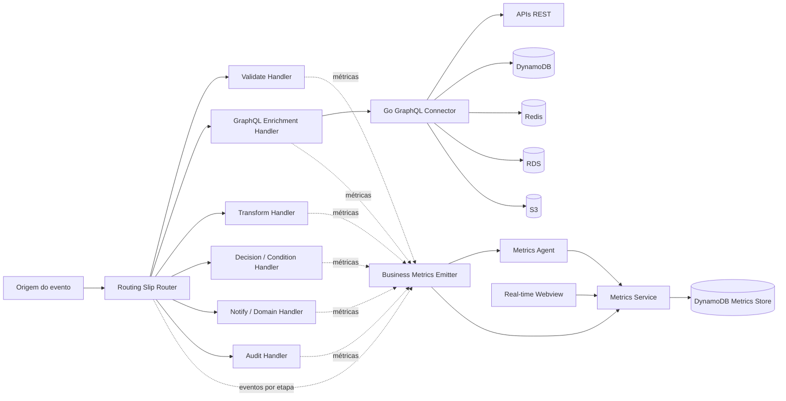
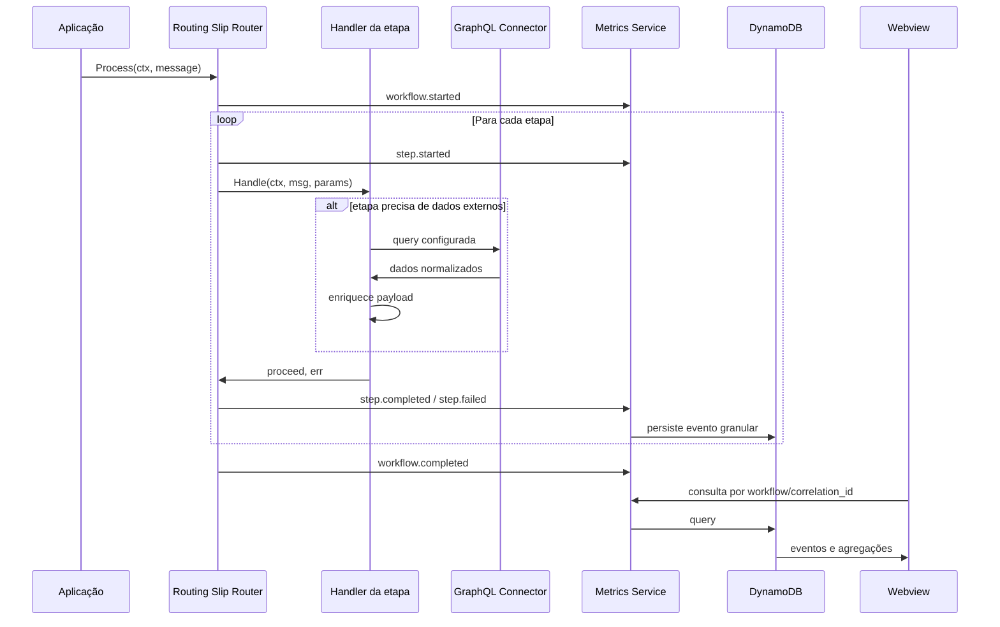
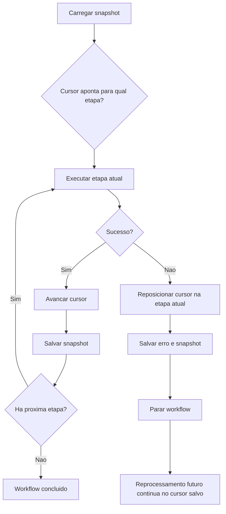
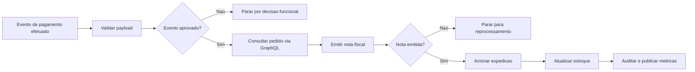
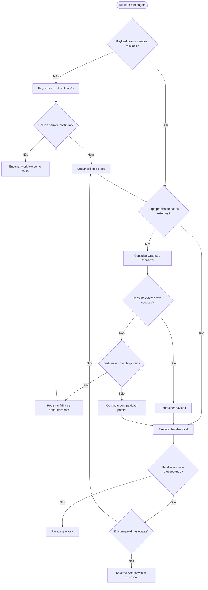
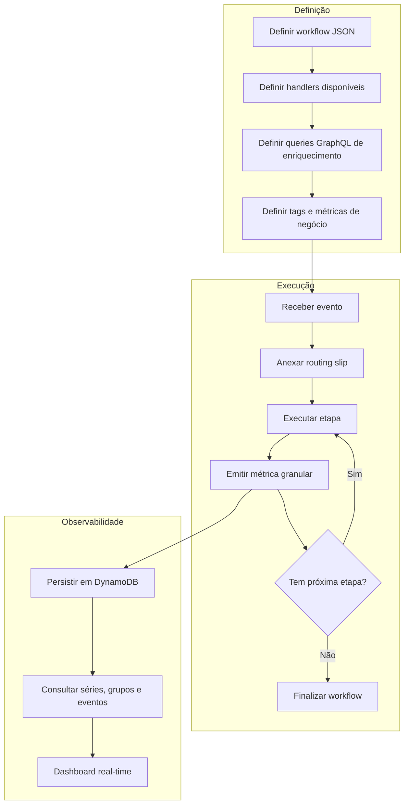
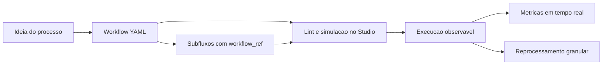

# Routing Slip Pattern - Proposta Arquitetural

## Visão Geral

Este projeto demonstra o uso do padrão **Routing Slip** para processamento de workflows dinâmicos em Go. A proposta evoluída transforma o projeto em uma base para uma ferramenta resiliente, robusta, escalável, reutilizável, observável, segura e modular, aplicável a qualquer tipo de workflow.

O motor principal continua simples: uma mensagem carrega um payload, metadados e uma lista ordenada de etapas. Cada etapa é resolvida em tempo de execução por um handler registrado. A evolução proposta adiciona dois pilares:

- **Integração externa para enriquecimento de payload** usando o projeto `go-graphql-connector` como camada unificada de acesso a APIs, bases de dados, caches e serviços externos.
- **Observabilidade granular de negócio** usando a ideia do projeto `custom-business-metrics` para publicar eventos e métricas por workflow, etapa, decisão, erro e payload enriquecido.

Com isso, o routing slip deixa de ser apenas uma sequência de handlers e passa a funcionar como um **orquestrador modular e observável**, capaz de enriquecer dados, tomar decisões, registrar evidências e expor o andamento do processamento em tempo real.

## Objetivo

Construir uma fundação técnica para workflows que precisam:

- receber qualquer tipo de payload;
- montar rotas de processamento dinamicamente;
- enriquecer dados consultando fontes externas;
- aplicar validações, decisões e transformações;
- continuar, parar ou pular etapas conforme política configurável;
- registrar histórico e erros por etapa;
- emitir métricas de negócio e eventos operacionais;
- permitir visualização em tempo real do processamento;
- ser reutilizada em diferentes domínios sem acoplamento ao caso de uso.

## Projetos Relacionados

Os projetos internos devem ser incorporados ao repositório principal como **Git submodules**. Isso preserva a autonomia de cada projeto, evita copiar código privado para dentro do app e permite versionar exatamente qual revisão do conector GraphQL e da plataforma de métricas foi usada em cada versão do routing slip.

Topologia proposta:

```text
routing-slip-pattern/
├── app/
│   └── modulo Go do routing slip
├── go-graphql-connector/
│   └── submodule privado para integracoes externas (branch develop)
├── custom-business-metrics/
│   └── submodule para metricas, DynamoDB e webview
├── docker/
│   └── Dockerfiles customizaveis por servico
├── docker-compose.yml
├── Makefile
└── DOCUMENTATION.md
```

Comandos úteis:

```bash
git submodule update --init --recursive
make prepare
make run
make test
make compose-up
```

Para validação local integrada, use `make prepare` antes de `make run`. O prepare sobe a stack de observabilidade com DynamoDB, metrics service, metrics agent, webview e serviços mockados de integração externa. O `make run` fica responsável por executar os cenários de workflow e popular o dashboard.

### Dockerfiles e CA Interna

O `docker-compose.yml` referencia Dockerfiles explícitos no diretório `docker/`, em vez de usar apenas imagens diretas. Isso facilita adaptar a execução para ambientes corporativos onde é necessário instalar certificados internos, configurar proxy, ajustar variáveis de ambiente ou preparar bundles de CA para SDKs.

Padrão recomendado para imagens Alpine, como `golang:1.22-alpine`, `golang:1.24-alpine`, `golang:1.25-alpine` e `nginx:alpine`:

```dockerfile
RUN apk add --no-cache ca-certificates && update-ca-certificates
COPY certs/internal-ca.crt /usr/local/share/ca-certificates/internal-ca.crt
RUN update-ca-certificates
ENV AWS_CA_BUNDLE=/usr/local/share/ca-certificates/internal-ca.crt
```

Para imagens baseadas em AWS CLI ou DynamoDB Local, valide o sistema operacional base antes de instalar pacotes. O AWS CLI respeita `AWS_CA_BUNDLE`; já o DynamoDB Local roda em JVM e pode exigir importação da CA no truststore Java com `keytool`, além do bundle Linux.

### `routing-slip-pattern`

Fornece o núcleo de orquestração:

- `Message`: unidade de trabalho com payload mutável, headers, routing slip, histórico e erros.
- `StepDef`: definição de etapa com nome e parâmetros.
- `Handler`: interface para qualquer etapa de processamento.
- `Router`: executor do workflow, registry de handlers, middlewares e política de erro.
- `SlipBuilder`: API fluente para montar rotas em código.
- `StateStore`: interface para persistir snapshots e permitir retomada.
- `MessageSnapshot`: estado serializável da mensagem, incluindo cursor.
- `config`: carregamento de workflows via JSON.

### `go-graphql-connector`

Pode ser usado como **Anti-Corruption Layer** e camada de integração:

- expõe uma API GraphQL dinâmica por configuração;
- resolve campos GraphQL usando conectores REST, DynamoDB, S3, RDS e Redis;
- permite timeout, retry e falha parcial por conector;
- carrega schema e conectores de arquivo local, variáveis de ambiente, SSM, Secrets Manager, S3 ou DynamoDB;
- centraliza a forma como workflows acessam dados externos.

Configuração mínima:

```json
{
  "schema": "local:schema.json",
  "connectors": "local:connectors.json",
  "route": "/graphql",
  "pretty": true,
  "graphiql": true,
  "allow_partial": false
}
```

Exemplo de connector REST:

```json
{
  "connectors": [
    {
      "field": "catalogo",
      "adapter": "rest",
      "adapterConfig": {
        "baseUrl": "https://mock.raysouz.studio",
        "endpoint": "/catalogo/produtos/{sku}",
        "method": "GET"
      },
      "keyPattern": "/catalogo/produtos/{sku}",
      "timeoutMs": 3000,
      "retries": 1,
      "responseTransform": {
        "unwrapPath": "data",
        "errorsPath": "errors",
        "failOnErrors": true
      }
    }
  ]
}
```

Recursos relevantes:

- adapters `rest`, `dynamodb`, `s3`, `rds` e `redis`;
- `responseTransform.unwrapPath` para simplificar respostas;
- `responseTransform.errorsPath` e `failOnErrors` para tratar erros funcionais de APIs;
- `timeoutMs`, `retries`, `optional` e `allow_partial` para resiliência por fonte;
- configuração com `local:`, `env:`, `ssm:`, `secret:`, `secrets:` e `s3:`;
- configuração de token STS via `authorization.require_token_sts`.

> Observação: a configuração de token STS cria o gerenciador de token no conector. Quando uma API REST precisar receber `Authorization: Bearer <token>`, valide se o adapter em uso injeta esse token automaticamente ou se será necessário plugar essa etapa na montagem dos headers.

### `custom-business-metrics`

Inspira a camada de métricas e visualização:

- captura métricas customizadas de negócio;
- aceita tags livres como `workflow`, `step`, `status`, `correlation_id`, `trace_id` e identificadores de domínio;
- armazena eventos em DynamoDB ou memória;
- permite consultas agregadas, séries temporais e dashboards em tempo real;
- separa emissão de métricas do fluxo principal via agent ou API HTTP.

Componentes:

| Componente | Papel |
|---|---|
| `agent` | Recebe eventos JSON via UDP, agrupa e encaminha em lote. |
| `service` | API HTTP para ingestão, consulta, agregação, retenção e dashboards. |
| `webview` | Interface para visualizar e editar dashboards. |
| `storage` | Memória para desenvolvimento ou DynamoDB/DynamoDB Local para persistência. |

Endpoints principais:

| Endpoint | Uso |
|---|---|
| `POST /v1/metrics` | Ingestão de eventos. |
| `GET /v1/metrics/events` | Eventos crus filtrados. |
| `GET /v1/metrics` | Agregações e sumários. |
| `GET /v1/metrics/series` | Séries temporais por bucket. |
| `GET /v1/metrics/dimensions` | Dimensões e tags disponíveis. |
| `GET /v1/dashboards` | Listagem de dashboards. |
| `POST /v1/dashboards` | Criação/atualização de dashboard. |
| `DELETE /v1/dashboards/{id}` | Remoção de dashboard. |

Benefícios para o routing slip:

- visualizar em tempo real onde cada mensagem está;
- acompanhar duração por step, falhas e integrações externas;
- filtrar eventos por `workflow`, `step`, `status`, `correlation_id`, `message_id` e tags de negócio;
- criar dashboards JSON sem alterar o runtime;
- usar TTL no DynamoDB para retenção controlada;
- enviar métricas diretamente por HTTP ou de forma desacoplada via UDP agent.

## Arquitetura Proposta



## Funcionamento

1. Uma aplicação cria uma `Message` com `ID`, `Payload` e `Headers`.
2. Um routing slip é anexado à mensagem por JSON, builder fluente ou outro mecanismo dinâmico.
3. O `Router` executa as etapas na ordem definida.
4. Cada handler lê e altera o payload conforme sua responsabilidade.
5. Um handler de enriquecimento pode consultar o `go-graphql-connector` para buscar dados externos.
6. Middlewares emitem métricas antes e depois de cada etapa.
7. Erros são registrados na própria mensagem e tratados conforme a política configurada.
8. Eventos de negócio são gravados em uma base analítica, como DynamoDB.
9. Uma interface consulta a base de métricas para exibir o progresso em tempo real.



## Componentes Funcionais

### 1. Motor de Routing Slip

Responsável por executar a rota anexada à mensagem. Ele deve permanecer pequeno, previsível e reutilizável.

Responsabilidades:

- registrar handlers por nome;
- aplicar middlewares;
- respeitar `context.Context`;
- executar etapas em ordem;
- armazenar histórico por etapa;
- aplicar políticas de erro;
- permitir parada graciosa com `proceed=false`.
- persistir o cursor para retomar processamentos interrompidos.

Políticas de erro:

| Política | Comportamento |
|---|---|
| `stop` | Para o workflow no primeiro erro. |
| `continue` | Registra o erro e segue para a próxima etapa. |
| `skip` | Registra o erro e marca a etapa como pulada. |

### 1.1. Retomada e Reprocessamento

Um diferencial essencial da proposta é permitir que um workflow pare em uma etapa e seja retomado sem repetir etapas anteriores. Isso evita o problema comum em orquestrações estáticas: quando uma execução falha no meio, o reprocessamento precisa voltar ao início e pode executar novamente ações que já produziram efeitos.

O modelo usa um `MessageSnapshot` persistido a cada mudança relevante de estado:

- antes do workflow iniciar;
- imediatamente antes de executar uma etapa;
- depois de uma etapa concluir;
- quando uma etapa falha;
- quando o workflow termina.

O campo mais importante é o `cursor`, que representa o índice da próxima etapa a executar. Quando uma etapa falha com política `StopOnError`, o router reposiciona o cursor para a etapa que falhou. Assim, o próximo reprocessamento reexecuta aquela etapa e segue o fluxo a partir dela.



Exemplo conceitual:

```go
store := slip.NewMemoryStateStore()
router := slip.NewRouter(
    slip.WithErrorPolicy(slip.StopOnError),
    slip.WithStateStore(store),
)

err := router.Process(ctx, msg)
if err != nil {
    snapshot, _ := store.Load(ctx, msg.ID)
    resumed := slip.MessageFromSnapshot(snapshot)
    _ = router.Process(ctx, resumed)
}
```

Em produção, o `MemoryStateStore` deve ser substituído por um adapter persistente, como DynamoDB. A tabela de estado do workflow pode ser separada da tabela de métricas.

Modelo sugerido para estado:

| Atributo | Uso |
|---|---|
| `pk` | `MESSAGE#<message_id>` |
| `sk` | `STATE#CURRENT` |
| `workflow` | Nome do workflow |
| `cursor` | Próxima etapa a executar |
| `status` | `running`, `failed`, `completed`, `stopped` |
| `payload` | Payload atual ou referência externa |
| `slip` | Lista versionada das etapas |
| `history` | Etapas concluídas |
| `errors` | Erros por etapa |
| `updated_at` | Controle operacional |

Para etapas com efeitos colaterais, a recomendação é combinar retomada com idempotência por `message_id`, `step` e `attempt`. Assim, mesmo que uma falha ocorra após uma chamada externa, o handler consegue detectar se a ação já foi aplicada.

### 2. Handler de Enriquecimento via GraphQL

A evolução proposta adiciona um handler conceitual chamado `graphql_enrich`.

Esse handler não deve conhecer diretamente REST, DynamoDB, Redis, S3 ou RDS. Ele conhece apenas a API GraphQL e deixa o `go-graphql-connector` resolver as integrações externas por configuração.

Exemplo de etapa:

```json
{
  "name": "graphql_enrich",
  "enabled": true,
  "params": {
    "endpoint": "http://localhost:8080/graphql",
    "query": "query ($buyerID: String!) { buyer(id: $buyerID) { id status loyaltyTier preferredRegion } }",
    "variables": {
      "buyerID": "{buyer_id}"
    },
    "target": "buyer_profile",
    "timeout_ms": 800,
    "required": true
  }
}
```

Resultado esperado no payload:

```json
{
  "buyer_id": "BUYER-42",
  "product_id": "SKU-9000",
  "quantity": 3,
  "buyer_profile": {
    "id": "BUYER-42",
    "status": "ACTIVE",
    "loyaltyTier": "GOLD",
    "preferredRegion": "SP"
  }
}
```

Benefícios:

- reduz acoplamento entre handlers e serviços externos;
- centraliza timeout, retry, credenciais e conectores;
- cria uma camada anticorrupção para dados legados;
- permite trocar fontes externas sem alterar o workflow;
- permite enriquecer payloads de qualquer domínio.

### 3. Handlers de Controle e Decisão

Além dos handlers básicos (`validate`, `condition`, `enrich`, `transform`, `notify`, `audit`, `graphql_enrich` e `rest_call`), o projeto suporta handlers para validação assertiva, cálculo, expressões CEL e roteamento condicional.

> **CEL expressions:** o runtime possui um handler `cel` baseado em `cel-go`. Ele permite escrever regras expressivas e decidir se uma falha deve travar o processamento, continuar de forma controlada, parar sem erro ou saltar para uma etapa posterior.

#### Paths com arrays

Os paths do payload aceitam dot notation com índices numéricos para acessar arrays:

```yaml
catalogo.produtos.0.sku
catalogo.produtos.0.disponibilidade.status
catalogo.produtos.0.preco.valor
```

Isso permite usar dados retornados por GraphQL em validações e cálculos posteriores.

#### Handler `assert`

O `assert` valida uma ou mais condições e falha o workflow quando os critérios não são atendidos. Diferente do `condition`, que para o fluxo de forma graciosa quando a condição não bate, o `assert` registra erro e respeita a `error_policy` do workflow.

Use `assert` quando uma regra é obrigatória para o processo continuar.

Validação simples:

```yaml
- name: assert
  params:
    field: catalogo.produtos.0.disponibilidade.status
    equals: DISPONIVEL
    message: Produto precisa estar disponivel.
```

Validação com todas as condições obrigatórias:

```yaml
- name: assert
  params:
    all:
      - field: catalogo.produtos.0.categoria
        equals: ELETRONICOS
      - field: catalogo.produtos.0.disponibilidade.status
        equals: DISPONIVEL
    message: Produto fora dos criterios de categoria ou disponibilidade.
```

Validação com qualquer condição aceita:

```yaml
- name: assert
  params:
    any:
      - field: catalogo.produtos.0.canal_entrega
        equals: TRANSPORTADORA
      - field: catalogo.produtos.0.canal_entrega
        equals: RETIRADA_LOJA
    message: Produto precisa ter um canal de entrega aceito.
```

Validação de coleção:

```yaml
- name: assert
  params:
    field: catalogo.produtos
    min_items: 1
    message: Nenhum produto retornado para o pedido.
```

Operadores suportados pelo `assert` são os mesmos usados pelo `compute` e `jump_if`: `equals`, `not_equals`, `less_than`, `less_than_or_equal`, `greater_than`, `greater_than_or_equal`, `min_items`, `max_items` e `exists`.

#### Handler `validate`

O `validate` deve ser usado no começo do workflow ou antes de integrações com efeitos externos. Ele garante que campos obrigatórios existem e não estão vazios.

```yaml
- name: validate
  params:
    required:
      - pedido_id
      - correlation_id
      - itens.0.sku
      - entrega.endereco.cep
    stop_on_failure: true
```

Quando `stop_on_failure` é `false`, o handler registra `validation_error`, mas permite que o fluxo continue:

```yaml
- name: validate
  params:
    required:
      - metadados.origem
    stop_on_failure: false
```

Campos gerados:

| Campo | Quando aparece |
|---|---|
| `validation_passed` | Quando todos os campos obrigatórios existem. |
| `validation_error` | Quando algum campo obrigatório está ausente. |

#### Handler `condition`

O `condition` é um gate funcional. Ele interrompe o workflow sem tratar como erro técnico quando uma regra simples não é atendida.

```yaml
- name: condition
  params:
    field: evento
    equals: PEDIDO_APROVADO
```

Também é possível parar quando um valor específico aparece:

```yaml
- name: condition
  params:
    field: pedido.status
    not_equals: CANCELADO
```

Use `condition` para decisões esperadas do negócio, como evento fora de escopo, status que não deve prosseguir ou payload que deve ser represado para outro fluxo.

#### Handler `compute`

O `compute` calcula um valor e grava o resultado em `target`.

Formato geral:

```yaml
- name: compute
  params:
    target: nome_do_campo
    value:
      field: caminho.no.payload
      less_than_or_equal: 1900000000
```

Variações suportadas:

```yaml
# Copiar o valor de um campo
- name: compute
  params:
    target: sku
    value:
      field: catalogo.produtos.0.sku
```

```yaml
# Valor literal
- name: compute
  params:
    target: origem
    value:
      literal: CHECKOUT_ONLINE
```

```yaml
# Verificar existência
- name: compute
  params:
    target: possui_produto
    value:
      exists: catalogo.produtos.0
```

```yaml
# Contar itens de uma coleção
- name: compute
  params:
    target: quantidade_produtos
    value:
      count: catalogo.produtos
```

```yaml
# Comparações numéricas
- name: compute
  params:
    target: produto_promocional
    value:
      field: catalogo.produtos.0.preco.valor
      less_than_or_equal: 100
```

Operadores de comparação suportados:

| Operador | Uso |
|---|---|
| `equals` | igualdade |
| `not_equals` | diferença |
| `less_than` | menor que |
| `less_than_or_equal` | menor ou igual |
| `greater_than` | maior que |
| `greater_than_or_equal` | maior ou igual |
| `min_items` | tamanho mínimo de lista/map/string |
| `max_items` | tamanho máximo de lista/map/string |
| `exists` | existência de path |
| `count` | contagem de itens |
| `literal` | valor fixo |

Exemplo de validação de quantidade:

```yaml
- name: compute
  params:
    target: possui_produtos
    value:
      field: catalogo.produtos
      min_items: 1
```

#### Handler `jump_if`

O `jump_if` altera o cursor do routing slip quando uma condição é satisfeita.

Formato geral:

```yaml
- name: jump_if
  params:
    field: produto_promocional
    equals: true
    to: finalizar
```

O destino em `to` pode apontar para:

- `id` de um step, recomendado;
- `name` de um handler, aceito como fallback.

Prefira sempre `id`, porque handlers podem se repetir no workflow.
O salto deve apontar para uma etapa posterior à etapa atual, evitando loops acidentais no processamento.

Exemplo com `id`:

```yaml
- name: compute
  params:
    target: produto_promocional
    value:
      field: catalogo.produtos.0.preco.valor
      less_than_or_equal: 100

- name: jump_if
  params:
    field: produto_promocional
    equals: true
    to: finalizar

- name: enrich
  params:
    data:
      classificacao_pedido: "processamento padrao"

- id: finalizar
  name: audit
  params:
    event: pedido.promocional.completed
    fields:
      - correlation_id
      - pedido_id
      - produto_promocional
```

#### Handler `cel`

O `cel` avalia uma expressão CEL e espera um resultado booleano. Ele é indicado quando a regra precisa combinar múltiplos campos, funções como `size()` ou condições mais expressivas do que os operadores declarativos.

O runtime disponibiliza:

- `payload`: mapa completo do payload;
- `headers`: headers da mensagem;
- variáveis de primeiro nível do payload que tenham nomes válidos em CEL, como `pedido`, `itens`, `catalogo` e `entrega`.

Validação obrigatória que falha o workflow quando a expressão é falsa:

```yaml
- name: cel
  params:
    expr: "pedido.status == 'APROVADO' && size(itens) > 0"
    message: Pedido precisa estar aprovado e possuir itens.
    on_false: error
```

`on_false: error` é o comportamento padrão quando `to` não é informado. A falha respeita a `error_policy` do workflow e preserva o cursor para reprocessamento.

Validação que salta para outra etapa quando a expressão é falsa:

```yaml
- id: avaliar_pedido
  name: cel
  params:
    expr: "pedido.total > 0 && entrega.endereco.cep != ''"
    on_false: jump
    to: revisar_pedido
    target: pedido_pronto_para_entrega

- name: enrich
  params:
    data:
      rota: EXPEDICAO

- id: revisar_pedido
  name: audit
  params:
    event: pedido.revisao_necessaria
    fields:
      - correlation_id
      - pedido.id
      - pedido_pronto_para_entrega
```

Variações de `on_false`:

| Valor | Comportamento |
|---|---|
| `error` | Falha a etapa e registra erro. É o padrão. |
| `fail` | Alias de `error`. |
| `jump` | Continua a execução a partir do step informado em `to`. |
| `continue` | Grava o resultado booleano e segue para a próxima etapa. |
| `stop` | Interrompe o workflow sem tratar como erro técnico. |

Campos gravados:

| Campo | Descrição |
|---|---|
| `cel_passed` | Resultado booleano da última expressão CEL. |
| `<target>` | Quando `target` é informado, recebe o mesmo resultado booleano. |
| `cel_stopped` | Gravado como `true` quando `on_false: stop` interrompe o fluxo. |
| `jumped_to` / `jumped_to_cursor` | Gravados quando `on_false: jump` altera o cursor. |

Exemplos úteis:

```yaml
# Verificar coleção retornada por integração
- name: cel
  params:
    expr: "size(catalogo.produtos) > 0"
    message: Nenhum produto encontrado no catálogo.
```

```yaml
# Usar payload explicitamente
- name: cel
  params:
    expr: "payload.evento == 'PEDIDO_APROVADO' && payload.pedido.total >= 50"
```

```yaml
# Continuar, mas registrar a decisão para etapas posteriores
- name: cel
  params:
    expr: "entrega.tipo == 'EXPRESSA' && pedido.total >= 100"
    target: elegivel_entrega_expressa
    on_false: continue
```

No Studio, a simulação local cobre o subconjunto mais comum de CEL, como comparações, operadores booleanos, acesso por ponto, `size()` e `has()`. O runtime Go é a fonte de verdade para validação final das expressões.

#### Handler `filter_array`

O `filter_array` remove itens de um array que não atendem a uma condição. Ele pode alterar o array original ou gravar o resultado em outro campo.

Use quando um enriquecimento retorna uma coleção maior do que o workflow deve processar, como catálogo, opções de entrega, itens elegíveis ou qualquer lista que precise ser reduzida antes das próximas etapas.

Filtro declarativo no próprio array:

```yaml
- name: filter_array
  params:
    source: catalogo.produtos
    where:
      all:
        - field: item.disponibilidade.status
          equals: DISPONIVEL
        - field: item.preco.valor
          less_than_or_equal: 100
```

Nesse formato, `catalogo.produtos` passa a conter somente os itens mantidos.

Filtro gravando em outro campo:

```yaml
- name: filter_array
  params:
    source: catalogo.produtos
    target: produtos_elegiveis
    where:
      field: item.categoria
      equals: ELETRONICOS
```

Filtro usando CEL por item:

```yaml
- name: filter_array
  params:
    source: entrega.opcoes
    target: entrega.opcoes_validas
    expr: "item.prazo_dias <= 3 && item.custo <= 25"
```

Durante a avaliação, o handler disponibiliza:

| Variável | Descrição |
|---|---|
| `item` | Item atual do array. |
| `index` | Índice do item no array original. |
| payload original | Campos de primeiro nível do payload continuam disponíveis. |

Campos gravados:

| Campo | Descrição |
|---|---|
| `<target>_filtered_count` | Quantidade de itens mantidos. |
| `<target>_removed_count` | Quantidade de itens removidos. |

#### Exemplo: produto promocional

Depois de enriquecer o payload via GraphQL:

```yaml
- name: graphql_enrich
  params:
    query: "query (...) { dataSources(...) { catalogo { produtos { sku categoria disponibilidade { status } preco { valor } } } } }"
    variables:
      pedidoID: "{pedido_id}"
      sku: "{itens.0.sku}"
    target: catalogo
    result_path: dataSources.catalogo
    required: true
```

É possível validar categoria/disponibilidade e calcular se o item se enquadra em uma rota promocional:

```yaml
- name: assert
  params:
    all:
      - field: catalogo.produtos.0.categoria
        equals: ELETRONICOS
      - field: catalogo.produtos.0.disponibilidade.status
        equals: DISPONIVEL
    message: Produto fora dos criterios de categoria ou disponibilidade.

- name: compute
  params:
    target: produto_promocional
    value:
      field: catalogo.produtos.0.preco.valor
      less_than_or_equal: 100

- name: jump_if
  params:
    field: produto_promocional
    equals: true
    to: finalizar
```

Se `produto_promocional` for `true`, o workflow salta para o step `id: finalizar`. Caso contrário, segue normalmente para as próximas etapas.

#### Handler `enrich`

O `enrich` adiciona dados ao payload sem chamar serviços externos.

```yaml
- name: enrich
  params:
    data:
      origem: CHECKOUT_ONLINE
      prioridade: NORMAL
```

Com `prefix`, os campos injetados recebem um prefixo:

```yaml
- name: enrich
  params:
    prefix: meta_
    data:
      origem: CHECKOUT_ONLINE
```

#### Handler `transform`

O `transform` normaliza campos de texto.

```yaml
- name: transform
  params:
    field: comprador.email
    operation: lowercase
    target: comprador_email_normalizado
```

Operações suportadas:

| Transformação | Resultado |
|---|---|
| `uppercase` | Converte para maiúsculas. |
| `lowercase` | Converte para minúsculas. |
| `trim` | Remove espaços no início/fim. |
| `prefix:<valor>` | Adiciona prefixo. |
| `suffix:<valor>` | Adiciona sufixo. |

#### Handler `graphql_enrich`

O `graphql_enrich` consulta um endpoint GraphQL, normalmente o `go-graphql-connector`, e grava o resultado no payload.

```yaml
- name: graphql_enrich
  params:
    endpoint: "${GRAPHQL_ENDPOINT:-http://localhost:8090/graphql}"
    query: "query ($pedidoID: String!) { dataSources(pedidoID: $pedidoID) { order { pedido_id status } } }"
    variables:
      pedidoID: "{pedido_id}"
    target: pedido
    result_path: dataSources.order
    timeout_ms: 3000
    required: true
```

Quando `required: false`, falhas de endpoint ou respostas incompletas marcam `<target>_partial: true` e permitem continuar.

#### Handler `rest_call`

O `rest_call` chama uma API REST e grava a resposta no payload.

```yaml
- name: rest_call
  params:
    base_url: "https://mock.raysouz.studio"
    method: POST
    endpoint: /entregas
    target: entrega
    headers:
      x-correlation-id: "{correlation_id}"
    body:
      pedido_id: "{pedido_id}"
      itens: "{itens}"
    result_path: data
    timeout_ms: 3000
    required: true
```

#### Handler `audit`

O `audit` registra evidências funcionais em log estruturado.

```yaml
- name: audit
  params:
    event: pedido.processado
    fields:
      - pedido_id
      - correlation_id
      - entrega.status
```

#### Handler `notify`

O `notify` simula uma notificação. Em produção, o handler pode receber uma função real de envio no registro do runtime.

```yaml
- name: notify
  params:
    channel: webhook
    recipient: "https://example.local/hook"
    template: "Pedido {pedido_id} processado com status {entrega.status}"
```

#### Validações declarativas e CEL

A abordagem declarativa continua recomendada quando a regra é simples e precisa ser altamente explicável por campo e operador:

```yaml
- name: assert
  params:
    all:
      - field: pedido.status
        equals: APROVADO
      - field: itens
        min_items: 1
```

Esse formato oferece vantagens importantes:

- lint simples no Studio;
- mensagens de erro explicáveis;
- operadores fáceis de documentar;
- menor risco de executar expressões dinâmicas;
- melhor rastreabilidade por campo e operador.

Use CEL quando a regra fica mais clara como expressão:

```yaml
- name: cel
  params:
    expr: "pedido.status == 'APROVADO' && size(itens) > 0"
    on_false: error
    message: Pedido precisa estar aprovado e possuir itens.
```

Na prática, `assert`, `compute`, `condition`, `jump_if` e `cel` convivem. A escolha deve priorizar clareza, rastreabilidade e facilidade de manutenção.

### 4. Composição de Workflows

Fluxos extensos podem ser divididos em múltiplos arquivos YAML e compostos com `workflow_ref`. Isso permite organizar scripts por domínio ou microserviço sem transformar um único arquivo em um workflow difícil de analisar.

Durante o carregamento do workflow, o `workflow_ref` é expandido: as etapas do arquivo referenciado entram no ponto onde a referência foi declarada. Para o motor de execução, o resultado é um único routing slip contínuo, com cursor, histórico, métricas e reprocessamento em nível granular.

Exemplo de estrutura no workspace:

```text
workflows/
├── pedidos/
│   └── pagamento-aprovado.yaml
├── fiscal/
│   └── emitir-nota.yaml
├── expedicao/
│   └── preparar-entrega.yaml
└── notificacoes/
    └── avisar-comprador.yaml
```

Exemplo no workflow principal:

```yaml
name: pagamento-aprovado
error_policy: stop
message_id_path: pedido_id
correlation_id_path: correlation_id

steps:
  - id: validar_evento
    name: validate
    params:
      required:
        - pedido_id
        - correlation_id

  - id: emitir_nota
    name: workflow_ref
    params:
      file: ../fiscal/emitir-nota.yaml

  - id: preparar_entrega
    name: workflow_ref
    params:
      file: ../expedicao/preparar-entrega.yaml

  - id: avisar_comprador
    name: workflow_ref
    params:
      file: ../notificacoes/avisar-comprador.yaml
```

Exemplo do arquivo referenciado:

```yaml
name: emitir-nota
steps:
  - id: montar_payload
    name: enrich
    params:
      data:
        etapa_fiscal: INICIADA

  - id: emitir
    name: rest_call
    params:
      base_url: "https://mock.raysouz.studio"
      method: POST
      endpoint: /fiscal/notas
      target: nota_fiscal

  - id: finalizar
    name: audit
    params:
      event: fiscal.nota_emitida
      fields:
        - pedido_id
        - nota_fiscal.status
```

Regras de composição:

- `params.file`, `params.path` ou `params.workflow` aponta para o YAML referenciado.
- Caminhos relativos são resolvidos a partir do arquivo que contém o `workflow_ref`.
- Use `../outro-contexto/arquivo.yaml` para referenciar workflows de outro diretório irmão.
- O `id` do step `workflow_ref` vira prefixo dos steps expandidos, por exemplo `emitir_nota.montar_payload`.
- Se `params.prefix` for informado, ele substitui o prefixo automático.
- Saltos `jump_if` internos que apontam para IDs do workflow referenciado são reescritos com o prefixo.
- Referências cíclicas são bloqueadas durante o carregamento.

Benefícios:

- reduz o tamanho de cada script;
- permite reaproveitar subfluxos em diferentes workflows;
- preserva execução contínua e observabilidade granular;
- mantém reprocessamento por cursor mesmo com scripts fisicamente separados;
- favorece organização por contexto, domínio ou microserviço.

No Studio, a ação **Exportar workflow composto** gera um YAML único com todos os `workflow_ref` resolvidos. Esse arquivo exportado pode ser usado quando você quiser executar, versionar ou compartilhar a versão consolidada do fluxo sem depender da árvore de arquivos do workspace.

### 5. Métricas Granulares do Routing Slip

A evolução proposta adiciona um middleware conceitual chamado `MetricsMiddleware`.

Esse middleware emite eventos para o `custom-business-metrics` ou para uma API compatível. Os eventos podem ser enviados diretamente por HTTP ou por um agent UDP para reduzir impacto no fluxo principal.

Eventos mínimos:

- `workflow.started`
- `workflow.completed`
- `workflow.failed`
- `step.started`
- `step.completed`
- `step.failed`
- `step.skipped`
- `step.stopped`
- `payload.enriched`
- `decision.evaluated`

Exemplo de evento:

```json
{
  "name": "routing_slip.step.completed",
  "kind": "count",
  "value": 1,
  "unit": "event",
  "workflow": "order-processing",
  "step": "graphql_enrich",
  "status": "success",
  "source": "routing-slip-router",
  "tags": {
    "message_id": "MSG-001",
    "correlation_id": "corr-abc",
    "trace_id": "trace-xyz",
    "handler": "graphql_enrich",
    "error_policy": "stop",
    "duration_ms": "37",
    "target": "buyer_profile"
  },
  "timestamp": "2026-05-13T12:00:00Z"
}
```

Consultas habilitadas:

- quantas mensagens estão em cada etapa;
- quais etapas mais falham;
- duração média por handler;
- quais payloads foram enriquecidos;
- quais workflows pararam por regra de decisão;
- histórico granular por `message_id`, `correlation_id` ou `trace_id`;
- throughput por workflow, domínio ou origem.

## Exemplo Principal: Pagamento para Fulfillment

O cenário `payment-event-fulfillment` simula um fluxo de pós-pagamento mais próximo de um processo real:

1. recebe um evento `PAGAMENTO_APROVADO`;
2. usa `payload.pedido_id` para consultar o pedido via GraphQL Connector;
3. aciona uma integração que representa a Lambda de emissão de nota fiscal;
4. confirma a nota fiscal emitida antes de acionar a expedição;
5. atualiza o estoque dos itens vendidos;
6. registra auditoria e métricas por etapa para acompanhamento no dashboard.



Payload de entrada:

```json
{
  "evento": "PAGAMENTO_APROVADO",
  "payload": {
    "pagamento_id": "PAG-5544",
    "pedido_id": "PED-9988",
    "valor_pago": 150
  },
  "correlation_id": "corr-payment-fulfillment-001"
}
```

Esse exemplo demonstra a proposta central do projeto: cada etapa tem cursor persistivel, pode ser observada individualmente e pode ser retomada do ponto de falha sem repetir chamadas anteriores que ja produziram efeito, como emissão fiscal ou atualização de estoque.

## Modelo de Workflow Proposto

```json
{
  "name": "generic-enriched-workflow",
  "description": "Workflow genérico com enriquecimento externo e métricas granulares",
  "error_policy": "stop",
  "observability": {
    "enabled": true,
    "metrics_endpoint": "http://localhost:8080/v1/metrics",
    "emit_payload_hash": true,
    "emit_payload_snapshot": false,
    "business_tags": ["customer_id", "product_id", "region"]
  },
  "steps": [
    {
      "name": "validate",
      "enabled": true,
      "params": {
        "required": ["buyer_id", "product_id", "quantity"],
        "stop_on_failure": true
      }
    },
    {
      "name": "graphql_enrich",
      "enabled": true,
      "params": {
        "endpoint": "http://localhost:8080/graphql",
        "query": "query ($buyerID: String!) { buyer(id: $buyerID) { id status loyaltyTier preferredRegion } }",
        "variables": {
          "buyerID": "{buyer_id}"
        },
        "target": "buyer_profile",
        "timeout_ms": 800,
        "required": true
      }
    },
    {
      "name": "condition",
      "enabled": true,
      "params": {
        "field": "buyer_profile.status",
        "equals": "ACTIVE"
      }
    },
    {
      "name": "transform",
      "enabled": true,
      "params": {
        "field": "buyer_id",
        "operation": "uppercase",
        "target": "buyer_id"
      }
    },
    {
      "name": "audit",
      "enabled": true,
      "params": {
        "event": "workflow.processed",
        "fields": ["buyer_id", "product_id", "buyer_profile"]
      }
    }
  ]
}
```

## Árvore de Decisão Funcional



## Processo Operacional



## Exemplo de Dashboard em Tempo Real

Widgets recomendados:

| Widget | Consulta |
|---|---|
| Total processado | `name=routing_slip.workflow.completed` |
| Falhas por etapa | `name=routing_slip.step.failed groupBy=step` |
| Latência por handler | `name=routing_slip.step.duration groupBy=step` |
| Workflows em andamento | `status=started - completed` |
| Enriquecimentos externos | `name=routing_slip.payload.enriched groupBy=target` |
| Jornada por mensagem | `tag.message_id=MSG-001` |

## Studio

O `studio` oferece uma experiência local para construir, validar e simular workflows YAML antes de executar no runtime Go.

Recursos principais:

- workspace local com pastas representando contextos ou microserviços;
- editor YAML com lint, atalhos, comentários e foco no step a partir dos logs;
- payload de entrada editável;
- simulação por fase/step;
- reprocessamento local a partir do snapshot da execução anterior;
- composição com `workflow_ref`;
- exportação de workflow composto;
- documentação navegável;
- resumo final da execução com steps executados, erros, integrações acionadas, tempo total e diferença para o processamento anterior.

O resumo final da execução contabiliza integrações acionadas por handlers como `graphql_enrich`, `rest_call` e `notify`. Quando as integrações reais estão desativadas, o Studio registra as chamadas simuladas para manter visível o desenho operacional do fluxo.

O botão **Reprocessar** fica disponível após uma execução. Ele usa o snapshot anterior para retomar do cursor salvo, permitindo validar se o workflow continua do ponto registrado e comparar o tempo do processamento atual com o anterior.

## Segurança

Princípios recomendados:

- não persistir payload completo por padrão em métricas;
- emitir hash, resumo ou campos permitidos quando necessário;
- usar allowlist de tags de negócio;
- proteger endpoint GraphQL e endpoint de métricas com autenticação;
- isolar credenciais no `go-graphql-connector`;
- usar timeouts curtos para integrações externas;
- validar tamanho máximo de payload e resposta externa;
- registrar erros sem vazar segredos;
- usar TLS fora do ambiente local;
- aplicar IAM mínimo para DynamoDB, SSM, Secrets Manager, S3 e demais fontes.

## Resiliência e Escalabilidade

Recomendações:

- handlers devem ser idempotentes quando possível;
- cada etapa deve respeitar `context.Context`;
- integrações externas devem ter timeout e retry configuráveis;
- falhas parciais podem ser tratadas por `required=false` em enriquecimentos;
- métricas devem ser emitidas de forma assíncrona ou com fallback não bloqueante;
- DynamoDB deve usar chaves compatíveis com consulta por workflow, tempo, step e correlation id;
- payloads grandes devem ser armazenados fora da trilha quente de métricas;
- workflows devem ser versionados.

## Modelo de Dados para Métricas

Um desenho possível para DynamoDB:

| Atributo | Uso |
|---|---|
| `pk` | `WORKFLOW#<workflow>#DATE#<yyyy-mm-dd>` |
| `sk` | `<timestamp>#<message_id>#<step>#<event>` |
| `gsi1pk` | `CORRELATION#<correlation_id>` |
| `gsi1sk` | `<timestamp>#<workflow>#<step>` |
| `gsi2pk` | `STEP#<workflow>#<step>` |
| `gsi2sk` | `<timestamp>#<status>#<message_id>` |
| `expires_at` | TTL para retenção automática |
| `tags` | mapa livre para filtros de negócio |

Esse modelo favorece:

- linha do tempo por workflow;
- busca e2e por correlação;
- análise por etapa;
- retenção automática;
- dashboards com janelas recentes.

## Interfaces Recomendadas

### Handler

```go
type Handler interface {
    Name() string
    Handle(ctx context.Context, msg *Message, params map[string]any) (proceed bool, err error)
}
```

### Emissor de Métricas

```go
type MetricsEmitter interface {
    Emit(ctx context.Context, event MetricEvent) error
}
```

### Evento de Métrica

```go
type MetricEvent struct {
    Name      string
    Kind      string
    Value     float64
    Unit      string
    Workflow  string
    Step      string
    Status    string
    Source    string
    Tags      map[string]string
    Timestamp time.Time
}
```

### Cliente de Enriquecimento

```go
type ExternalDataClient interface {
    Query(ctx context.Context, query string, variables map[string]any) (map[string]any, error)
}
```

## Estratégia de Implementação

### Fase 1 - Núcleo Observável

- adicionar `MetricsMiddleware`;
- emitir eventos de início, fim, erro, skip e parada;
- criar `MetricEvent` e `MetricsEmitter`;
- implementar emitter em memória para testes;
- implementar emitter HTTP/UDP compatível com `custom-business-metrics`.

### Fase 2 - Enriquecimento Externo

- adicionar `GraphQLEnrichmentHandler`;
- interpolar variáveis a partir do payload;
- aplicar timeout por etapa;
- gravar resposta no campo `target`;
- suportar `required=true/false`;
- emitir evento `payload.enriched`.

### Fase 3 - Persistência e Dashboard

- usar o service do `custom-business-metrics`;
- persistir métricas em DynamoDB;
- criar dashboards por workflow, etapa e correlação;
- adicionar filtros por tags de negócio.

### Fase 4 - Generalização

- versionar workflows;
- registrar catálogo de handlers;
- validar JSON de configuração;
- adicionar suporte a regras dinâmicas;
- permitir múltiplas estratégias de roteamento;
- publicar SDK para aplicações produtoras.

## Benefícios

| Benefício | Impacto prático |
|---|---|
| **Velocidade** | Workflows são declarados em YAML e podem evoluir sem recompilar o motor. |
| **Facilidade** | Handlers pequenos reduzem a carga cognitiva durante construção e revisão. |
| **Rastreabilidade** | Cursor, histórico, erros e auditoria mostram exatamente onde cada mensagem passou. |
| **Observabilidade** | Métricas por workflow, etapa, status e correlação alimentam dashboards em tempo real. |
| **Explicabilidade** | O YAML mostra de forma legível quais regras foram aplicadas e por quê. |
| **Transparência** | Logs por fase revelam entrada, regra, saída, duração e falhas. |
| **Reprocessamento granular** | Uma execução pode continuar do ponto de falha sem repetir etapas concluídas. |
| **Modularidade** | `workflow_ref` divide fluxos extensos em scripts menores e reutilizáveis. |
| **Reutilização** | O mesmo motor atende workflows de pedidos, pagamentos, logística, cadastro, atendimento, inventário ou publicação de conteúdo. |
| **Segurança** | Integrações e credenciais ficam isoladas no conector e podem usar políticas próprias. |
| **Resiliência** | Políticas de erro, timeouts, fallbacks e idempotência controlam falhas. |
| **Escalabilidade** | Métricas, integrações e workflows podem crescer independentemente. |
| **Baixo acoplamento** | APIs externas são consumidas via GraphQL configurável, não diretamente pelos handlers de domínio. |



## Exemplo Aplicado: Pedido de E-commerce

Payload inicial:

```json
{
  "customer_id": "cust-42",
  "product_id": "SKU-9000",
  "quantity": 3,
  "correlation_id": "corr-001"
}
```

Fluxo:

1. `validate` garante campos obrigatórios.
2. `graphql_enrich` busca perfil do comprador, região, preferências e disponibilidade de catálogo.
3. `condition` interrompe se o cliente não está ativo.
4. `transform` normaliza identificadores.
5. `notify` avisa canais operacionais.
6. `audit` registra evidência funcional.
7. `MetricsMiddleware` registra todos os passos no DynamoDB.
8. A webview mostra a jornada pelo `correlation_id`.

Resultado: é possível saber em tempo real quando o pedido entrou, quais dados externos foram usados, quanto tempo cada etapa levou, onde falhou e qual foi o estado final.

## Conclusão

A proposta une três capacidades complementares:

- o `routing-slip-pattern` como motor de workflow;
- o `go-graphql-connector` como camada de integração e enriquecimento;
- o `custom-business-metrics` como camada de telemetria de negócio e visualização real-time.

Essa combinação cria uma plataforma de processamento orientada a metadados, com baixo acoplamento, alta explicabilidade e capacidade de adaptação para múltiplos domínios.
