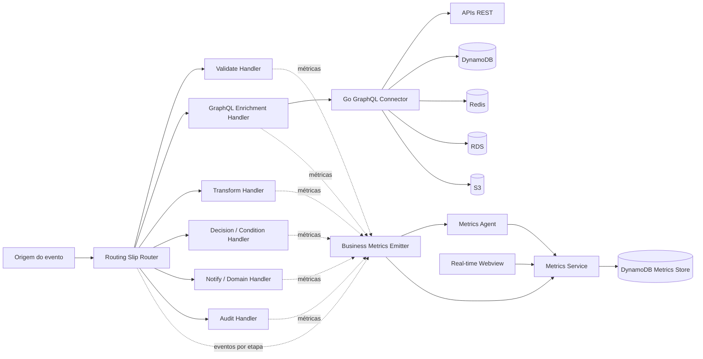
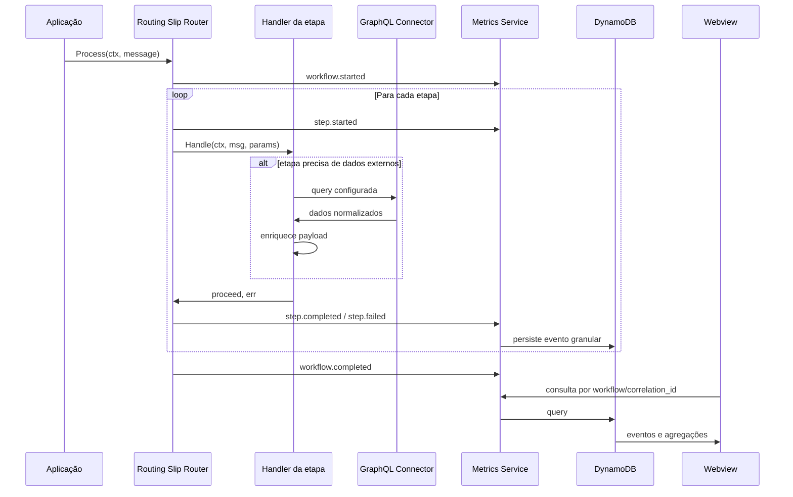
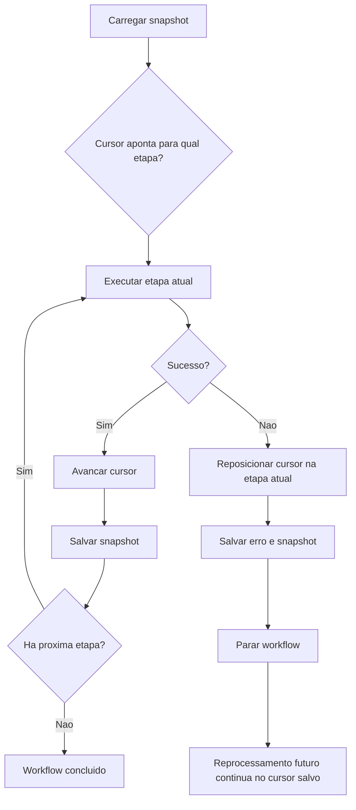
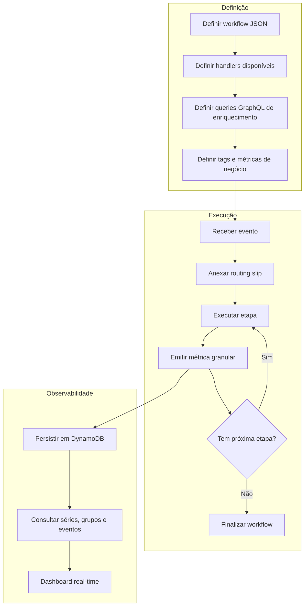

# Routing Slip Pattern - Proposta Arquitetural

## Visão Geral

Este projeto demonstra o uso do padrão **Routing Slip** para processamento de workflows dinâmicos em Go. A proposta evoluída transforma o projeto em uma base para uma ferramenta resiliente, robusta, escalável, reutilizável, observável, segura e modular, aplicável a qualquer tipo de workflow.

O motor principal continua simples: uma mensagem carrega um payload, metadados e uma lista ordenada de etapas. Cada etapa é resolvida em tempo de execução por um handler registrado. A evolução proposta adiciona dois pilares:

- **Integração externa para enriquecimento de payload** usando o projeto `go-graphql-connector` como camada unificada de acesso a APIs, bancos, caches e serviços externos.
- **Observabilidade granular de negócio** usando a ideia do projeto `custom-business-metrics` para publicar eventos e métricas por workflow, etapa, decisão, erro e payload enriquecido.

Com isso, o routing slip deixa de ser apenas uma sequência de handlers e passa a funcionar como um **orquestrador modular e observável**, capaz de enriquecer dados, tomar decisões, registrar evidências e expor o andamento do processamento em tempo real.

## Objetivo

Construir uma fundação técnica para workflows que precisam:

- receber qualquer tipo de payload;
- montar rotas de processamento dinamicamente;
- enriquecer dados consultando fontes externas;
- aplicar validações, decisões e transformações;
- continuar, parar ou pular etapas conforme política configurável;
- registrar histórico e erros por etapa;
- emitir métricas de negócio e eventos operacionais;
- permitir visualização em tempo real do processamento;
- ser reutilizada em diferentes domínios sem acoplamento ao caso de uso.

## Projetos Relacionados

Os projetos internos devem ser incorporados ao repositório principal como **Git submodules**. Isso preserva a autonomia de cada projeto, evita copiar código privado para dentro do app e permite versionar exatamente qual revisão do conector GraphQL e da plataforma de métricas foi usada em cada versão do routing slip.

Topologia proposta:

```text
routing-slip-pattern/
├── app/
│   └── modulo Go do routing slip
├── go-graphql-connector/
│   └── submodule privado para integracoes externas (branch develop)
├── custom-business-metrics/
│   └── submodule para metricas, DynamoDB e webview
├── docker/
│   └── Dockerfiles customizaveis por servico
├── docker-compose.yml
├── Makefile
└── DOCUMENTATION.md
```

Comandos úteis:

```bash
git submodule update --init --recursive
make prepare
make run
make test
make compose-up
```

Para validação local integrada, use `make prepare` antes de `make run`. O prepare sobe a stack de observabilidade com DynamoDB, metrics service, metrics agent, webview e serviços mockados de integração externa. O `make run` fica responsável por executar os cenários de workflow e popular o dashboard.

### Dockerfiles e CA Interna

O `docker-compose.yml` referencia Dockerfiles explícitos no diretório `docker/`, em vez de usar apenas imagens diretas. Isso facilita adaptar a execução para ambientes corporativos onde é necessário instalar certificados internos, configurar proxy, ajustar variáveis de ambiente ou preparar bundles de CA para SDKs.

Padrão recomendado para imagens Alpine, como `golang:1.22-alpine`, `golang:1.24-alpine`, `golang:1.25-alpine` e `nginx:alpine`:

```dockerfile
RUN apk add --no-cache ca-certificates && update-ca-certificates
COPY certs/internal-ca.crt /usr/local/share/ca-certificates/internal-ca.crt
RUN update-ca-certificates
ENV AWS_CA_BUNDLE=/usr/local/share/ca-certificates/internal-ca.crt
```

Para imagens baseadas em AWS CLI ou DynamoDB Local, valide o sistema operacional base antes de instalar pacotes. O AWS CLI respeita `AWS_CA_BUNDLE`; já o DynamoDB Local roda em JVM e pode exigir importação da CA no truststore Java com `keytool`, além do bundle Linux.

### `routing-slip-pattern`

Fornece o núcleo de orquestração:

- `Message`: unidade de trabalho com payload mutável, headers, routing slip, histórico e erros.
- `StepDef`: definição de etapa com nome e parâmetros.
- `Handler`: contrato para qualquer etapa de processamento.
- `Router`: executor do workflow, registry de handlers, middlewares e política de erro.
- `SlipBuilder`: API fluente para montar rotas em código.
- `StateStore`: contrato para persistir snapshots e permitir retomada.
- `MessageSnapshot`: estado serializável da mensagem, incluindo cursor.
- `config`: carregamento de workflows via JSON.

### `go-graphql-connector`

Pode ser usado como **Anti-Corruption Layer** e camada de integração:

- expõe uma API GraphQL dinâmica por configuração;
- resolve campos GraphQL usando conectores REST, DynamoDB, S3, RDS e Redis;
- permite timeout, retry e falha parcial por conector;
- carrega schema e conectores de arquivo local, variáveis de ambiente, SSM, Secrets Manager, S3 ou DynamoDB;
- centraliza a forma como workflows acessam dados externos.

### `custom-business-metrics`

Inspira a camada de métricas e visualização:

- captura métricas customizadas de negócio;
- aceita tags livres como `workflow`, `step`, `status`, `correlation_id`, `trace_id` e identificadores de domínio;
- armazena eventos em DynamoDB ou memória;
- permite consultas agregadas, séries temporais e dashboards em tempo real;
- separa emissão de métricas do fluxo principal via agent ou API HTTP.

## Arquitetura Proposta



## Funcionamento

1. Uma aplicação cria uma `Message` com `ID`, `Payload` e `Headers`.
2. Um routing slip é anexado à mensagem por JSON, builder fluente ou outro mecanismo dinâmico.
3. O `Router` executa as etapas na ordem definida.
4. Cada handler lê e altera o payload conforme sua responsabilidade.
5. Um handler de enriquecimento pode consultar o `go-graphql-connector` para buscar dados externos.
6. Middlewares emitem métricas antes e depois de cada etapa.
7. Erros são registrados na própria mensagem e tratados conforme a política configurada.
8. Eventos de negócio são gravados em uma base analítica, como DynamoDB.
9. Uma interface consulta a base de métricas para exibir o progresso em tempo real.



## Componentes Funcionais

### 1. Motor de Routing Slip

Responsável por executar a rota anexada à mensagem. Ele deve permanecer pequeno, previsível e reutilizável.

Responsabilidades:

- registrar handlers por nome;
- aplicar middlewares;
- respeitar `context.Context`;
- executar etapas em ordem;
- armazenar histórico por etapa;
- aplicar políticas de erro;
- permitir parada graciosa com `proceed=false`.
- persistir o cursor para retomar processamentos interrompidos.

Políticas de erro:

| Política | Comportamento |
|---|---|
| `stop` | Para o workflow no primeiro erro. |
| `continue` | Registra o erro e segue para a próxima etapa. |
| `skip` | Registra o erro e marca a etapa como pulada. |

### 1.1. Retomada e Reprocessamento

Um diferencial essencial da proposta é permitir que um workflow pare em uma etapa e seja retomado sem repetir etapas anteriores. Isso evita o problema comum em orquestrações estáticas: quando uma execução falha no meio, o reprocessamento precisa voltar ao início e pode executar novamente ações que já produziram efeitos.

O modelo usa um `MessageSnapshot` persistido a cada mudança relevante de estado:

- antes do workflow iniciar;
- imediatamente antes de executar uma etapa;
- depois de uma etapa concluir;
- quando uma etapa falha;
- quando o workflow termina.

O campo mais importante é o `cursor`, que representa o índice da próxima etapa a executar. Quando uma etapa falha com política `StopOnError`, o router reposiciona o cursor para a etapa que falhou. Assim, o próximo reprocessamento reexecuta aquela etapa e segue o fluxo a partir dela.



Exemplo conceitual:

```go
store := slip.NewMemoryStateStore()
router := slip.NewRouter(
    slip.WithErrorPolicy(slip.StopOnError),
    slip.WithStateStore(store),
)

err := router.Process(ctx, msg)
if err != nil {
    snapshot, _ := store.Load(ctx, msg.ID)
    resumed := slip.MessageFromSnapshot(snapshot)
    _ = router.Process(ctx, resumed)
}
```

Em produção, o `MemoryStateStore` deve ser substituído por um adapter persistente, como DynamoDB. A tabela de estado do workflow pode ser separada da tabela de métricas.

Modelo sugerido para estado:

| Atributo | Uso |
|---|---|
| `pk` | `MESSAGE#<message_id>` |
| `sk` | `STATE#CURRENT` |
| `workflow` | Nome do workflow |
| `cursor` | Próxima etapa a executar |
| `status` | `running`, `failed`, `completed`, `stopped` |
| `payload` | Payload atual ou referência externa |
| `slip` | Lista versionada das etapas |
| `history` | Etapas concluídas |
| `errors` | Erros por etapa |
| `updated_at` | Controle operacional |

Para etapas com efeitos colaterais, a recomendação é combinar retomada com idempotência por `message_id`, `step` e `attempt`. Assim, mesmo que uma falha ocorra após uma chamada externa, o handler consegue detectar se a ação já foi aplicada.

### 2. Handler de Enriquecimento via GraphQL

A evolução proposta adiciona um handler conceitual chamado `graphql_enrich`.

Esse handler não deve conhecer diretamente REST, DynamoDB, Redis, S3 ou RDS. Ele conhece apenas o contrato GraphQL e deixa o `go-graphql-connector` resolver as integrações externas por configuração.

Exemplo de etapa:

```json
{
  "name": "graphql_enrich",
  "enabled": true,
  "params": {
    "endpoint": "http://localhost:8080/graphql",
    "query": "query ($customerID: String!) { customer(id: $customerID) { id riskSegment status creditLimit } }",
    "variables": {
      "customerID": "{customer_id}"
    },
    "target": "customer_profile",
    "timeout_ms": 800,
    "required": true
  }
}
```

Resultado esperado no payload:

```json
{
  "customer_id": "CUST-42",
  "product_id": "SKU-9000",
  "quantity": 3,
  "customer_profile": {
    "id": "CUST-42",
    "riskSegment": "LOW",
    "status": "ACTIVE",
    "creditLimit": 2500
  }
}
```

Benefícios:

- reduz acoplamento entre handlers e serviços externos;
- centraliza timeout, retry, credenciais e conectores;
- cria uma camada anticorrupção para dados legados;
- permite trocar fontes externas sem alterar o workflow;
- permite enriquecer payloads de qualquer domínio.

### 3. Métricas Granulares do Routing Slip

A evolução proposta adiciona um middleware conceitual chamado `MetricsMiddleware`.

Esse middleware emite eventos para o `custom-business-metrics` ou para uma API compatível. Os eventos podem ser enviados diretamente por HTTP ou por um agent UDP para reduzir impacto no fluxo principal.

Eventos mínimos:

- `workflow.started`
- `workflow.completed`
- `workflow.failed`
- `step.started`
- `step.completed`
- `step.failed`
- `step.skipped`
- `step.stopped`
- `payload.enriched`
- `decision.evaluated`

Exemplo de evento:

```json
{
  "name": "routing_slip.step.completed",
  "kind": "count",
  "value": 1,
  "unit": "event",
  "workflow": "order-processing",
  "step": "graphql_enrich",
  "status": "success",
  "source": "routing-slip-router",
  "tags": {
    "message_id": "MSG-001",
    "correlation_id": "corr-abc",
    "trace_id": "trace-xyz",
    "handler": "graphql_enrich",
    "error_policy": "stop",
    "duration_ms": "37",
    "target": "customer_profile"
  },
  "timestamp": "2026-05-13T12:00:00Z"
}
```

Consultas habilitadas:

- quantas mensagens estão em cada etapa;
- quais etapas mais falham;
- duração média por handler;
- quais payloads foram enriquecidos;
- quais workflows pararam por regra de decisão;
- histórico granular por `message_id`, `correlation_id` ou `trace_id`;
- throughput por workflow, domínio ou origem.

## Modelo de Workflow Proposto

```json
{
  "name": "generic-enriched-workflow",
  "description": "Workflow genérico com enriquecimento externo e métricas granulares",
  "error_policy": "stop",
  "observability": {
    "enabled": true,
    "metrics_endpoint": "http://localhost:8080/v1/metrics",
    "emit_payload_hash": true,
    "emit_payload_snapshot": false,
    "business_tags": ["customer_id", "product_id", "region"]
  },
  "steps": [
    {
      "name": "validate",
      "enabled": true,
      "params": {
        "required": ["customer_id", "product_id", "quantity"],
        "stop_on_failure": true
      }
    },
    {
      "name": "graphql_enrich",
      "enabled": true,
      "params": {
        "endpoint": "http://localhost:8080/graphql",
        "query": "query ($customerID: String!) { customer(id: $customerID) { id status riskSegment } }",
        "variables": {
          "customerID": "{customer_id}"
        },
        "target": "customer_profile",
        "timeout_ms": 800,
        "required": true
      }
    },
    {
      "name": "condition",
      "enabled": true,
      "params": {
        "field": "customer_profile.status",
        "equals": "ACTIVE"
      }
    },
    {
      "name": "transform",
      "enabled": true,
      "params": {
        "field": "customer_id",
        "operation": "uppercase",
        "target": "customer_id"
      }
    },
    {
      "name": "audit",
      "enabled": true,
      "params": {
        "event": "workflow.processed",
        "fields": ["customer_id", "product_id", "customer_profile"]
      }
    }
  ]
}
```

## Árvore de Decisão Funcional


## Processo Operacional



## Exemplo de Dashboard em Tempo Real

Widgets recomendados:

| Widget | Consulta |
|---|---|
| Total processado | `name=routing_slip.workflow.completed` |
| Falhas por etapa | `name=routing_slip.step.failed groupBy=step` |
| Latência por handler | `name=routing_slip.step.duration groupBy=step` |
| Workflows em andamento | `status=started - completed` |
| Enriquecimentos externos | `name=routing_slip.payload.enriched groupBy=target` |
| Jornada por mensagem | `tag.message_id=MSG-001` |

## Segurança

Princípios recomendados:

- não persistir payload completo por padrão em métricas;
- emitir hash, resumo ou campos permitidos quando necessário;
- usar allowlist de tags de negócio;
- proteger endpoint GraphQL e endpoint de métricas com autenticação;
- isolar credenciais no `go-graphql-connector`;
- usar timeouts curtos para integrações externas;
- validar tamanho máximo de payload e resposta externa;
- registrar erros sem vazar segredos;
- usar TLS fora do ambiente local;
- aplicar IAM mínimo para DynamoDB, SSM, Secrets Manager, S3 e demais fontes.

## Resiliência e Escalabilidade

Recomendações:

- handlers devem ser idempotentes quando possível;
- cada etapa deve respeitar `context.Context`;
- integrações externas devem ter timeout e retry configuráveis;
- falhas parciais podem ser tratadas por `required=false` em enriquecimentos;
- métricas devem ser emitidas de forma assíncrona ou com fallback não bloqueante;
- DynamoDB deve usar chaves compatíveis com consulta por workflow, tempo, step e correlation id;
- payloads grandes devem ser armazenados fora da trilha quente de métricas;
- workflows devem ser versionados.

## Modelo de Dados para Métricas

Um desenho possível para DynamoDB:

| Atributo | Uso |
|---|---|
| `pk` | `WORKFLOW#<workflow>#DATE#<yyyy-mm-dd>` |
| `sk` | `<timestamp>#<message_id>#<step>#<event>` |
| `gsi1pk` | `CORRELATION#<correlation_id>` |
| `gsi1sk` | `<timestamp>#<workflow>#<step>` |
| `gsi2pk` | `STEP#<workflow>#<step>` |
| `gsi2sk` | `<timestamp>#<status>#<message_id>` |
| `expires_at` | TTL para retenção automática |
| `tags` | mapa livre para filtros de negócio |

Esse modelo favorece:

- linha do tempo por workflow;
- busca e2e por correlação;
- análise por etapa;
- retenção automática;
- dashboards com janelas recentes.

## Contratos Recomendados

### Handler

```go
type Handler interface {
    Name() string
    Handle(ctx context.Context, msg *Message, params map[string]any) (proceed bool, err error)
}
```

### Emissor de Métricas

```go
type MetricsEmitter interface {
    Emit(ctx context.Context, event MetricEvent) error
}
```

### Evento de Métrica

```go
type MetricEvent struct {
    Name      string
    Kind      string
    Value     float64
    Unit      string
    Workflow  string
    Step      string
    Status    string
    Source    string
    Tags      map[string]string
    Timestamp time.Time
}
```

### Cliente de Enriquecimento

```go
type ExternalDataClient interface {
    Query(ctx context.Context, query string, variables map[string]any) (map[string]any, error)
}
```

## Estratégia de Implementação

### Fase 1 - Núcleo Observável

- adicionar `MetricsMiddleware`;
- emitir eventos de início, fim, erro, skip e parada;
- criar `MetricEvent` e `MetricsEmitter`;
- implementar emitter em memória para testes;
- implementar emitter HTTP/UDP compatível com `custom-business-metrics`.

### Fase 2 - Enriquecimento Externo

- adicionar `GraphQLEnrichmentHandler`;
- interpolar variáveis a partir do payload;
- aplicar timeout por etapa;
- gravar resposta no campo `target`;
- suportar `required=true/false`;
- emitir evento `payload.enriched`.

### Fase 3 - Persistência e Dashboard

- usar o service do `custom-business-metrics`;
- persistir métricas em DynamoDB;
- criar dashboards por workflow, etapa e correlação;
- adicionar filtros por tags de negócio.

### Fase 4 - Generalização

- versionar workflows;
- registrar catálogo de handlers;
- validar JSON de configuração;
- adicionar suporte a regras dinâmicas;
- permitir múltiplas estratégias de roteamento;
- publicar SDK para aplicações produtoras.

## Benefícios

- **Modularidade:** handlers pequenos, focados e intercambiáveis.
- **Reutilização:** o mesmo motor atende workflows de pedidos, pagamentos, logística, crédito, cadastro ou conciliação.
- **Observabilidade:** cada etapa gera eventos consultáveis em tempo real.
- **Segurança:** integrações e credenciais ficam isoladas no conector.
- **Resiliência:** políticas de erro, timeouts e fallbacks controlam falhas.
- **Escalabilidade:** métricas e workflows podem crescer independentemente.
- **Transparência:** histórico e métricas explicam como cada payload foi processado.
- **Baixo acoplamento:** APIs externas são consumidas via GraphQL configurável, não diretamente pelos handlers de domínio.

## Exemplo Aplicado: Pedido de E-commerce

Payload inicial:

```json
{
  "customer_id": "cust-42",
  "product_id": "SKU-9000",
  "quantity": 3,
  "correlation_id": "corr-001"
}
```

Fluxo:

1. `validate` garante campos obrigatórios.
2. `graphql_enrich` busca perfil do cliente, limite, região e flags de risco.
3. `condition` interrompe se o cliente não está ativo.
4. `transform` normaliza identificadores.
5. `notify` avisa canais operacionais.
6. `audit` registra evidência funcional.
7. `MetricsMiddleware` registra todos os passos no DynamoDB.
8. A webview mostra a jornada pelo `correlation_id`.

Resultado: é possível saber em tempo real quando o pedido entrou, quais dados externos foram usados, quanto tempo cada etapa levou, onde falhou e qual foi o estado final.

## Conclusão

A proposta une três capacidades complementares:

- o `routing-slip-pattern` como motor de workflow;
- o `go-graphql-connector` como camada de integração e enriquecimento;
- o `custom-business-metrics` como camada de telemetria de negócio e visualização real-time.

Essa combinação cria uma plataforma de processamento orientada a metadados, com baixo acoplamento, alta explicabilidade e capacidade de adaptação para múltiplos domínios.
