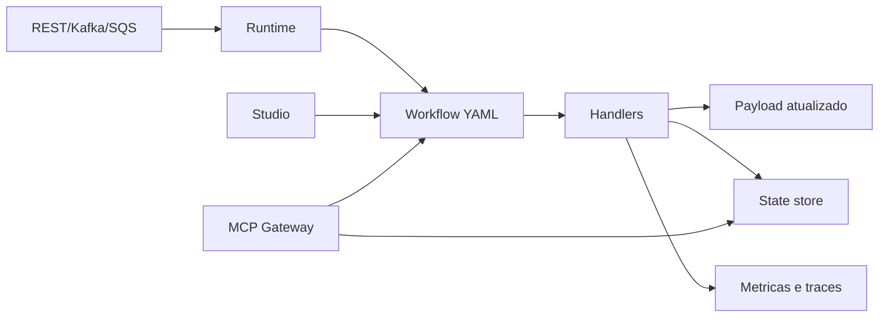

# Routing Slip Pattern

O `routing-slip-pattern` e um framework para construir workflows modulares, rastreaveis e reprocessaveis. Ele permite descrever processos em YAML, executar cada etapa com handlers reutilizaveis, enriquecer payloads com dados externos, registrar metricas e retomar uma execucao do ponto correto quando algo falha.

A proposta e tornar o processamento explicito. O caminho do fluxo fica no arquivo YAML, o estado fica no state store, os resultados aparecem em historico e metricas, e o Studio oferece um ambiente para criar, testar e entender os workflows.



## Objetivo

O projeto oferece uma base resiliente, robusta, escalavel, reutilizavel, observavel, segura e modular para workflows de qualquer dominio.

Ele ajuda a responder:

- o que deve acontecer agora;
- quais dados foram usados;
- qual regra decidiu o caminho;
- onde uma execucao parou;
- como continuar sem repetir efeitos anteriores;
- quais metricas explicam o comportamento do processo.

## Projetos do ecossistema

| Projeto | Funcao |
| --- | --- |
| `routing-slip-pattern` | Runtime de workflows, handlers, state store, triggers REST/Kafka/SQS e MCP Gateway. |
| `go-graphql-connector` | Fachada GraphQL configuravel para consumir APIs, DynamoDB, Redis, S3, RDS e outros conectores. |
| `custom-business-metrics` | Ingestao, armazenamento e visualizacao de metricas funcionais e tecnicas. |

## Conceitos fundamentais

| Conceito | Descricao |
| --- | --- |
| Workflow | Sequencia declarativa de etapas. |
| Routing slip | Lista de steps que acompanha a mensagem. |
| Handler | Unidade de execucao de uma etapa. |
| Payload | Documento JSON processado e enriquecido ao longo do fluxo. |
| Cursor | Posicao da proxima etapa a executar. |
| State store | Persistencia do snapshot de execucao. |
| Idempotencia | Protecao contra repeticao de efeitos ja concluidos. |
| Trace | Identificador tecnico para acompanhar chamadas ponta a ponta. |
| Correlation | Identificador funcional para agrupar eventos do mesmo processo. |
| MCP | Interface de tools para validar, explicar, consultar e planejar workflows. |

## Execucao local

Na raiz do workspace integrado:

```bash
make start
make studio
```

O ambiente local possui dois modos de execucao.

| Modo | Comando | Quando usar |
| --- | --- | --- |
| Stack padrao | `make prepare` | Usa containers separados para runtime, GraphQL, metricas e dependencias. E o modo recomendado para testes integrados mais fieis. |
| Compacto | `make run-compact` | Executa `routing-slip-pattern`, `go-graphql-connector` e `custom-business-metrics` em um unico container local, com portas separadas. E util para demonstracoes e testes rapidos. |

URLs comuns:

| Recurso | URL |
| --- | --- |
| Studio local | `http://localhost:8089` |
| Runtime REST | `http://localhost:8088/process` |
| GraphQL Connector | `http://localhost:8090/graphql` |
| Metrics Webview | `http://localhost:5173` |
| MCP Gateway | `http://localhost:9091/mcp` |

No modo compacto, os logs dos processos sao prefixados para facilitar a leitura:

```bash
make logs-compact
```

Esse modo usa storage em memoria para metricas e state store em arquivo dentro do container. Para validar persistencia em DynamoDB, filas e isolamento por servico, use a stack padrao.

## Configuracao

O runtime recebe dois arquivos:

```bash
go run . --config ../config.yaml --workflow ../workflows/payments/payment-fulfillment.yaml
```

O `config.yaml` define trigger, metricas, state store, MCP e endpoints externos.

```yaml
service:
  name: routing-slip-pattern
  run_id: local-config

trigger:
  connector: rest
  mode: sync
  rest:
    addr: ":8088"
    path: /process

features:
  tracing_enabled: true
  persistent_state_enabled: true
  mcp_enabled: false

state_store:
  type: file
  path: .routing-slip-state
  idempotency:
    enabled: true
    key_template: "{workflow}:{message_id}:{step_index}:{step}"
  processing_lock:
    enabled: true
    ttl_seconds: 300

mcp:
  enabled: false
  bind: 127.0.0.1:9091
  mode: readonly
  auth:
    type: none
```

### Conectores de entrada e modo de execucao

O bloco `trigger` separa duas decisoes: **como** o workflow inicia e **como** a chamada deve ser respondida.

| Campo | Valores | Uso |
| --- | --- | --- |
| `trigger.connector` | `rest`, `kafka`, `sqs`, `sns` | Define a origem que aciona o workflow. |
| `trigger.mode` | `sync`, `async` | Define se a chamada espera o resultado ou apenas registra a solicitacao. |
| `trigger.type` | `rest`, `kafka`, `sqs` | Campo legado mantido por compatibilidade. Em novas configuracoes, prefira `connector`. |

No modo `sync`, a chamada REST aguarda a execucao e retorna cursor, historico, payload e erro quando houver. E indicado para integracoes em que o chamador precisa tomar uma decisao imediatamente.

No modo `async`, a chamada REST retorna `202 Accepted` com `message_id` e `correlation_id`, enquanto o processamento segue em segundo plano. Esse modo e mais adequado para batch, eventos e fluxos em que o acompanhamento ocorre por metricas, state store, logs ou MCP.

Exemplo REST sincrono:

```yaml
trigger:
  connector: rest
  mode: sync
  rest:
    addr: ":8088"
    path: /process
```

Exemplo REST assincrono:

```yaml
trigger:
  connector: rest
  mode: async
  rest:
    addr: ":8088"
    path: /process
```

Exemplo Kafka:

```yaml
trigger:
  connector: kafka
  mode: async
  kafka:
    brokers:
      - localhost:9092
    topic: order-events
    group_id: routing-slip-pattern
```

Exemplo SQS em lote:

```yaml
trigger:
  connector: sqs
  mode: async
  sqs:
    endpoint: http://localhost:4566
    region: us-east-1
    queue_url: http://localhost:4566/000000000000/order-events
    wait_time_seconds: 10
    max_messages: 10
    visibility_timeout: 30
```

Exemplo SNS via fila de inscricao:

```yaml
trigger:
  connector: sns
  mode: async
  sns:
    endpoint: http://localhost:4566
    region: us-east-1
    queue_url: http://localhost:4566/000000000000/order-events-sns
    wait_time_seconds: 10
    max_messages: 10
```

Para SNS, o runtime consome a fila SQS inscrita no topico. Se a mensagem vier no envelope padrao do SNS, o campo `Message` e extraido e tratado como payload JSON do workflow.

## Uso em AWS Lambda

O projeto possui um Terraform base em `infra/lambda-layer` para publicar uma **Lambda Layer** do `routing-slip-pattern`. A layer disponibiliza configuracoes, workflows e assets em `/opt/routing-slip`, permitindo construir Lambdas mais simples: o codigo Go importa o framework no build e carrega os arquivos da layer em runtime.

> Em Go, uma Lambda e compilada como binario. A layer nao injeta pacotes Go no build automaticamente; ela funciona como pacote operacional para arquivos compartilhados, workflows, configuracoes, certificados ou extensoes.

Publicar a layer:

```bash
cd infra/lambda-layer
terraform init
terraform apply \
  -var='aws_region=us-east-1' \
  -var='layer_name=routing-slip-pattern-framework'
```

Depois de criada, preencha as referencias de ARN onde precisar anexar a layer:

```hcl
routing_slip_layer_version_arn = "arn:aws:lambda:REGION:ACCOUNT:layer:routing-slip-pattern-framework:1"
extra_layer_arns = [
  "arn:aws:lambda:REGION:ACCOUNT:layer:certificados-internos:1"
]
```

Criar uma Lambda exemplo anexando a layer:

```bash
terraform apply \
  -var='create_example_lambda=true' \
  -var='example_lambda_package_file=./function.zip' \
  -var='extra_layer_arns=["arn:aws:lambda:REGION:ACCOUNT:layer:certificados-internos:1"]'
```

No ambiente Docker do laboratorio, o serviço `routing-slip-app` simula esse desenho: o binario fica em `/var/task/bootstrap`, a layer e montada em `/opt/routing-slip` e a chamada REST continua exposta em `http://localhost:8088/process`.

Exemplo de Lambda Go usando workflow da layer:

```go
package main

import (
	"context"
	"encoding/json"
	"os"

	"github.com/aws/aws-lambda-go/lambda"
	"github.com/raywall/routing-slip-pattern/app/handlers"
	"github.com/raywall/routing-slip-pattern/app/slip"
	"gopkg.in/yaml.v3"
)

type workflowFile struct {
	Name              string         `yaml:"name"`
	MessageIDPath     string         `yaml:"message_id_path"`
	CorrelationIDPath string         `yaml:"correlation_id_path"`
	Steps             []slip.StepDef `yaml:"steps"`
}

func main() {
	workflowPath := env("ROUTING_SLIP_WORKFLOW_PATH", "/opt/routing-slip/workflows/workflow.yaml")
	data, err := os.ReadFile(workflowPath)
	if err != nil {
		panic(err)
	}

	var workflow workflowFile
	if err := yaml.Unmarshal(data, &workflow); err != nil {
		panic(err)
	}

	router := slip.NewRouter(slip.WithErrorPolicy(slip.StopOnError))
	router.MustRegister(handlers.ValidationHandler{})
	router.MustRegister(handlers.EnrichmentHandler{})
	router.MustRegister(handlers.AuditHandler{})

	lambda.Start(func(ctx context.Context, payload map[string]any) (map[string]any, error) {
		messageID, _ := payload[workflow.MessageIDPath].(string)
		if messageID == "" {
			messageID = "lambda-request"
		}

		msg := slip.NewMessage(messageID, payload)
		msg.Headers["workflow"] = workflow.Name
		msg.AttachSlip(workflow.Steps)

		err := router.Process(ctx, msg)
		return map[string]any{
			"message_id":      msg.ID,
			"correlation_id":  msg.CorrelationID,
			"cursor":          msg.Cursor(),
			"remaining_steps": msg.RemainingSteps(),
			"payload":         msg.Payload,
			"errors":          msg.Errors,
		}, err
	})
}

func env(key, fallback string) string {
	if value := os.Getenv(key); value != "" {
		return value
	}
	return fallback
}
```

Para usar handlers de integracao, registre tambem `GraphQLEnrichmentHandler`, `RESTCallHandler`, `NotificationHandler` e demais handlers necessarios. Em cenarios com reprocessamento duravel, configure um `StateStore` compatível, como DynamoDB, ao criar o `Router`.

## Estrutura basica de workflow

```yaml
name: order-processing
description: Processa evento de pedido recebido.
version: "1.0"
error_policy: stop
message_id_path: order_id
correlation_id_path: correlation_id

steps:
  - id: validate-input
    name: validate
    params:
      required:
        - order_id
        - customer_id

  - id: load-order
    name: rest_call
    params:
      base_url: https://api.example.test
      endpoint: /orders/{order_id}
      method: GET
      target: order
      required: true

  - id: audit-completed
    name: audit
    params:
      event: order.processing.completed
      fields:
        - correlation_id
        - order_id
        - order.status
```

| Campo | Uso |
| --- | --- |
| `name` | Nome tecnico do workflow. |
| `description` | Descricao funcional. |
| `version` | Versao do script. |
| `error_policy` | `stop`, `continue` ou `skip`. |
| `message_id_path` | Campo usado para identificar e reprocessar. |
| `correlation_id_path` | Campo usado para correlacionar logs, metricas e traces. |
| `steps` | Lista ordenada de etapas. |

Se o payload recebido nao trouxer o campo definido em `correlation_id_path`, o runtime gera automaticamente um UUID v4 com `crypto/rand`, injeta o valor no payload antes da primeira etapa e propaga o mesmo identificador em headers, logs, metricas e traces. Isso evita exemplos com correlacoes fixas como `corr-001` e reduz o risco de duas execucoes independentes compartilharem o mesmo identificador por terem sido disparadas no mesmo instante.

Para idempotencia e retomada, prefira que `message_id_path` aponte para um identificador funcional estavel do evento, como `order_id` ou `event_id`. O `correlation_id` identifica a execucao ponta a ponta; o `message_id` identifica o snapshot usado para reprocessar do ponto em que parou.

## Paths e arrays

Paths usam notacao de ponto para acessar dados do payload:

```json
{
  "order": {
    "id": "ORD-1001",
    "items": [
      { "sku": "SKU-1", "quantity": 2 }
    ]
  }
}
```

| Path | Valor |
| --- | --- |
| `order.id` | `ORD-1001` |
| `order.items.0.sku` | `SKU-1` |

Use paths em validacoes, queries, auditoria, condicoes e interpolacoes:

```yaml
variables:
  orderID: "{order.id}"
```

## Reprocessamento e state store

O state store salva snapshots com cursor, payload, historico, erros, status, trace e estado das etapas. Quando uma execucao falha, o runtime pode carregar o snapshot e continuar da etapa correta.

Tipos suportados:

| Tipo | Uso |
| --- | --- |
| `memory` | Testes e demos descartaveis. |
| `file` | Desenvolvimento local. |
| `dynamodb` | Execucao distribuida e containers. |

Exemplo com DynamoDB:

```yaml
state_store:
  type: dynamodb
  table: routing-slip-state
  endpoint: http://dynamodb:8000
  region: us-east-1
  ttl_days: 30
```

A idempotencia por etapa evita repetir um step ja concluido com sucesso:

```yaml
state_store:
  idempotency:
    enabled: true
    key_template: "{workflow}:{message_id}:{step_index}:{step}"
  processing_lock:
    enabled: true
    ttl_seconds: 300
```

O `processing_lock` protege a entrada do workflow por `message_id`. Quando duas instancias recebem o mesmo item ao mesmo tempo, apenas uma adquire o processamento; a outra recebe conflito no conector REST ou mantém o evento para nova tentativa no conector de fila. Isso evita duplicidade antes mesmo de existir um snapshot salvo.

Quando o mesmo `message_id` já possui snapshot `completed`, o runtime retorna o snapshot persistido sem executar as etapas novamente. Assim, retries tardios, redeliveries de fila e chamadas REST duplicadas não repetem integrações externas nem ações de negócio.

| Campo | Uso |
| --- | --- |
| `idempotency.enabled` | Evita repetir etapas ja concluídas em reprocessamentos. |
| `idempotency.key_template` | Define a chave durável da etapa. |
| `processing_lock.enabled` | Evita processamento simultâneo do mesmo `message_id`. |
| `processing_lock.ttl_seconds` | Tempo máximo do lock antes de ser considerado expirado. |

Use `message_id_path` para um identificador funcional estável do item, como `event_id`, `order_id` ou outro ID de negócio. Esse campo é a base para retomada, idempotência e proteção contra duplicidade. O `correlation_id` identifica a jornada ponta a ponta.

## Resiliencia

Cada step pode declarar retry e tratamento de falha:

```yaml
- id: load-catalog
  name: graphql_enrich
  params:
    target: product
    required: true
  resilience:
    retry:
      attempts: 3
      backoff: exponential
      initial_interval_ms: 200
      max_interval_ms: 1500
      jitter: true
    on_failure:
      action: stop
```

Acoes de falha:

| Acao | Resultado |
| --- | --- |
| `stop` | Para e salva cursor da falha. |
| `continue` | Registra erro e segue. |
| `skip` | Pula a etapa. |
| `jump` | Redireciona para outro step. |

## Composicao de scripts

Use `workflow_ref` para dividir scripts longos:

```yaml
- id: delivery
  name: workflow_ref
  params:
    file: delivery/prepare-delivery.yaml
    prefix: delivery
```

No Studio, o path recomendado parte da raiz do workspace: `microservico/workflow`. Assim, se o workspace possui `service-first/A.yaml` e `service-last/B.yaml`, qualquer script pode referenciar `service-last/B` sem usar `../`.

```yaml
- id: call-last-service
  name: workflow_ref
  params:
    file: service-last/B
    prefix: last
```

O Studio valida se o workflow referenciado existe no workspace aberto. O runtime tambem aceita esse formato quando o workflow principal esta dentro de uma pasta de contexto. Caminhos relativos com `./` ou `../` continuam aceitos por compatibilidade, mas devem ser usados apenas quando fizerem sentido fora do workspace.

O runtime expande o arquivo referenciado e prefixa IDs para evitar conflito. O workflow referenciado herda a mesma mensagem do workflow principal, incluindo `message_id`, `correlation_id`, `trace_id`, headers e payload atual. Com isso, a rastreabilidade e2e permanece contínua mesmo quando o processo é dividido em vários arquivos.

## Handlers disponiveis

| Handler | Quando usar |
| --- | --- |
| `validate` | Validar campos obrigatorios. |
| `condition` | Parar o fluxo sem erro tecnico quando uma regra nao bate. |
| `assert` | Falhar o workflow quando uma regra obrigatoria nao e atendida. |
| `compute` | Criar valores derivados. |
| `cel` | Avaliar expressoes CEL. |
| `filter_array` | Filtrar itens de arrays. |
| `array_transform` | Filtrar arrays, alterar campos dos itens e transformar arrays aninhados. |
| `enrich` | Adicionar dados estaticos ao payload. |
| `transform` | Normalizar texto. |
| `graphql_enrich` | Enriquecer via GraphQL Connector. |
| `rest_call` | Chamar API REST diretamente. |
| `aws_action` | Executar efeitos controlados em DynamoDB, S3, SQS, SNS, Secrets Manager ou Parameter Store. |
| `datadog_metric` | Enviar metrica customizada para o Datadog. |
| `jump_if` | Alterar o cursor para uma etapa posterior. |
| `log` | Registrar um log estruturado explicito. |
| `audit` | Registrar evidencia funcional. |
| `notify` | Disparar ou simular notificacao. |

### validate

```yaml
- name: validate
  params:
    required:
      - correlation_id
      - order_id
```

### assert

```yaml
- name: assert
  params:
    all:
      - field: order.status
        equals: APPROVED
      - field: order.items
        min_items: 1
    message: Order is not ready.
```

Operadores: `equals`, `not_equals`, `less_than`, `less_than_or_equal`, `greater_than`, `greater_than_or_equal`, `min_items`, `max_items`, `exists`.

### compute

```yaml
- name: compute
  params:
    target: has_items
    value:
      field: order.items
      min_items: 1
```

### graphql_enrich

```yaml
- name: graphql_enrich
  params:
    endpoint: http://localhost:8090/graphql
    query: "query ($orderID: String!) { dataSources(orderID: $orderID) { order { id status } } }"
    variables:
      orderID: "{order_id}"
    target: order
    result_path: dataSources.order
    timeout_ms: 3000
    required: true
```

### rest_call

```yaml
- name: rest_call
  params:
    base_url: https://api.example.test
    endpoint: /orders/{order_id}
    method: GET
    target: order
    required: true
```

### log

Use `log` quando uma etapa precisa registrar uma evidencia operacional ou funcional alem dos logs automaticos do runtime. O handler inclui `message_id`, `correlation_id` e `trace_id` quando existirem.

```yaml
- name: log
  params:
    level: info
    message: "Pedido {order_id} validado para expedicao"
    fields:
      - order_id
      - customer.segment
    data:
      source: workflow
      stage: fulfillment
    required: false
```

Opcoes:

| Parametro | Uso |
| --- | --- |
| `level` | `debug`, `info`, `warn` ou `error`. Padrao: `info`. |
| `message` | Texto do log com interpolacao por `{path}`. |
| `fields` | Lista de paths do payload que devem entrar no log. |
| `data` | Objeto adicional com valores fixos ou interpolados. |
| `required` | Se `true`, falha quando um campo em `fields` nao existe. |

### datadog_metric

Use `datadog_metric` para emitir indicadores customizados em pontos importantes do workflow, como processamentos concluidos, reprocessamentos, erros funcionais ou integracoes acionadas.

```yaml
- name: datadog_metric
  params:
    metric: routing_slip.orders.completed
    type: count
    value: 1
    tags:
      workflow: order-fulfillment
      channel: "{input.channel}"
      status: success
    api_key: "{secrets.datadog_api_key}"
    api_url: https://api.datadoghq.com/api/v1/series
    timeout_ms: 2000
    required: false
```

Opcoes:

| Parametro | Uso |
| --- | --- |
| `metric` | Nome da metrica no Datadog. Obrigatorio. |
| `value` | Valor numerico. Padrao: `1`. |
| `type` | `count`, `gauge` ou `rate`. Padrao: `count`. |
| `tags` | Mapa ou lista de tags. O handler adiciona `correlation_id` automaticamente quando existir. |
| `api_key` | Chave do Datadog. Se omitida, usa `DATADOG_API_KEY`. |
| `api_url` | Endpoint da API de series. Se omitido, usa `DATADOG_API_URL` ou a API publica do Datadog. |
| `required` | Se `false`, falhas de envio nao interrompem o workflow. |

### aws_action

Use `aws_action` para efeitos externos que nao devem passar pela camada GraphQL de consulta. O GraphQL Connector continua sendo a camada anticorrupcao para leitura e enriquecimento; `aws_action` fica reservado para comandos e efeitos controlados.

Parametros comuns:

| Parametro | Uso |
| --- | --- |
| `service` | `dynamodb`, `s3`, `sqs`, `sns`, `secretsmanager` ou `ssm`. |
| `action` | Acao do servico, como `put`, `get`, `update`, `delete`, `send` ou `publish`. |
| `region` | Regiao AWS. Padrao: `us-east-1`. |
| `endpoint` | Endpoint alternativo, util para LocalStack. |
| `target` | Path onde o resultado sera gravado no payload. Padrao: `aws_result`. |
| `required` | Se `true`, falhas interrompem o workflow. Se `false`, marca `<target>_partial`. |

#### DynamoDB

```yaml
- name: aws_action
  params:
    service: dynamodb
    action: put
    region: us-east-1
    endpoint: http://localstack:4566
    table: workflow-items
    item:
      pk: "ORDER#{order_id}"
      sk: "STATUS"
      status: "{order.status}"
      updated_at: "{received_at}"
    target: dynamodb_result
```

Leitura:

```yaml
- name: aws_action
  params:
    service: dynamodb
    action: get
    table: workflow-items
    key:
      pk: "ORDER#{order_id}"
      sk: "STATUS"
    target: stored_status
```

Atualizacao:

```yaml
- name: aws_action
  params:
    service: dynamodb
    action: update
    table: workflow-items
    key:
      pk: "ORDER#{order_id}"
      sk: "STATUS"
    update_expression: "SET #status = :status"
    expression_attribute_names:
      "#status": status
    expression_attribute_values:
      ":status": SHIPPED
    target: update_result
```

#### S3

```yaml
- name: aws_action
  params:
    service: s3
    action: put
    endpoint: http://localstack:4566
    bucket: workflow-artifacts
    key: "orders/{order_id}/payload.json"
    body:
      order_id: "{order_id}"
      status: "{order.status}"
    target: s3_result
```

Use `action: get` para ler o arquivo para `target.body` e `action: delete` para remove-lo.

#### SQS e SNS

```yaml
- name: aws_action
  params:
    service: sqs
    action: send
    queue_url: http://localstack:4566/000000000000/order-events
    message:
      type: ORDER_READY
      order_id: "{order_id}"
    target: sqs_result
```

```yaml
- name: aws_action
  params:
    service: sns
    action: publish
    topic_arn: arn:aws:sns:us-east-1:000000000000:order-events
    subject: ORDER_READY
    message:
      order_id: "{order_id}"
      status: "{order.status}"
    target: sns_result
```

#### Secrets Manager e Parameter Store

```yaml
- name: aws_action
  params:
    service: secretsmanager
    action: get
    secret_id: /routing-slip/datadog
    target: datadog_secret
```

```yaml
- name: aws_action
  params:
    service: ssm
    action: put
    name: /routing-slip/orders/max-retries
    value: "3"
    type: String
    overwrite: true
    target: parameter_result
```

### filter_array

```yaml
- name: filter_array
  params:
    source: order.items
    target: valid_items
    where:
      field: item.quantity
      greater_than: 0
```

### array_transform

Use quando alem de filtrar itens for necessario alterar campos dos itens ou processar arrays aninhados.

```yaml
- name: array_transform
  params:
    source: order.items
    target: eligible_items
    filters:
      expr: "item.status == 'AVAILABLE'"
    updates:
      - when:
          field: item.warehouse
          equals: MAIN
        set:
          priority: HIGH
    nested:
      - source: batches
        filters:
          expr: "item.expires_at > today"
```

Durante a avaliacao, o handler disponibiliza `item`, `index`, `parent`, `today` e `end_of_current_month_plus_2`.

### cel

```yaml
- name: cel
  params:
    expr: "order.status == 'APPROVED' && size(order.items) > 0"
    on_false: error
    message: Order is not valid.
```

## Observabilidade

O runtime propaga `traceparent`, `trace_id`, `span_id` e `correlation_id`. O historico de cada step registra status, duracao, tentativa e trace.

```json
{
  "Step": "graphql_enrich",
  "Status": "success",
  "Duration": 180000000,
  "TraceID": "4bf92f3577b34da6a3ce929d0e0e4736",
  "Attempt": 1
}
```

As metricas podem ser consultadas no `custom-business-metrics` por workflow, step, handler, status, correlation ou trace.

## MCP Gateway

O MCP Gateway expoe tools para Studio, agentes e automacoes.

```yaml
mcp:
  enabled: true
  bind: 127.0.0.1:9091
  mode: readonly
  auth:
    type: api_key
    env: ROUTING_SLIP_MCP_API_KEY
```

Tools principais:

| Tool | Uso |
| --- | --- |
| `list_handlers` | Lista handlers e parametros. |
| `validate_workflow` | Valida YAML e saltos. |
| `explain_workflow` | Explica etapas e integracoes. |
| `export_workflow` | Exporta YAML composto. |
| `get_execution` | Recupera snapshot. |
| `list_state_snapshots` | Lista snapshots. |
| `plan_workflow` | Gera rascunho assistido. |
| `generate_workflow_from_business_rules` | Gera YAML e payload base a partir de regras de negocio. |
| `validate_workflow_against_business_rules` | Valida se o workflow cobre regras ativas. |
| `suggest_handlers` | Sugere handlers. |
| `generate_test_payload` | Gera payload de teste. |
| `assess_idempotency` | Aponta riscos de idempotencia. |
| `suggest_metrics` | Sugere metricas e auditorias. |

Exemplo:

```bash
curl -s http://localhost:9091/mcp \
  -H 'content-type: application/json' \
  -d '{"jsonrpc":"2.0","id":1,"method":"tools/list"}'
```

Quando usado pelo Studio no navegador, o gateway responde a preflight `OPTIONS` e expoe headers de rastreabilidade. Em ambiente compartilhado, mantenha `auth.type: api_key` e prefira bind local ou uma camada autenticada na frente do endpoint.

## Planner assistido

O planner MCP ajuda a criar rascunhos a partir de descricao, campos obrigatorios e endpoints. Ele nao grava arquivos nem executa steps; sempre retorna uma proposta para revisao.

```bash
curl -s http://localhost:9091/mcp \
  -H 'content-type: application/json' \
  -d '{
    "jsonrpc": "2.0",
    "id": 10,
    "method": "tools/call",
    "params": {
      "name": "plan_workflow",
      "arguments": {
        "name": "Catalog Sync",
        "description": "Recebe evento de catalogo, consulta API REST de produto e audita o resultado",
        "required_fields": ["correlation_id", "product_id"],
        "endpoints": [
          {
            "name": "product-api",
            "method": "GET",
            "url": "https://api.example.test/products/{product_id}"
          }
        ]
      }
    }
  }'
```

### Geracao por regras de negocio

Quando o usecase possui regras de negocio cadastradas, o MCP pode gerar o primeiro rascunho do workflow e um payload base. A tool usa apenas regras `ACTIVE`; se nenhuma regra ativa existir, usa as regras informadas como rascunho.

```bash
curl -s http://localhost:9091/mcp \
  -H 'content-type: application/json' \
  -d '{
    "jsonrpc": "2.0",
    "id": 11,
    "method": "tools/call",
    "params": {
      "name": "generate_workflow_from_business_rules",
      "arguments": {
        "workflow_name": "order-review",
        "business_rules": [
          {
            "rule_id": "order_total_positive",
            "status": "ACTIVE",
            "execution_order": 1,
            "human_context": {
              "name": "Total positivo",
              "description": "O campo {order.total} deve existir antes da aprovacao."
            },
            "technical_metadata": {
              "dependencies": [
                {"type": "system", "name": "order-api", "component": "orders", "action": "read"}
              ],
              "observability": {
                "datadog_monitor_ids": ["123", "456"],
                "custom_metrics": {
                  "name": "routing_slip.order.total_checked",
                  "type": "gauge",
                  "tags": ["env:production", "team:backend"]
                },
                "log_markers": ["total-check"]
              }
            }
          }
        ]
      }
    }
  }'
```

A resposta inclui:

- `yaml`: workflow inicial com `validate`, `log`, `cel`, `audit` e metricas quando declaradas;
- `test_payload`: payload de entrada com `correlation_id` unico e campos inferidos;
- `coverage`: relacao entre regras e steps sugeridos;
- `decision_notes`: observacoes para revisao humana.

O Studio expõe essa tool no painel de configuracao pelo botao **Gerar por regras**. O resultado aparece como preview no painel principal e pode ser aplicado ao editor com confirmacao.

### Lint orientado por regras

O lint do Studio considera as regras `ACTIVE` do arquivo de projeto. Para cada regra ativa, ele verifica:

- se o `rule_id` ou nome aparece em algum step, auditoria, log ou metrica;
- se campos inferidos em `{path}` aparecem no workflow ou no `validate`;
- se metricas declaradas em `technical_metadata.observability.custom_metrics` possuem `datadog_metric`;
- se marcadores declarados em `technical_metadata.observability.log_markers` possuem `log`;
- se dependencias entre regras apontam para regras ativas do mesmo usecase.

Quando uma regra ativa ainda nao esta coberta pelo script, o lint emite `warn`, nao `error`. Isso permite documentar regras antes da implementacao completa e evoluir o workflow por etapas. A validacao nao substitui revisao funcional; ela funciona como guarda-corpo para evitar que uma regra ativa permaneca esquecida.

## Routing Slip Studio

O Studio oferece:

- workspace local por pastas e arquivos YAML;
- arquivo de projeto do Studio com configuracao, payload, workflow e regras de negocio;
- editor com lint, linhas, comentarios, indentacao e atalhos;
- payload de entrada em JSON;
- configuracao de endpoints REST, GraphQL e MCP;
- execucao simulada;
- visualizacao macro/micro do workflow em diagrama com zoom, movimentacao por mouse, reorganizacao manual dos vertices e download em PNG;
- logs agrupados por etapa, separados por arquivo quando o workflow usa `workflow_ref`, com abas de navegacao por script executado;
- camada de loading bloqueante sobre os logs durante o processamento para evitar interacao enquanto a execucao ainda esta em andamento;
- foco automatico no arquivo e na etapa de origem ao clicar em um log;
- visualizacao e edicao de regras de negocio associadas a cada usecase;
- geracao assistida de workflow e payload a partir das regras de negocio;
- resumo por arquivo executado, com tempo total, integracoes, erros e identificadores (`trace_id`, `correlation_id`) em campos dedicados;
- reprocessamento local;
- validacao e explicacao de workflow via MCP;
- diagnostico de conectores GraphQL, REST e notificacao;
- documentacao integrada;
- tema claro/escuro;
- modo mobile focado em leitura.

A documentacao do Studio e montada a partir de arquivos Markdown em `studio/docs/content`. Cada pasta possui um `index.md` com `sidebar_position` e `sidebar_label`, e cada arquivo de conteudo possui o mesmo front matter para ordenar e nomear os subitens. A interface descobre a estrutura publicada em `docs/content`, lê os headers dos arquivos e monta a navegacao sem depender de `documentation.js` ou `manifest.json`.

No painel de configuracao, os botoes **Validar MCP** e **Explicar MCP** usam o YAML aberto no editor como entrada. O botao **Gerar por regras** usa as regras de negocio do usecase para produzir um rascunho de workflow e payload. O botao **Diagnosticar conectores** faz uma leitura local do workflow e destaca integracoes, endpoints, tentativas e circuit breaker declarado.

### Arquivo de projeto do Studio

O Studio aceita workflows YAML puros, mas ao salvar um usecase pode registrar um projeto mais completo. Esse arquivo guarda tudo que o usuario precisa para retomar a construcao e os testes sem reconfigurar o ambiente:

```yaml
service: exemplos
usecase: recebe-evento-sqs

project_settings:
  use_real_integrations: true
  integrations:
    graphql_endpoint: http://localhost:8090/graphql
    rest_workflow_endpoint: http://localhost:8088/process
    external_api_url: https://mock.example.test
  mcp_server:
    mcp_endpoint: http://localhost:9091/mcp
    mcp_api_key: ""

payload_data: |
  {
    "request_id": "REQ-1001",
    "product_id": "SKU-200",
    "correlation_id": "7331809a-1b6a-4636-9b76-c5b4f483136b"
  }

workflow_script:
  name: recebe-evento-sqs
  error_policy: stop
  message_id_path: request_id
  correlation_id_path: correlation_id
  steps:
    - name: validate
      params:
        required:
          - request_id
          - product_id

business_rules: []
```

Ao exportar, o Studio gera apenas o `workflow_script`, removendo metadados de projeto.

### Business rules

As regras de negocio documentam as decisoes que o workflow representa. Cada regra possui quatro visoes:

| Visao | Objetivo |
| --- | --- |
| `human_context` | Explicar a regra para pessoas de produto, operacao e negocio. |
| `engineering_context` | Registrar aplicacao, tipo, repositorio e ponto de entrada técnico. |
| `ai_logic` | Orientar modelos LLM/MCP sobre como interpretar, investigar ou validar a regra. |
| `technical_metadata` | Registrar dependencias, monitores, metricas e marcadores de log. |

Exemplo neutro:

```yaml
rule_id: validacao_entrega_expressa_01
domain: ecommerce
context: checkout
execution_order: 1
status: ACTIVE
human_context:
  name: Elegibilidade para entrega expressa
  description: >
    A entrega expressa so pode ser oferecida quando o produto esta disponivel
    no centro de distribuicao da regiao e o pedido foi confirmado ate 14h.
  business_owner: Squad Experiencia de Entrega
engineering_context:
  application_name: order-fulfillment
  application_type: workflow
  repository_url: https://github.com/example/order-fulfillment
  entrypoint: workflows/delivery/express-eligibility.yaml
ai_logic: >
  Ao investigar atraso em entrega expressa, valide disponibilidade regional,
  horario de confirmacao do pedido e resultado da regra de elegibilidade.
technical_metadata:
  dependencies:
    - type: business_rule
      rule_id: estoque_regional_disponivel_01
      relation: depends_on
    - type: system
      name: inventory
      component: regional-stock
      action: read
  observability:
    datadog_monitor_ids:
      - "123456"
    custom_metrics:
      name: delivery.express.eligible
      type: gauge
      tags:
        - env:production
        - team:logistics
    log_markers:
      - express-eligibility
```

No workspace, as regras aparecem como subitens do usecase. Ao clicar em uma regra, ela e exibida no painel de resultado em formato de formulario, com campos separados para visao humana, engenharia, IA, observabilidade e dependencias. A tela evita editar YAML cru e reduz o risco de quebrar a estrutura esperada pelo Studio.

Quando o usecase possui mais de uma regra, os botoes **Anterior** e **Proxima** permitem navegar entre elas. Dependencias declaradas com `type: business_rule` e `rule_id` viram links para a regra relacionada; ao abrir uma dependencia, o botao **Voltar** retorna para a regra que originou a navegacao. Ao excluir uma regra, o Studio avisa quando outra regra do mesmo usecase declara dependencia dela.

## Case ecommerce distribuido

O projeto inclui um case completo para validar o ecossistema em um cenário distribuido e neutro: atendimento e entrega de um pedido confirmado em ecommerce.

O case cobre:

- recebimento de evento REST, Kafka ou SQS;
- validacao de payload;
- enriquecimento via `go-graphql-connector`;
- consulta de pedido, cliente, estoque e politica de entrega;
- reserva de estoque;
- calculo de promessa de entrega;
- selecao de transportadora;
- emissao de documento operacional;
- separacao em centro de distribuicao;
- notificacao do cliente;
- atualizacao de status;
- publicacao de evento final;
- metricas, traces, snapshots e reprocessamento.

Arquivos principais:

| Caminho | Uso |
| --- | --- |
| `workflows/ecommerce-distributed/order-fulfillment-main.yaml` | Workflow principal composto. |
| `cases/ecommerce-distributed/payloads` | Payloads de teste. |
| `cases/ecommerce-distributed/mocks` | Script de cadastro e respostas usadas pelo mock service. |
| `cases/ecommerce-distributed/bruno` | Colecao Bruno do case. |
| `cases/ecommerce-distributed/scripts/generate_events.py` | Gerador de eventos e carga REST. |
| `cases/ecommerce-distributed/scripts/run_tests.py` | Runner das suites regressiva, performance, caos e MCP. |
| `go-graphql-connector/examples/ecommerce-distributed` | Configuracao GraphQL do case. |

O script `cases/ecommerce-distributed/scripts/generate_events.py` gera `event_id` unico e UUID v4 novo para `correlation_id` em cada processamento. Isso evita colisao com snapshots antigos e torna cada execucao rastreavel de forma independente.

Comandos:

```bash
make run-ecommerce-case
make ecommerce-rest
make ecommerce-load COUNT=25
make ecommerce-regression
make ecommerce-performance COUNT=100 CONCURRENCY=8
make ecommerce-chaos
make ecommerce-mcp-test
make ecommerce-test-suite COUNT=25 CONCURRENCY=4
```

A colecao Bruno do case possui requisicoes MCP para listar tools, validar o workflow carregado, explicar o fluxo e sugerir metricas. Isso permite testar a camada MCP no mesmo cenario usado para performance, resiliencia e observabilidade.

As suites gravam evidencias em `cases/ecommerce-distributed/results/` com arquivos `latest-regression.json`, `latest-performance.json`, `latest-chaos.json` e `latest-mcp.json`.

Atalhos:

| Atalho | Acao |
| --- | --- |
| `Tab` | Indentar. |
| `Shift+Tab` | Remover indentacao. |
| `Ctrl+/` ou `Cmd+/` | Comentar/descomentar. |
| `Ctrl+Enter` ou `Cmd+Enter` | Processar workflow no Studio. |
| `Ctrl+S` ou `Cmd+S` | Salvar arquivo aberto. |

## Boas praticas

- Defina `message_id_path` e `correlation_id_path`.
- Use `id` estavel nos steps.
- Comece com `validate`.
- Use `audit` em marcos importantes.
- Use `assert` para regras obrigatorias.
- Use `condition` para paradas funcionais esperadas.
- Use `resilience` em integracoes externas.
- Habilite state store em fluxos que precisam de retomada.
- Evite side effects em etapas de enriquecimento.
- Teste com payloads simples antes de ligar integracoes reais.

## Publicacao do framework Go

O framework localizado em `app` e publicado como:

```text
github.com/raywall/routing-slip-pattern/app
```

Pull requests para `main` executam `go mod tidy`, testes e `go vet`. Depois do merge, o workflow
`Publish Go Framework` cria automaticamente a proxima versao patch SemVer, iniciando em `v0.1.0`,
publica uma tag no formato `app/vX.Y.Z` e solicita a versao ao Go Module Proxy para indexacao no
`pkg.go.dev`.

Exemplo de consumo:

```bash
go get github.com/raywall/routing-slip-pattern/app@latest
```

Uma reexecucao da Action para o mesmo commit reutiliza a tag existente. O prefixo `app/` na tag e
obrigatorio para que o Go reconheca corretamente o modulo mantido no subdiretorio.

## Runtime importavel

O Studio desenha e testa workflows. Aplicacoes de producao importam
`github.com/raywall/routing-slip-pattern/app/framework`.

```go
agent, err := metrics.New(metrics.Config{
	ServiceEndpoint: "http://metrics-service:8080/v1/metrics",
})
go agent.Run(ctx)

runtime, err := routing.New(ctx, routing.Options{
	ConfigSource:   source.Local{Path: "config.yaml"},
	WorkflowSource: source.Local{Path: "workflow.yaml"},
	MetricsAgent:   agent,
})
```

`source.Local`, `source.Inline` e `source.AWS` permitem recuperar configuração
e workflow de arquivo local, S3, Secrets Manager, Parameter Store ou DynamoDB.
`source.AWS.Endpoint` permite LocalStack e endpoints privados.

Use `runtime.Run(ctx)` em ECS, EKS, VM ou local; `runtime.Process(ctx, payload)`
em Lambda e consumidores de eventos; e `runtime.Handler()` para integrar com
ALB, API Gateway ou um servidor existente. `runtime.MCPHandler()` expõe
workflows, regras e execuções para clientes MCP.

O runtime adquire processing lease, preserva `correlation_id`, salva snapshots
e impede a repetição de steps concluídos. Exemplos compiláveis estão em
`examples/importable-rest`, `examples/importable-lambda` e
`examples/aws-sources`.
