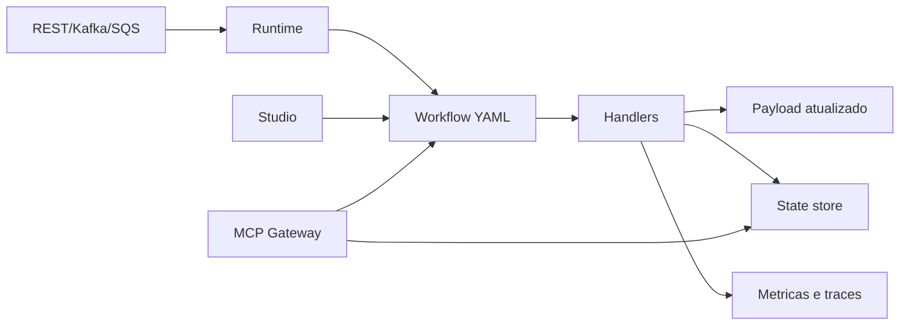

# Routing Slip Pattern

O `routing-slip-pattern` e um framework para construir workflows modulares, rastreaveis e reprocessaveis. Ele permite descrever processos em YAML, executar cada etapa com handlers reutilizaveis, enriquecer payloads com dados externos, registrar metricas e retomar uma execucao do ponto correto quando algo falha.

A proposta e tornar o processamento explicito. O caminho do fluxo fica no arquivo YAML, o estado fica no state store, os resultados aparecem em historico e metricas, e o Studio oferece um ambiente para criar, testar e entender os workflows.



## Objetivo

O projeto oferece uma base resiliente, robusta, escalavel, reutilizavel, observavel, segura e modular para workflows de qualquer dominio.

Ele ajuda a responder:

- o que deve acontecer agora;
- quais dados foram usados;
- qual regra decidiu o caminho;
- onde uma execucao parou;
- como continuar sem repetir efeitos anteriores;
- quais metricas explicam o comportamento do processo.

## Projetos do ecossistema

| Projeto | Funcao |
| --- | --- |
| `routing-slip-pattern` | Runtime de workflows, handlers, state store, triggers REST/Kafka/SQS e MCP Gateway. |
| `go-graphql-connector` | Fachada GraphQL configuravel para consumir APIs, DynamoDB, Redis, S3, RDS e outros conectores. |
| `custom-business-metrics` | Ingestao, armazenamento e visualizacao de metricas funcionais e tecnicas. |

## Conceitos fundamentais

| Conceito | Descricao |
| --- | --- |
| Workflow | Sequencia declarativa de etapas. |
| Routing slip | Lista de steps que acompanha a mensagem. |
| Handler | Unidade de execucao de uma etapa. |
| Payload | Documento JSON processado e enriquecido ao longo do fluxo. |
| Cursor | Posicao da proxima etapa a executar. |
| State store | Persistencia do snapshot de execucao. |
| Idempotencia | Protecao contra repeticao de efeitos ja concluidos. |
| Trace | Identificador tecnico para acompanhar chamadas ponta a ponta. |
| Correlation | Identificador funcional para agrupar eventos do mesmo processo. |
| MCP | Interface de tools para validar, explicar, consultar e planejar workflows. |

## Execucao local

Na raiz do workspace integrado:

```bash
make start
make studio
```

O ambiente local possui dois modos de execucao.

| Modo | Comando | Quando usar |
| --- | --- | --- |
| Stack padrao | `make prepare` | Usa containers separados para runtime, GraphQL, metricas e dependencias. E o modo recomendado para testes integrados mais fieis. |
| Compacto | `make run-compact` | Executa `routing-slip-pattern`, `go-graphql-connector` e `custom-business-metrics` em um unico container local, com portas separadas. E util para demonstracoes e testes rapidos. |

URLs comuns:

| Recurso | URL |
| --- | --- |
| Studio local | `http://localhost:8089` |
| Runtime REST | `http://localhost:8088/process` |
| GraphQL Connector | `http://localhost:8090/graphql` |
| Metrics Webview | `http://localhost:5173` |
| MCP Gateway | `http://localhost:9091/mcp` |

No modo compacto, os logs dos processos sao prefixados para facilitar a leitura:

```bash
make logs-compact
```

Esse modo usa storage em memoria para metricas e state store em arquivo dentro do container. Para validar persistencia em DynamoDB, filas e isolamento por servico, use a stack padrao.

## Configuracao

O runtime recebe dois arquivos:

```bash
go run . --config ../config.yaml --workflow ../workflows/payments/payment-fulfillment.yaml
```

O `config.yaml` define trigger, metricas, state store, MCP e endpoints externos.

```yaml
service:
  name: routing-slip-pattern
  run_id: local-config

trigger:
  type: rest
  rest:
    addr: ":8088"
    path: /process

features:
  tracing_enabled: true
  persistent_state_enabled: true
  mcp_enabled: false

state_store:
  type: file
  path: .routing-slip-state
  idempotency:
    enabled: true
    key_template: "{workflow}:{message_id}:{step_index}:{step}"

mcp:
  enabled: false
  bind: 127.0.0.1:9091
  mode: readonly
  auth:
    type: none
```

## Estrutura basica de workflow

```yaml
name: order-processing
description: Processa evento de pedido recebido.
version: "1.0"
error_policy: stop
message_id_path: order_id
correlation_id_path: correlation_id

steps:
  - id: validate-input
    name: validate
    params:
      required:
        - correlation_id
        - order_id
        - customer_id

  - id: load-order
    name: rest_call
    params:
      base_url: https://api.example.test
      endpoint: /orders/{order_id}
      method: GET
      target: order
      required: true

  - id: audit-completed
    name: audit
    params:
      event: order.processing.completed
      fields:
        - correlation_id
        - order_id
        - order.status
```

| Campo | Uso |
| --- | --- |
| `name` | Nome tecnico do workflow. |
| `description` | Descricao funcional. |
| `version` | Versao do script. |
| `error_policy` | `stop`, `continue` ou `skip`. |
| `message_id_path` | Campo usado para identificar e reprocessar. |
| `correlation_id_path` | Campo usado para correlacionar logs, metricas e traces. |
| `steps` | Lista ordenada de etapas. |

## Paths e arrays

Paths usam notacao de ponto para acessar dados do payload:

```json
{
  "order": {
    "id": "ORD-1001",
    "items": [
      { "sku": "SKU-1", "quantity": 2 }
    ]
  }
}
```

| Path | Valor |
| --- | --- |
| `order.id` | `ORD-1001` |
| `order.items.0.sku` | `SKU-1` |

Use paths em validacoes, queries, auditoria, condicoes e interpolacoes:

```yaml
variables:
  orderID: "{order.id}"
```

## Reprocessamento e state store

O state store salva snapshots com cursor, payload, historico, erros, status, trace e estado das etapas. Quando uma execucao falha, o runtime pode carregar o snapshot e continuar da etapa correta.

Tipos suportados:

| Tipo | Uso |
| --- | --- |
| `memory` | Testes e demos descartaveis. |
| `file` | Desenvolvimento local. |
| `dynamodb` | Execucao distribuida e containers. |

Exemplo com DynamoDB:

```yaml
state_store:
  type: dynamodb
  table: routing-slip-state
  endpoint: http://dynamodb:8000
  region: us-east-1
  ttl_days: 30
```

A idempotencia por etapa evita repetir um step ja concluido com sucesso:

```yaml
state_store:
  idempotency:
    enabled: true
    key_template: "{workflow}:{message_id}:{step_index}:{step}"
```

## Resiliencia

Cada step pode declarar retry e tratamento de falha:

```yaml
- id: load-catalog
  name: graphql_enrich
  params:
    target: product
    required: true
  resilience:
    retry:
      attempts: 3
      backoff: exponential
      initial_interval_ms: 200
      max_interval_ms: 1500
      jitter: true
    on_failure:
      action: stop
```

Acoes de falha:

| Acao | Resultado |
| --- | --- |
| `stop` | Para e salva cursor da falha. |
| `continue` | Registra erro e segue. |
| `skip` | Pula a etapa. |
| `jump` | Redireciona para outro step. |

## Composicao de scripts

Use `workflow_ref` para dividir scripts longos:

```yaml
- id: delivery
  name: workflow_ref
  params:
    file: delivery/prepare-delivery.yaml
    prefix: delivery
```

O runtime expande o arquivo referenciado e prefixa IDs para evitar conflito.

## Handlers disponiveis

| Handler | Quando usar |
| --- | --- |
| `validate` | Validar campos obrigatorios. |
| `condition` | Parar o fluxo sem erro tecnico quando uma regra nao bate. |
| `assert` | Falhar o workflow quando uma regra obrigatoria nao e atendida. |
| `compute` | Criar valores derivados. |
| `cel` | Avaliar expressoes CEL. |
| `filter_array` | Filtrar itens de arrays. |
| `enrich` | Adicionar dados estaticos ao payload. |
| `transform` | Normalizar texto. |
| `graphql_enrich` | Enriquecer via GraphQL Connector. |
| `rest_call` | Chamar API REST diretamente. |
| `jump_if` | Alterar o cursor para uma etapa posterior. |
| `audit` | Registrar evidencia funcional. |
| `notify` | Disparar ou simular notificacao. |

### validate

```yaml
- name: validate
  params:
    required:
      - correlation_id
      - order_id
```

### assert

```yaml
- name: assert
  params:
    all:
      - field: order.status
        equals: APPROVED
      - field: order.items
        min_items: 1
    message: Order is not ready.
```

Operadores: `equals`, `not_equals`, `less_than`, `less_than_or_equal`, `greater_than`, `greater_than_or_equal`, `min_items`, `max_items`, `exists`.

### compute

```yaml
- name: compute
  params:
    target: has_items
    value:
      field: order.items
      min_items: 1
```

### graphql_enrich

```yaml
- name: graphql_enrich
  params:
    endpoint: http://localhost:8090/graphql
    query: "query ($orderID: String!) { dataSources(orderID: $orderID) { order { id status } } }"
    variables:
      orderID: "{order_id}"
    target: order
    result_path: dataSources.order
    timeout_ms: 3000
    required: true
```

### rest_call

```yaml
- name: rest_call
  params:
    base_url: https://api.example.test
    endpoint: /orders/{order_id}
    method: GET
    target: order
    required: true
```

### filter_array

```yaml
- name: filter_array
  params:
    source: order.items
    target: valid_items
    where:
      field: item.quantity
      greater_than: 0
```

### cel

```yaml
- name: cel
  params:
    expr: "order.status == 'APPROVED' && size(order.items) > 0"
    on_false: error
    message: Order is not valid.
```

## Observabilidade

O runtime propaga `traceparent`, `trace_id`, `span_id` e `correlation_id`. O historico de cada step registra status, duracao, tentativa e trace.

```json
{
  "Step": "graphql_enrich",
  "Status": "success",
  "Duration": 180000000,
  "TraceID": "4bf92f3577b34da6a3ce929d0e0e4736",
  "Attempt": 1
}
```

As metricas podem ser consultadas no `custom-business-metrics` por workflow, step, handler, status, correlation ou trace.

## MCP Gateway

O MCP Gateway expoe tools para Studio, agentes e automacoes.

```yaml
mcp:
  enabled: true
  bind: 127.0.0.1:9091
  mode: readonly
  auth:
    type: api_key
    env: ROUTING_SLIP_MCP_API_KEY
```

Tools principais:

| Tool | Uso |
| --- | --- |
| `list_handlers` | Lista handlers e parametros. |
| `validate_workflow` | Valida YAML e saltos. |
| `explain_workflow` | Explica etapas e integracoes. |
| `export_workflow` | Exporta YAML composto. |
| `get_execution` | Recupera snapshot. |
| `list_state_snapshots` | Lista snapshots. |
| `plan_workflow` | Gera rascunho assistido. |
| `suggest_handlers` | Sugere handlers. |
| `generate_test_payload` | Gera payload de teste. |
| `assess_idempotency` | Aponta riscos de idempotencia. |
| `suggest_metrics` | Sugere metricas e auditorias. |

Exemplo:

```bash
curl -s http://localhost:9091/mcp \
  -H 'content-type: application/json' \
  -d '{"jsonrpc":"2.0","id":1,"method":"tools/list"}'
```

Quando usado pelo Studio no navegador, o gateway responde a preflight `OPTIONS` e expoe headers de rastreabilidade. Em ambiente compartilhado, mantenha `auth.type: api_key` e prefira bind local ou uma camada autenticada na frente do endpoint.

## Planner assistido

O planner MCP ajuda a criar rascunhos a partir de descricao, campos obrigatorios e endpoints. Ele nao grava arquivos nem executa steps; sempre retorna uma proposta para revisao.

```bash
curl -s http://localhost:9091/mcp \
  -H 'content-type: application/json' \
  -d '{
    "jsonrpc": "2.0",
    "id": 10,
    "method": "tools/call",
    "params": {
      "name": "plan_workflow",
      "arguments": {
        "name": "Catalog Sync",
        "description": "Recebe evento de catalogo, consulta API REST de produto e audita o resultado",
        "required_fields": ["correlation_id", "product_id"],
        "endpoints": [
          {
            "name": "product-api",
            "method": "GET",
            "url": "https://api.example.test/products/{product_id}"
          }
        ]
      }
    }
  }'
```

## Routing Slip Studio

O Studio oferece:

- workspace local por pastas e arquivos YAML;
- editor com lint, linhas, comentarios, indentacao e atalhos;
- payload de entrada em JSON;
- configuracao de endpoints REST, GraphQL e MCP;
- execucao simulada;
- logs agrupados por etapa;
- resumo com tempo total, `trace_id`, `correlation_id`, integracoes e erros;
- reprocessamento local;
- validacao e explicacao de workflow via MCP;
- diagnostico de conectores GraphQL, REST e notificacao;
- documentacao integrada;
- tema claro/escuro;
- modo mobile focado em leitura.

No painel de configuracao, os botoes **Validar MCP** e **Explicar MCP** usam o YAML aberto no editor como entrada. O botao **Diagnosticar conectores** faz uma leitura local do workflow e destaca integracoes, endpoints, tentativas e circuit breaker declarado.

Atalhos:

| Atalho | Acao |
| --- | --- |
| `Tab` | Indentar. |
| `Shift+Tab` | Remover indentacao. |
| `Ctrl+/` ou `Cmd+/` | Comentar/descomentar. |
| `Ctrl+Enter` ou `Cmd+Enter` | Executar. |
| `Ctrl+S` ou `Cmd+S` | Salvar arquivo aberto. |

## Boas praticas

- Defina `message_id_path` e `correlation_id_path`.
- Use `id` estavel nos steps.
- Comece com `validate`.
- Use `audit` em marcos importantes.
- Use `assert` para regras obrigatorias.
- Use `condition` para paradas funcionais esperadas.
- Use `resilience` em integracoes externas.
- Habilite state store em fluxos que precisam de retomada.
- Evite side effects em etapas de enriquecimento.
- Teste com payloads simples antes de ligar integracoes reais.
