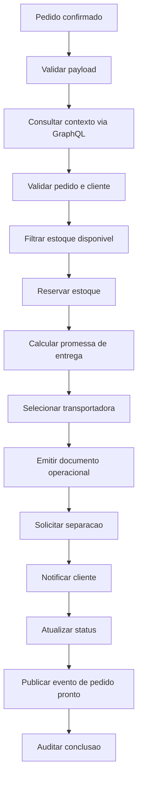

# Case ecommerce-distributed

Este case demonstra um fluxo distribuido de atendimento e entrega de pedidos. O objetivo e validar performance, resiliencia, escalabilidade, rastreabilidade, observabilidade e reprocessamento por cursor usando o ecossistema:

- `routing-slip-pattern`;
- `go-graphql-connector`;
- `custom-business-metrics`;
- mocks em `mock.raysouz.studio`;
- eventos REST, Kafka ou SQS.

O dominio e propositalmente neutro: pedido confirmado em ecommerce, enriquecimento de contexto, reserva de estoque, promessa de entrega, operacao logistica, notificacao e publicacao de evento final.

## Fluxo funcional



## Arquivos principais

| Arquivo | Uso |
|---|---|
| `workflows/ecommerce-distributed/order-fulfillment-main.yaml` | Workflow principal composto. |
| `workflows/ecommerce-distributed/order-context.yaml` | Enriquecimento e validacao do contexto. |
| `workflows/ecommerce-distributed/reserve-and-delivery.yaml` | Reserva, promessa e transportadora. |
| `workflows/ecommerce-distributed/operations-and-notification.yaml` | Operacoes, notificacao e evento final. |
| `cases/ecommerce-distributed/payloads/*.json` | Payloads de teste. |
| `cases/ecommerce-distributed/mocks/*.json` | Modelos de mocks externos. |
| `cases/ecommerce-distributed/bruno` | Colecao Bruno do case. |
| `cases/ecommerce-distributed/scripts/generate_events.py` | Gerador simples de eventos e carga REST. |

## Executando localmente

Suba a stack:

```bash
cd /Users/raysouz/Workspace/estudos/workflows
make prepare
```

Execute o workflow localmente:

```bash
make run-ecommerce-case
```

Envie um payload REST:

```bash
make ecommerce-rest
```

Gere 100 eventos em arquivo NDJSON:

```bash
make ecommerce-events COUNT=100
```

Envie 25 eventos via REST:

```bash
make ecommerce-load COUNT=25
```

## Variantes de teste

| Cenario | Objetivo |
|---|---|
| `happy-path` | Valida o fluxo completo sem falhas. |
| `partial-data` | Simula dados incompletos de estoque para validar decisao alternativa ou parada funcional. |
| `stop-and-reprocess` | Usa o mesmo desenho de payload para validar parada, snapshot e reprocessamento. |
| `slow-connector` | Deve ser configurado no mock para testar timeout e impacto de latencia. |
| `retry-success` | Mock retorna erro nas primeiras chamadas e sucesso depois. |
| `circuit-open` | Mock retorna indisponibilidade ate abrir circuit breaker no connector. |

## Indicadores recomendados

- throughput por segundo;
- tempo total por workflow;
- p50, p90, p95 e p99 por etapa;
- retries por handler ou connector;
- circuit breakers abertos;
- falhas por `trace_id`;
- tempo entre falha e reprocessamento;
- etapas preservadas por idempotencia;
- volume de notificacoes opcionais com falha.

## Criterios de sucesso

- O `trace_id` aparece no runtime, GraphQL connector e metricas.
- A falha de uma integracao obrigatoria salva snapshot com cursor correto.
- O reprocessamento continua do ponto salvo.
- Etapas ja concluidas nao repetem efeitos externos quando a idempotencia estiver habilitada.
- O dashboard de metricas permite localizar a execucao por `correlation_id` ou `trace_id`.
- O Studio consegue explicar o workflow e diagnosticar integracoes pelo MCP.
