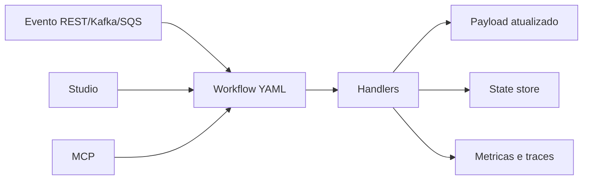

# Visao geral

O `routing-slip-pattern` e um framework para construir workflows modulares, rastreaveis e reprocessaveis. Ele permite descrever o fluxo em YAML, executar cada etapa com handlers reutilizaveis, enriquecer o payload com dados externos, registrar metricas e retomar o processamento do ponto correto quando algo falha.

A proposta e simples: em vez de esconder o processo dentro de codigo imperativo, o workflow deixa o caminho visivel. Cada etapa tem nome, parametros, entrada, saida, status e historico.

O framework foi desenhado para qualquer dominio: pedidos, catalogo, atendimento, logistica, onboarding, validacao documental, notificacoes, sincronizacao de dados ou qualquer processo em etapas.

## O que voce encontra no ecossistema

- **Runtime** para executar workflows.
- **Studio** para editar, validar, simular e entender scripts.
- **GraphQL Connector** para enriquecer payloads com APIs e servicos externos.
- **Custom Business Metrics** para visualizar execucoes, etapas e falhas.
- **State store** para retomada robusta.
- **MCP Gateway** para tools de validacao, explicacao, consulta de estado e planejamento assistido.

## Primeiro contato recomendado

1. Leia os conceitos fundamentais.
2. Abra a estrutura basica de workflow.
3. Entenda paths e arrays.
4. Explore os handlers.
5. Use o Studio para editar e executar um exemplo.
6. Ligue integracoes reais quando o fluxo local estiver claro.
