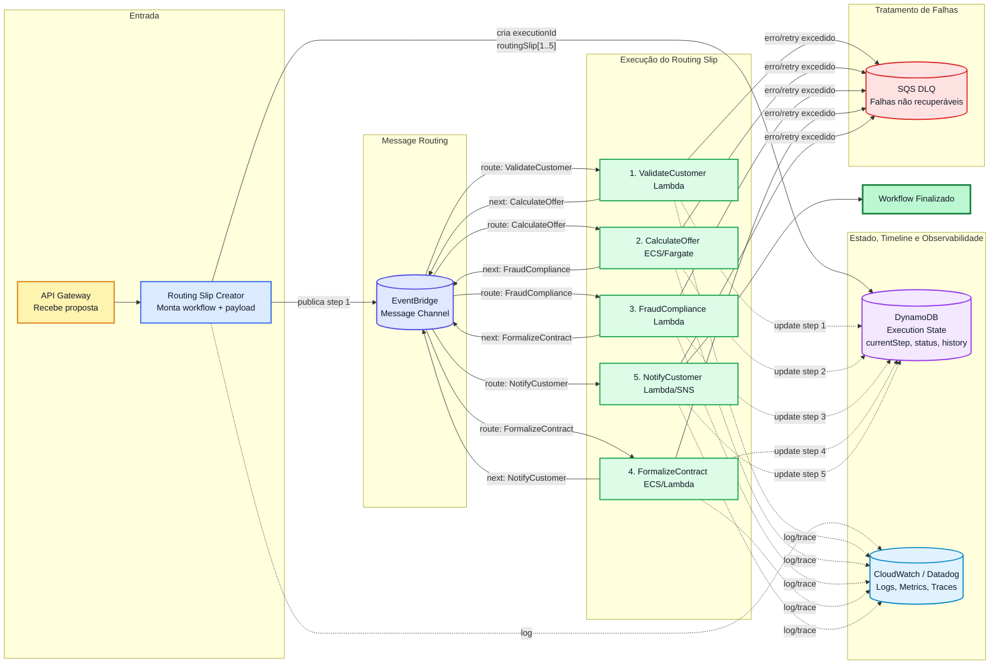

# Routing Slip Pattern

De forma simplificada, um padrão `routing slip` (ou guia de encaminhamento) pode ser definido como um documento ou registro que acompanha um item, mensagem ou paciente através de uma série de etapas ou departamentos de processamento. Tendo como função fundamental, ditar a rota exata a ser seguida e registrar as ações concluídas em cada ponto.

Apesar de ser um termo que pode ser aplicado nos três contextos distintos abaixo, vamos focar apenas no uso do padrão voltado aplicado ao desenvolvimento de sistemas.

  1. Arquitetura de Software (mensageria)
  2. Ambientes Médicos e Clínicos
  3. Logística, Controle de Produção e Corporativo

O padrão `Routing Slip` (ou padrão de encaminhamento) é usado para criar transações distribuídas, permitindo que em vez de um controlador central ditando o caminho (orquestração), **a mensagem carrega seu próprio "itinerário"** contendo uma lista de serviços (atividades) que devem ser executados em sequência.

## Como funciona?

Bastante comum em processos assíncronos ou microsserviços, tanto a ideia quanto a estrutura aplicada a um `routing slip` é bastante simples. `Cada serviço recebe a mensagem, executa sua tarefa, atualiza o status no documento e encaminha para o próximo destino listado`, possibilitando assim um maior controle do processo. Além de gerar rastreabilidade, explicabilidade e viabilizar a criação de `checkpoints` que garantem que um processo possa ser retomado a qualquer momento do exato ponto onde parou. 

[ref](https://www.enterpriseintegrationpatterns.com/patterns/messaging/RoutingTable.html)

## Qual a proposta do framework?

O `routing-slip-pattern` é um framework low-code versátil, robusto e altamente customizável para construir workflows modulares, rastreáveis e capazes de retomada. Ele trata cada processamento como uma execução única, garantindo idempotência e reduzindo riscos de duplicidade. Com ele, você pode:

- Descrever o fluxo de processamento em formato YAML;
- Executar cada etapa com handlers reutilizáveis;
- Enriquece o payload com dados externos;
- Registrar métricas e logs;
- Retomar o processamento exatamente do ponto onde ocorreu uma falha.

A proposta é simples: **em vez de esconder o processo dentro de código imperativo, o workflow deixa o caminho visível**. Cada etapa tem nome, parâmetros, entrada, saída, status e histórico.

O framework foi projetado para atender qualquer domínio: pedidos, catálogo, atendimento, logística, onboarding, validação documental, notificações, sincronização de dados – ou qualquer processo que precise ser executado em etapas.

## O que você encontra no ecossistema?

- **Runtime**: executa os workflows.
- **Studio**: editor para criar, validar, simular e entender scripts.
- **GraphQL Connector**: enriquece payloads com APIs e serviços externos.
- **Custom Business Metrics**: visualiza execuções, etapas e falhas.
- **State store**: permite retomada robusta.
- **MCP Gateway**: fornece ferramentas para validação, explicação, consulta de estado e planejamento assistido.

## Recomendações

1. Leia os [conceitos fundamentais](#).
2. Conheça a estrutura básica de um workflow.
3. Entenda como funcionam paths e arrays.
4. Explore os handlers disponíveis.
5. Utilize o Studio para editar e executar um exemplo.
6. Integre sistemas reais somente quando o fluxo local estiver claro.
