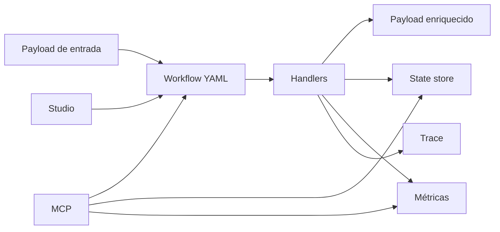

# Conceitos fundamentais

Antes de escrever workflows, vale alinhar alguns conceitos. Eles aparecem no Studio, nos arquivos YAML e nas métricas geradas durante a execução.

| Conceito | O que significa neste projeto |
| --- | --- |
| Workflow | Sequencia declarativa de etapas que processa um payload. |
| Routing slip | Lista de passos que acompanha a mensagem e define o caminho de processamento. |
| Handler | Unidade de execução. Cada handler sabe fazer uma coisa: validar, enriquecer, chamar API, auditar, saltar, filtrar. |
| Connector | Origem que inicia o workflow: REST, Kafka, SQS ou SNS. |
| Modo de execução | Define se a chamada responde de forma sincrona (`sync`) ou aceita o processamento para acompanhamento posterior (`async`). |
| Payload | Documento JSON que entra no workflow e vai sendo enriquecido ou transformado. |
| Cursor | Posição da proxima etapa a executar. E o que permite retomar do ponto correto. |
| State store | Persistência do snapshot de execução: cursor, payload, histórico, erros, trace e estado das etapas. |
| Idempotência | Capacidade de evitar repetir um efeito externo quando uma etapa ja foi concluída. |
| Resiliência | Politicas de retry, backoff, jitter e tratamento de falha por etapa. |
| Rastreabilidade | Uso de `trace_id`, `span_id`, `correlation_id` e histórico para acompanhar uma execução ponta a ponta. |
| Explicabilidade | Capacidade de entender por que uma etapa executou, parou, falhou, pulou ou redirecionou o fluxo. |
| GraphQL enrich | Enriquecimento do payload usando o `go-graphql-connector` como fachada para APIs e serviços externos. |
| Métricas | Eventos técnicos e funcionais que alimentam dashboards e analises operacionais. |
| MCP | Interface de tools para agentes, Studio e automações consultarem, explicarem e planejarem workflows. |

## Como esses conceitos se conectam

O ponto central e simples: o workflow descreve o que precisa acontecer; o runtime executa; o state store permite retomar; as métricas e traces tornam tudo observável; o Studio e o MCP ajudam a criar, validar e investigar.
