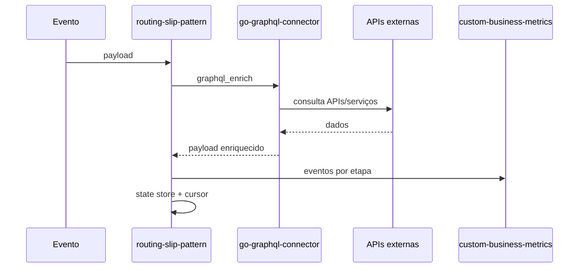

# Projetos do ecossistema

O framework e formado por projetos independentes, mas pensados para funcionar juntos. Essa separação permite usar apenas o que for necessário em cada contexto.

## Routing Slip Pattern

E o runtime de workflows. Ele carrega um YAML, recebe eventos por REST, Kafka ou SQS, executa handlers, persiste estado, emite métricas e permite retomada a partir do cursor salvo.

Use quando precisar:

- orquestrar processos com varias etapas;
- enriquecer payloads antes de decidir;
- reprocessar do ponto de falha;
- tornar o fluxo explicável para operação e engenharia;
- reutilizar os mesmos handlers em fluxos diferentes.

## Go GraphQL Connector

E a camada de integração para APIs e serviços externos. Ele permite criar uma API GraphQL configurável que consulta REST, DynamoDB, Redis, S3, RDS e outros conectores suportados.

Use quando precisar:

- concentrar consultas externas em uma interface GraphQL;
- reduzir acoplamento entre workflow e APIs internas;
- reutilizar configurações de connector em vários workflows;
- gerenciar token, timeout, retry e circuit breaker por integração;
- simplificar enriquecimentos usando `graphql_enrich`.

## Custom Business Metrics

E a camada de métricas e dashboards. Ela recebe eventos do runtime, armazena dados e permite acompanhar execuções, etapas, falhas, duração, retries, traces e reprocessamentos.

Use quando precisar:

- acompanhar workflows em tempo real;
- buscar processos por `correlation_id`, `trace_id` ou tags;
- entender gargalos por etapa;
- comparar execução original e reprocessamento;
- criar dashboards específicos por domínio.

## Como os projetos trabalham juntos

## Modos locais

Na raiz do workspace existe um `Makefile` para operar os tres projetos juntos.

| Modo | Comando | Uso recomendado |
| --- | --- | --- |
| Stack padrão | `make prepare` | Sobe containers separados e preserva melhor o desenho real de integração. |
| Compacto | `make run-compact` | Sobe os tres projetos principais em um único container para testes rápidos. |

O modo compacto expõe as mesmas portas principais: REST do workflow em `8088`, GraphQL em `8090`, métricas em `8080`, webview em `5173` e MCP em `9091`. Ele e pratico para demonstrar o ecossistema, mas nao substitui a stack padrão quando o objetivo e validar isolamento, DynamoDB, filas ou comportamento operacional mais proximo de produção.
