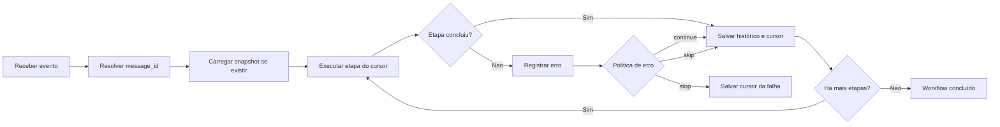

# Como funciona funciona o Routing Slip?

Um workflow e um contrato declarativo. Ele descreve a sequencia de handlers que processa um payload, quais campos identificam a mensagem, qual politica de erro deve ser usada e quais etapas podem enriquecer, validar, transformar, auditar ou chamar integrações.

O runtime executa a lista em ordem. A cada etapa, ele atualiza o cursor, registra histórico, emite métricas e salva estado quando o state store esta habilitado.

## Quando usar o Routing Slip?

Use o Routing Slip quando o processo:

- possui múltiplas etapas;
- precisa consultar dados externos;
- precisa ser rastreável e explicável;
- deve continuar do ponto de falha;
- pode crescer e precisa ser dividido em partes;
- deve gerar métricas por etapa.

## Quando evitar o uso do Routing Slip?

Se o processamento e uma única operação simples, sem reprocessamento, sem regras e sem integrações, um endpoint comum pode ser suficiente. O Routing Slip mostra mais valor quando o fluxo tem variação, risco operacional ou necessidade de visibilidade.

