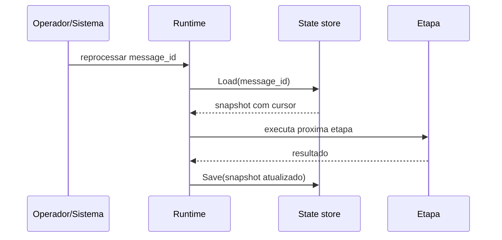

# Reprocessamento

Reprocessar nao significa executar tudo novamente. No Routing Slip, reprocessar significa carregar o snapshot salvo, recuperar o cursor e continuar da etapa correta.

Isso e util quando uma etapa falha depois que etapas anteriores ja produziram resultado. Por exemplo: o fluxo validou o evento, carregou dados do pedido, reservou uma janela de entrega e falhou ao notificar o cliente. Ao reprocessar, o runtime pode continuar da notificacao em vez de repetir as etapas anteriores.

## Como funciona



## O que torna o reprocessamento seguro

- `message_id_path` estavel;
- `state_store` habilitado;
- `id` estavel nos steps;
- idempotencia por etapa;
- handlers com efeitos externos bem isolados;
- auditoria antes e depois de integracoes importantes.

## Configuracao recomendada

```yaml
features:
  persistent_state_enabled: true

state_store:
  type: dynamodb
  table: routing-slip-state
  ttl_days: 30
  idempotency:
    enabled: true
    key_template: "{workflow}:{message_id}:{step_index}:{step}"
```

## Boas praticas

- Nao use timestamp aleatorio como `message_id`.
- Prefira IDs do evento ou do processo de negocio.
- Use `audit` em pontos importantes.
- Use `required: true` para integracoes obrigatorias.
- Em integracoes com efeito externo, garanta idempotencia tambem no sistema chamado quando possivel.

