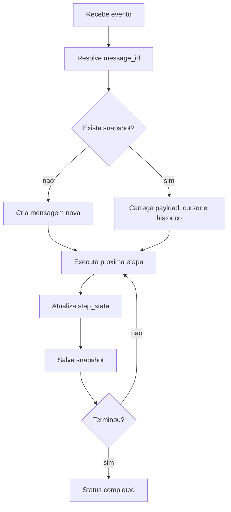

# State store e retomada robusta

O state store e o ponto que torna o Routing Slip capaz de continuar um processamento de onde ele parou. A cada mudanca relevante, o runtime grava um snapshot com cursor, payload atual, historico, erros, rastreabilidade, status geral e estado granular de cada etapa.

Isso evita recomecar um fluxo inteiro quando uma etapa falha no meio do caminho. Em um workflow de venda online, por exemplo, se a validacao e a reserva de entrega ja foram concluidas, uma falha temporaria na notificacao do cliente pode ser reprocessada a partir do ponto salvo, sem repetir as etapas anteriores.

## O que e persistido

| Campo | Uso |
| --- | --- |
| `id` | Identificador da mensagem/processamento. |
| `workflow` | Nome do workflow que originou o processamento. |
| `workflow_version` | Versao informada no arquivo de workflow, quando existir. |
| `status` | `created`, `running`, `failed`, `stopped`, `cancelled` ou `completed`. |
| `cursor` | Proxima etapa que deve ser executada. |
| `payload` | Payload enriquecido ate o ponto atual. |
| `history` | Historico das etapas ja executadas. |
| `errors` | Falhas registradas durante a execucao. |
| `step_states` | Estado granular por etapa, incluindo tentativas, status e ultimo erro. |
| `trace_id` | Identificador de rastreabilidade distribuida. |

## Configuracao

```yaml
features:
  persistent_state_enabled: true

state_store:
  type: dynamodb
  table: routing-slip-state
  endpoint: http://dynamodb:8000
  region: us-east-1
  ttl_days: 30
  idempotency:
    enabled: true
    key_template: "{workflow}:{message_id}:{step_index}:{step}"
```

Tipos suportados:

| Tipo | Quando usar |
| --- | --- |
| `memory` | Testes unitarios e execucoes descartaveis. |
| `file` | Desenvolvimento local simples, com snapshots JSON em disco. |
| `dynamodb` | Execucao local integrada, ambientes distribuidos e reprocessamento entre reinicios. |

## Como a retomada funciona



## Idempotencia por etapa

Quando `state_store.idempotency.enabled` esta ativo, o runtime calcula uma chave por etapa. Se uma etapa ja estiver marcada como `success` e o cursor voltar para ela por engano ou por reprocessamento manual, a etapa nao e executada novamente; o historico recebe o status `idempotent_skip`.

Exemplo de chave:

```text
catalog-sync:evt-1001:2:graphql_enrich
```

Tokens disponiveis:

| Token | Significado |
| --- | --- |
| `{workflow}` | Nome do workflow. |
| `{message_id}` | ID do processamento. |
| `{correlation_id}` | Correlation ID, quando existir. |
| `{step}` | Nome do handler. |
| `{step_id}` | ID da etapa no YAML. |
| `{step_ref}` | `step_id` quando existir, senao `step`. |
| `{step_index}` | Posicao numerica da etapa no workflow expandido. |

## Exemplo com file store

```yaml
features:
  persistent_state_enabled: true

state_store:
  type: file
  path: .routing-slip-state
  idempotency:
    enabled: true
    key_template: "{workflow}:{message_id}:{step_index}:{step}"
```

Esse modo grava um arquivo JSON por processamento e e uma boa opcao para entender a estrutura do snapshot sem depender de infraestrutura externa.

## Erro de infraestrutura x estado inexistente

O runtime trata de forma diferente um snapshot inexistente e uma falha real do store. Quando o estado nao existe, a mensagem e criada do zero. Quando o DynamoDB, o disco ou outro backend retorna erro de infraestrutura, o processamento para, evitando repetir etapas anteriores por engano.

## Exemplo com DynamoDB

A tabela precisa ter chave composta:

| Campo | Tipo | Papel |
| --- | --- | --- |
| `pk` | String | ID da mensagem. |
| `sk` | String | Valor fixo `state`. |

O snapshot completo fica no atributo `snapshot`. O runtime tambem grava campos operacionais como `workflow`, `status`, `cursor`, `correlation_id`, `trace_id`, `updated_at` e `expires_at`.

```bash
aws dynamodb create-table \
  --table-name routing-slip-state \
  --attribute-definitions AttributeName=pk,AttributeType=S AttributeName=sk,AttributeType=S \
  --key-schema AttributeName=pk,KeyType=HASH AttributeName=sk,KeyType=RANGE \
  --billing-mode PAY_PER_REQUEST
```

Com TTL habilitado em `expires_at`, snapshots antigos sao removidos automaticamente depois do periodo configurado em `ttl_days`.
