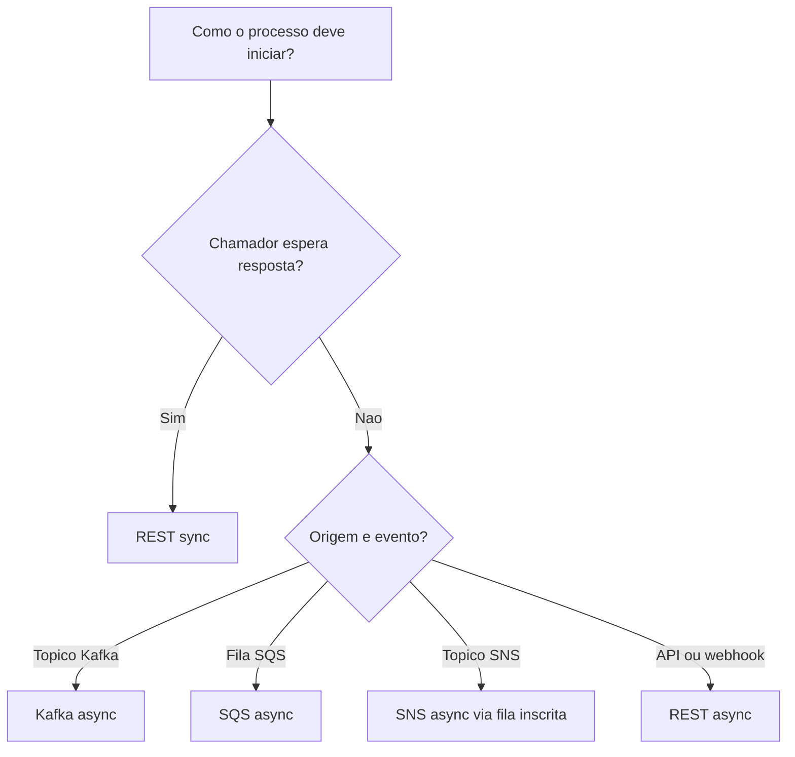

# Conectores e modos de execucao

O workflow pode ser iniciado por diferentes origens sem alterar o desenho das etapas. Essa separacao ajuda a reaproveitar o mesmo processo em uma API REST, em um topico Kafka, em uma fila SQS ou em uma inscricao SNS.

## Conectores

Use `trigger.connector` para indicar de onde o payload chega.

| Connector | Quando usar | Comportamento |
| --- | --- | --- |
| `rest` | Chamadas vindas de API Gateway, ALB, webhooks ou porta local. | Recebe um `POST` com JSON e executa o workflow. |
| `kafka` | Eventos publicados em topicos. | Consome mensagens continuamente usando `brokers`, `topic` e `group_id`. |
| `sqs` | Filas de eventos, retentativas ou buffers de processamento. | Faz long polling e pode buscar uma ou mais mensagens por chamada. |
| `sns` | Eventos publicados em topicos SNS. | Consome a fila SQS inscrita no topico e extrai o `Message` do envelope SNS quando existir. |

O campo `trigger.type` continua aceito por compatibilidade, mas a configuracao recomendada e `trigger.connector`.

## Modos de execucao

Use `trigger.mode` para definir como o runtime deve responder.

| Modo | Uso | Retorno |
| --- | --- | --- |
| `sync` | Integracoes que precisam de resposta imediata. | Retorna o resultado da execucao com cursor, historico, payload e erro quando houver. |
| `async` | Eventos, batch e processamentos que podem ser acompanhados depois. | Retorna aceite da solicitacao e deixa a execucao seguir em segundo plano ou pelo consumidor do conector. |

Para `kafka`, `sqs` e `sns`, o uso natural e `async`, porque a origem ja trabalha por eventos. Para `rest`, os dois modos sao uteis: `sync` em validacoes imediatas e `async` quando a API deve apenas aceitar o processamento.

## REST sincrono

```yaml
trigger:
  connector: rest
  mode: sync
  rest:
    addr: ":8088"
    path: /process
```

Nesse modo, a resposta HTTP inclui os principais dados da execucao:

```json
{
  "message_id": "MSG-001",
  "workflow": "order-fulfillment",
  "correlation_id": "5b6fbef5-2a23-4770-8c7f-f4172f77f0a1",
  "cursor": 4,
  "remaining_steps": 0,
  "history": [],
  "errors": [],
  "payload": {},
  "error": ""
}
```

## REST assincrono

```yaml
trigger:
  connector: rest
  mode: async
  rest:
    addr: ":8088"
    path: /process
```

A API responde rapidamente com `202 Accepted`:

```json
{
  "status": "accepted",
  "mode": "async",
  "message_id": "MSG-001",
  "workflow": "order-fulfillment",
  "correlation_id": "5b6fbef5-2a23-4770-8c7f-f4172f77f0a1"
}
```

Depois disso, a execucao pode ser acompanhada pelo state store, metricas, Studio, logs ou MCP.

## Kafka

```yaml
trigger:
  connector: kafka
  mode: async
  kafka:
    brokers:
      - localhost:9092
    topic: order-events
    group_id: routing-slip-pattern
    min_bytes: 1
    max_bytes: 10485760
```

Cada mensagem do topico deve ser um JSON valido. Headers Kafka sao copiados para os headers internos da mensagem do routing slip.

## SQS

```yaml
trigger:
  connector: sqs
  mode: async
  sqs:
    endpoint: http://localhost:4566
    region: us-east-1
    queue_url: http://localhost:4566/000000000000/order-events
    wait_time_seconds: 10
    max_messages: 10
    visibility_timeout: 30
```

`max_messages` controla o consumo unitario ou em lote. Quando a mensagem e processada com sucesso, ela e removida da fila.

## SNS

```yaml
trigger:
  connector: sns
  mode: async
  sns:
    endpoint: http://localhost:4566
    region: us-east-1
    queue_url: http://localhost:4566/000000000000/order-events-sns
    wait_time_seconds: 10
    max_messages: 10
    visibility_timeout: 30
```

O conector SNS espera uma fila SQS inscrita no topico. Quando o corpo segue o envelope padrao do SNS, o runtime usa o campo `Message` como payload do workflow. Se o corpo ja for um JSON comum, ele e processado diretamente.

## Decisao rapida



Essa combinacao deixa o workflow independente do canal de entrada. O mesmo YAML pode ser executado de forma sincrona para testes e de forma assincrona em producao, desde que o payload tenha a mesma estrutura esperada pelas etapas.
