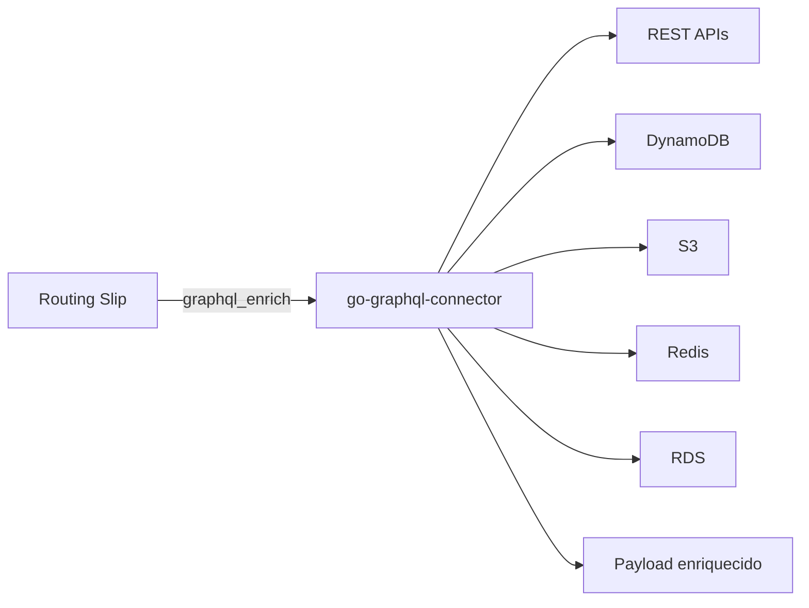

# GraphQL Connector

O `go-graphql-connector` e a camada de integração usada para enriquecer payloads do routing slip sem acoplar o workflow diretamente a APIs, bancos, caches ou serviços externos.

Ele funciona como uma **Anti-Corruption Layer**: o workflow conhece uma query GraphQL estável, enquanto o conector resolve como buscar os dados nas fontes configuradas.

| Papel | Beneficio |
|---|---|
| API GraphQL dinâmica | Expor um contrato único para varias fontes externas. |
| Connectors configuráveis | Trocar origem de dados sem mudar o workflow. |
| Response transform | Simplificar respostas removendo wrappers desnecessários. |
| Timeout/retry/opcionalidade | Controlar resiliência por fonte integrada. |
| Configuração por arquivo ou cloud | Usar local, env, SSM, Secrets Manager, S3 e DynamoDB. |
| Trace context | Preservar `trace_id` e propagar `traceparent` ate APIs externas. |



No routing slip, o uso acontece pelo handler `graphql_enrich`:

```yaml
- name: graphql_enrich
  params:
    endpoint: "${GRAPHQL_ENDPOINT:-http://localhost:8090/graphql}"
    query: "query ($sku: String!) { dataSources(sku: $sku) { catalogo { produtos { sku preco { valor } } } } }"
    variables:
      sku: "{itens.0.sku}"
    target: catalogo
    result_path: dataSources.catalogo
    timeout_ms: 3000
    required: true
```

Quando o workflow esta com rastreabilidade ativa, o `graphql_enrich` envia automaticamente `traceparent`, `X-Trace-ID` e `X-Correlation-ID`. O conector preserva o trace recebido, cria spans filhos para os connectors REST e devolve `X-Trace-ID` na resposta HTTP.
