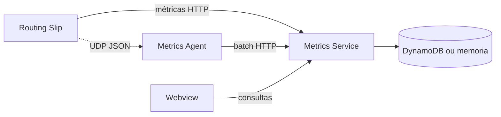

# Custom Business Metrics

O `custom-business-metrics` e a camada usada para observar o processamento em tempo real com métricas de negocio, eventos de etapa e dashboards configuráveis.

## Agent importável

O runtime pode receber uma instância do agent em vez de enviar métricas
diretamente para um endpoint:

```go
agent, err := metrics.New(metrics.Config{
    ServiceEndpoint: "http://metrics-service:8080/v1/metrics",
    BatchSize: 100,
    BufferSize: 5000,
})
go agent.Run(ctx)
```

O agent realiza buffer e envio em lote. A mesma instância pode ser utilizada
pelo routing slip, pelo GraphQL connector e pela aplicação hospedeira.

## MCP Analytics

O metrics service expõe tools MCP para buscar processos, recuperar uma execução
por `correlation_id` ou `trace_id` e consultar resumos por workflow. Em ambientes
compartilhados, configure `MCP_SERVER_API_KEY`.

Ele complementa logs técnicos: em vez de responder apenas "a aplicação esta de pe?", ele ajuda a responder "onde esta cada processamento?", "qual etapa falhou?", "quanto falta?" e "qual fluxo esta demorando mais?".


Componentes principais:

| Componente | Papel |
|---|---|
| `agent` | Recebe eventos JSON via UDP, agrupa e encaminha em lote. |
| `service` | API HTTP de ingestão, consulta, agregação, retenção e dashboards. |
| `webview` | Interface para visualizar e editar dashboards. |
| `storage` | Memoria para desenvolvimento ou DynamoDB/DynamoDB Local para persistência. |



Na rastreabilidade distribuída, cada evento pode trazer `trace_id` e `span_id`. Isso permite consultar toda a trilha técnica de uma execução, mesmo quando ela passa pelo workflow, pelo GraphQL connector e por APIs externas.

```bash
curl "http://localhost:8080/v1/metrics/events?trace_id=4bf92f3577b34da6a3ce929d0e0e4736"
curl "http://localhost:8080/v1/metrics/trace/4bf92f3577b34da6a3ce929d0e0e4736"
```
