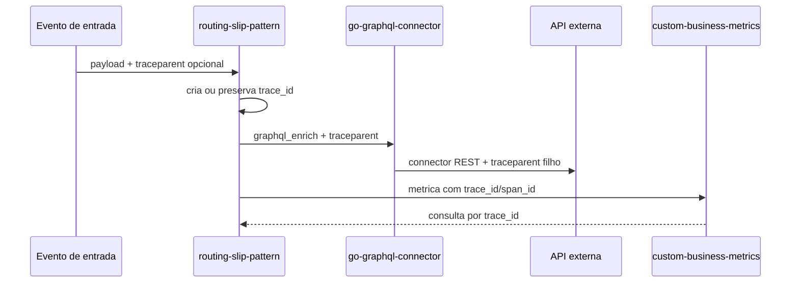

# Rastreabilidade distribuida

A Fase 1 adiciona um contrato comum de rastreabilidade entre o runtime de workflows, o GraphQL connector e o metrics service.

Na pratica, cada execucao passa a ter dois identificadores importantes:

| Campo | O que representa | Onde aparece |
|---|---|---|
| `correlation_id` | O processo de negocio. | Payload, resposta REST, metricas e filtros do dashboard. |
| `trace_id` | A trilha tecnica distribuida. | Headers, historico de steps, metricas e consultas tecnicas. |

O `trace_id` ajuda a responder perguntas como:

- por onde esta execucao passou?
- qual etapa chamou uma API externa?
- qual connector participou da consulta?
- onde a falha ocorreu?
- quais metricas pertencem a mesma execucao tecnica?

## Como funciona



Se a entrada ja trouxer um header `traceparent`, o workflow preserva o `trace_id`. Se nao trouxer, o runtime cria um novo trace automaticamente.

Configuracao aceita no `config.yaml`:

```yaml
observability:
  tracing:
    enabled: true
    exporter: none
    endpoint: http://localhost:4318
    service_name: routing-slip-pattern
```

Nesta fase o runtime ja cria spans usando a API do OpenTelemetry e propaga o contexto W3C. A conexao com um collector OTLP dedicado fica preparada para a evolucao seguinte.

## Headers propagados

Em chamadas GraphQL e REST, o runtime envia:

```http
traceparent: 00-4bf92f3577b34da6a3ce929d0e0e4736-00f067aa0ba902b7-01
X-Trace-ID: 4bf92f3577b34da6a3ce929d0e0e4736
X-Correlation-ID: corr-001
```

O `go-graphql-connector` entende esses headers e tambem os propaga para APIs REST integradas pelos connectors.

O handler `notify` tambem pode propagar os mesmos headers quando a entrega real usa `SendWithHeaders`. Isso permite que webhooks, notificadores e integrações assíncronas mantenham a mesma trilha técnica do workflow.

## Historico de steps

Cada item do historico passa a carregar dados de rastreio:

```json
{
  "Step": "graphql_enrich",
  "Status": "success",
  "TraceID": "4bf92f3577b34da6a3ce929d0e0e4736",
  "SpanID": "00f067aa0ba902b7",
  "Attempt": 1
}
```

Isso facilita clicar em um log do Studio, entender qual etapa executou e cruzar essa informacao com metricas e chamadas externas.

## Consultando metricas por trace

O `custom-business-metrics` aceita `trace_id` no topo do evento ou dentro de `tags`.

Consultas uteis:

```bash
curl "http://localhost:8080/v1/metrics/events?trace_id=4bf92f3577b34da6a3ce929d0e0e4736"
curl "http://localhost:8080/v1/metrics/trace/4bf92f3577b34da6a3ce929d0e0e4736"
```

## Por que isso importa

Sem rastreabilidade distribuida, cada projeto mostra apenas um pedaco da historia. Com `trace_id`, o usuario consegue sair de um workflow, chegar na query GraphQL, passar pela API externa e voltar para o dashboard de metricas usando o mesmo identificador.

Esse e o primeiro passo para as proximas fases: metricas assincronas, state store persistente, resiliencia padronizada e ferramentas MCP de investigacao.
