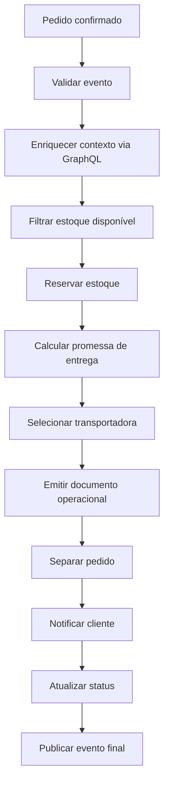

# Case e-commerce distribuído

O case e-commerce distribuído e um cenário de referencia para validar o ecossistema completo sem usar um domínio sensível. Ele simula o atendimento de um pedido confirmado, passando por enriquecimento de contexto, reserva de estoque, promessa de entrega, operação logística, notificação e publicação de evento final.

## O que o case demonstra

| Capacidade | Como aparece no case |
|---|---|
| Workflow composto | O fluxo principal usa `workflow_ref` para conectar arquivos menores. |
| Enriquecimento externo | `graphql_enrich` consulta pedido, cliente, estoque e politica de entrega. |
| Resiliência | Steps e connectors usam retry, backoff, jitter e circuit breaker. |
| Observabilidade | Cada etapa emite histórico, trace e métricas. |
| Reprocessamento | Falhas obrigatórias preservam cursor e payload enriquecido. |
| Escalabilidade | Eventos podem ser gerados em volume para REST, Kafka ou SQS. |

## Arquivos

| Caminho | Conteúdo |
|---|---|
| `workflows/ecommerce-distributed/order-fulfillment-main.yaml` | Workflow principal. |
| `workflows/ectomerce-distributed/order-context.yaml` | Consulta GraphQL e validações. |
| `workflows/ectomerce-distributed/reserve-and-delivery.yaml` | Reserva e planejamento de entrega. |
| `workflows/ecommerce-distributed/operations-and-notification.yaml` | Operações, notificação e evento final. |
| `cases/ecommerce-distributed` | Payloads, mocks, Bruno, scripts e plano de teste. |
| `go-graphql-connector/examples/ecommerce-distributed` | Schema e connectors GraphQL do case. |

## Fluxo



## Execução

```bash
cd /Users/raysouz/Workspace/estudos/workflows
make prepare
make run-ecommerce-case
```

Para enviar um evento REST:

```bash
make ecommerce-rest
```

Para gerar carga:

```bash
make ecommerce-load COUNT=25
```

## Variantes

- `happy-path`: fluxo completo com sucesso.
- `partial-data`: dados incompletos para validar parada funcional.
- `stop-and-reprocess`: base para interromper e retomar pelo cursor.
- `slow-connector`: latência alta configurada no mock.
- `retry-success`: falha transitória seguida de sucesso.
- `circuit-open`: indisponibilidade ate abrir circuit breaker.

## Correlation ID

O gerador de eventos cria um UUID v4 novo para `correlation_id` em cada processamento. Os payloads de exemplo usam formato UUID, mas execuções repetidas devem preferir `make ecommerce-events` ou `make ecommerce-load` para evitar reutilização manual do mesmo identificador.

## MCP no case

A coleção Bruno inclui requisições MCP para:

- listar tools disponíveis;
- validar o workflow carregado;
- explicar o workflow expandido;
- sugerir métricas e pontos de auditoria.

Use o Studio para abrir o workflow principal, validar via MCP, diagnosticar conectores e acompanhar os logs agrupados por etapa.
