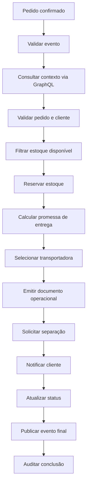

# Necessidade e especificações

O projeto de teste existe para validar o ecossistema em um cenário distribuído, observável e reprocessável, sem depender de um domínio regulado ou sensível. O cenário escolhido é o atendimento e entrega de um pedido confirmado em e-commerce.

Ele permite exercitar o `routing-slip-pattern`, o `go-graphql-connector`, o `custom-business-metrics`, o Studio, o MCP, mocks externos, carga REST e eventos para filas ou tópicos.

## Necessidade

Workflows reais costumam combinar validação, enriquecimento, decisão, chamada a serviços externos, persistência de estado, métricas e reprocessamento. Testar apenas um exemplo pequeno não mostra como a solução se comporta quando:

- o fluxo é dividido em vários contextos;
- APIs externas ficam lentas ou instáveis;
- uma etapa falha depois que etapas anteriores já produziram efeitos;
- o usuário precisa encontrar uma execução específica por `correlation_id` ou `trace_id`;
- o time precisa explicar o que foi processado sem reler logs brutos;
- é necessário gerar carga para observar gargalos e comportamento sob pressão.

## Especificações funcionais

| Requisito | Descrição |
|---|---|
| Evento inicial | Receber um evento `ORDER_CONFIRMED`. |
| Validação | Garantir `event_id`, `correlation_id`, `event_name`, `order_id`, `customer_id` e `region`. |
| Enriquecimento | Consultar pedido, cliente, estoque e política de entrega via GraphQL. |
| Estoque | Filtrar itens disponíveis e abortar quando não houver disponibilidade. |
| Reserva | Acionar serviço externo para reservar estoque. |
| Entrega | Calcular promessa de entrega e selecionar transportadora. |
| Operação | Emitir documento operacional e solicitar separação. |
| Notificação | Notificar cliente sem bloquear o fluxo quando a falha for opcional. |
| Status | Atualizar status do pedido para pronto para envio. |
| Evento final | Publicar evento de pedido pronto para expedição. |
| Auditoria | Registrar marcos funcionais em pontos relevantes. |

## Especificações não funcionais

| Requisito | Como é validado |
|---|---|
| Rastreabilidade | `correlation_id`, `trace_id`, histórico por etapa e eventos de métrica. |
| Reprocessamento | State store preserva cursor e payload enriquecido. |
| Idempotência | Etapas já concluídas podem ser preservadas no reprocessamento. |
| Resiliência | Retry, backoff, jitter, timeout e circuit breaker em integrações. |
| Observabilidade | Consulta em dashboard e métricas por workflow, step, status e trace. |
| Escalabilidade | Geração de eventos em lote para REST, Kafka ou SQS. |
| Segurança operacional | Uso de mocks, redaction e MCP em modo readonly. |
| Explicabilidade | Studio e MCP explicam workflow, etapas e integrações. |

## Fluxo de processo

## Artefatos

| Caminho | Uso |
|---|---|
| `workflows/ecommerce-distributed` | Workflows YAML do cenário. |
| `cases/ecommerce-distributed/payloads` | Payloads base. |
| `cases/ecommerce-distributed/mocks` | Modelos para o mock service. |
| `cases/ecommerce-distributed/bruno` | Requisições REST, GraphQL e MCP. |
| `cases/ecommerce-distributed/scripts/generate_events.py` | Geração de eventos e carga REST. |
| `cases/ecommerce-distributed/scripts/run_tests.py` | Execução das suites regressiva, performance, caos e MCP. |
| `go-graphql-connector/examples/ecommerce-distributed` | Schema e connectors GraphQL. |
