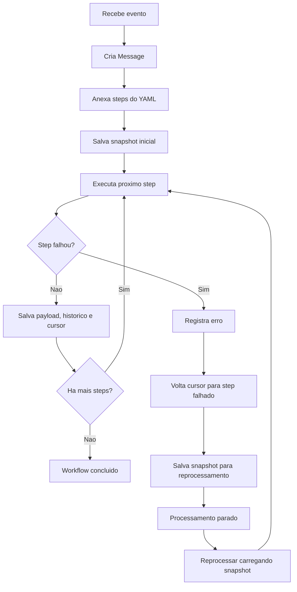
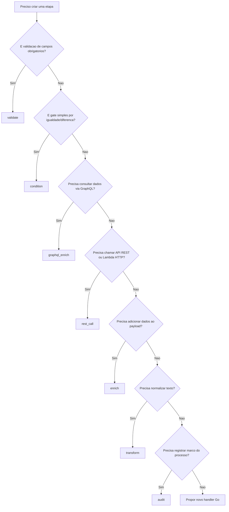

# Contexto do Projeto: routing-slip-pattern

## Repositorio local

`/Users/raysouz/Workspace/estudos/workflows/routing-slip-pattern`

Este arquivo serve como contexto para Devin, Claude, ChatGPT ou qualquer outro
modelo que precise analisar uma aplicacao real e transformar seu fluxo de
processamento em um workflow executavel pelo projeto `routing-slip-pattern`.

---

## O que e o projeto

O `routing-slip-pattern` e uma prova evoluida do padrao **Routing Slip** para
orquestrar workflows de forma configuravel, resiliente, observavel e
reprocessavel.

A ideia central e simples:

1. Um evento, mensagem ou request REST chega na aplicacao.
2. O payload inicial vira uma `Message`.
3. Um arquivo YAML define a lista ordenada de etapas.
4. Cada etapa e executada por um handler registrado no router.
5. O payload e enriquecido/mutado a cada etapa.
6. O estado pode ser salvo com cursor, historico, erros e payload.
7. Em caso de falha, o processamento pode ser retomado do ponto em que parou.

Esse modelo foi pensado para evitar um problema comum em orquestradores como
Step Functions: quando uma execucao falha em uma etapa intermediaria, o
reprocessamento normalmente exige reconstruir ou reexecutar passos anteriores.
Aqui, a posicao atual do workflow fica no cursor do routing slip.

---

## Objetivo ao criar um workflow

Ao analisar uma aplicacao real, o modelo deve produzir um arquivo YAML em
`workflows/<nome-do-workflow>.yaml` que represente o fluxo de negocio usando os
handlers existentes.

O workflow deve ser:

- **deterministico**: mesmas entradas devem gerar o mesmo caminho funcional;
- **reprocessavel**: passos ja concluidos nao devem depender de efeitos
  colaterais que precisem ser repetidos;
- **observavel**: etapas relevantes devem gerar payloads intermediarios claros;
- **modular**: cada etapa deve ter uma responsabilidade pequena;
- **integravel**: enriquecimentos externos devem usar `graphql_enrich` ou
  `rest_call`;
- **seguro**: nunca colocar segredo fixo no YAML; usar variaveis de ambiente;
- **compativel com o router atual**: o campo `name` de cada step deve ser o
  nome tecnico de um handler registrado.

---

## Estrutura importante do projeto

| Caminho | Finalidade |
|---|---|
| `app/main.go` | Bootstrap da aplicacao, registro dos handlers e flags `--config`/`--workflow` |
| `app/runtime_config.go` | Estruturas de `config.yaml` e do workflow YAML |
| `app/triggers.go` | Entradas REST, Kafka e SQS |
| `app/slip/slip.go` | Implementacao do Routing Slip, cursor, historico e politicas de erro |
| `app/slip/state_store.go` | Interface de persistencia do estado para reprocessamento |
| `app/handlers/` | Handlers disponiveis para etapas YAML |
| `config.yaml` | Configuracao de runtime: trigger, metricas e integracoes |
| `workflows/` | Workflows YAML executaveis |
| `bruno/` | Requisicoes de teste REST/GraphQL |
| `mocks/` | Exemplos de payloads para APIs externas/mock service |

---

## Como executar com workflow externo

A aplicacao usa duas configuracoes separadas:

```bash
go run ./app --config ./config.yaml --workflow ./workflows/payment-fulfillment.yaml
```

Ou via Docker/Makefile, dependendo do ambiente raiz:

```bash
make prepare
make run
```

O `config.yaml` define como o workflow sera acionado. O arquivo de workflow
define o que sera processado.

---

## Separacao entre config e workflow

### `config.yaml`

Use para infraestrutura/runtime:

- trigger: `rest`, `kafka` ou `sqs`;
- porta e path REST;
- topico Kafka;
- fila SQS;
- endpoint de metricas;
- endpoint GraphQL;
- base URL de APIs externas;
- serial/header de integracao.

### `workflows/*.yaml`

Use para regra de processo:

- nome e descricao do workflow;
- politica de erro;
- path do ID da mensagem;
- path do correlation ID;
- lista ordenada de steps;
- parametros de cada handler.

Nao coloque definicao de trigger dentro do workflow.

---

## Anatomia de um workflow YAML

```yaml
name: nome-tecnico-ou-funcional-do-workflow
description: Descricao curta do processo.
error_policy: stop
message_id_path: payload.id
correlation_id_path: correlation_id

steps:
  - name: validate
    params:
      required:
        - payload.id
        - payload.tipo

  - name: condition
    params:
      field: payload.tipo
      equals: EVENTO_ESPERADO

  - name: graphql_enrich
    params:
      query: "query ($id: String!) { dataSources(id: $id) { recurso { id status } } }"
      variables:
        id: "{payload.id}"
      target: recurso
      result_path: dataSources.recurso
      timeout_ms: 2000
      required: true

  - name: rest_call
    params:
      base_url: "${EXTERNAL_API_URL:-https://mock.raysouz.studio}"
      method: POST
      endpoint: /acao
      target: acao_resultado
      headers:
        X-Serial-Number: "${EXTERNAL_API_SERIAL:-serial-local}"
      body:
        id: "{payload.id}"
        status: "{recurso.status}"
      required: true

  - name: audit
    params:
      event: workflow.completed
      fields:
        - payload.id
        - recurso.status
        - acao_resultado.status
```

---

## Regra critica: `name` do step e tecnico

O campo `steps[].name` deve ser exatamente o nome de um handler registrado.

Correto:

```yaml
- name: validate
- name: condition
- name: graphql_enrich
```

Incorreto:

```yaml
- name: Validar Campos Obrigatorios
- name: Consultar Cliente
- name: Enviar Notificacao
```

Se usar nomes funcionais no campo `name`, o router falha com:

```text
no handler registered for step "Validar Campos Obrigatorios"
```

Coloque o significado funcional no `description` do workflow, nos nomes dos
targets, nos eventos de audit ou na documentacao externa. O `name` e o ID do
handler.

---

## Handlers disponiveis

### `validate`

Valida se campos obrigatorios existem no payload.

```yaml
- name: validate
  params:
    required:
      - correlation_id
      - data.codigo_cliente
      - data.valor
    stop_on_failure: true
```

Parametros:

| Campo | Tipo | Descricao |
|---|---|---|
| `required` | lista de string | Paths obrigatorios no payload |
| `stop_on_failure` | boolean | Se `true`, falha o workflow; default `true` |

Use dot notation para campos aninhados: `data.codigo_cliente`.

---

### `condition`

Interrompe graciosamente o workflow quando uma condicao nao e atendida.

```yaml
- name: condition
  params:
    field: data.event_name
    equals: DESCONTO_FOLHA_REALIZADO
```

Ou:

```yaml
- name: condition
  params:
    field: cliente.status
    not_equals: BLOQUEADO
```

Parametros:

| Campo | Tipo | Descricao |
|---|---|---|
| `field` | string | Path do payload |
| `equals` | any | Continua somente se o valor for igual |
| `not_equals` | any | Continua somente se o valor for diferente |

Importante: `condition` nao gera erro quando bloqueia o fluxo; ela retorna
`proceed=false` e encerra o restante das etapas de forma controlada.

---

### `enrich`

Adiciona dados estaticos ou estruturados ao payload.

```yaml
- name: enrich
  params:
    data:
      origem: API_EXTERNA
      checkpoint:
        status: RECEBIDO
        etapa: evento_validado
```

Com prefixo:

```yaml
- name: enrich
  params:
    prefix: order_
    data:
      status: READY
      source: routing-slip
```

Resultado: `order_status`, `order_source`, `order_enriched_at`.

---

### `transform`

Transforma um campo textual.

```yaml
- name: transform
  params:
    field: customer_id
    operation: uppercase
    target: customer_id_normalized
```

Operacoes suportadas:

- `uppercase`
- `lowercase`
- `trim`
- `prefix:<valor>`
- `suffix:<valor>`

---

### `graphql_enrich`

Consulta um endpoint GraphQL, normalmente o projeto `go-graphql-connector`, e
salva o resultado no payload.

```yaml
- name: graphql_enrich
  params:
    endpoint: "${GRAPHQL_ENDPOINT:-http://localhost:8090/graphql}"
    query: "query ($codigoCliente: String!) { dataSources(codigoCliente: $codigoCliente) { cliente { id status } } }"
    variables:
      codigoCliente: "{data.codigo_cliente}"
    target: cliente
    result_path: dataSources.cliente
    timeout_ms: 3000
    required: true
```

Parametros:

| Campo | Tipo | Descricao |
|---|---|---|
| `endpoint` | string | Opcional; se omitido usa `GRAPHQL_ENDPOINT` |
| `query` | string | Query GraphQL completa |
| `variables` | mapa | Variaveis da query, com interpolacao `{path}` |
| `target` | string | Campo onde o resultado sera salvo |
| `result_path` | string | Path dentro de `data` da resposta GraphQL |
| `timeout_ms` | numero | Timeout em milissegundos |
| `required` | boolean | Se `true`, falha em erro; se `false`, marca parcial |

Observacoes:

- A resposta GraphQL possui envelope padrao `{ "data": ... }`.
- O `result_path` parte de dentro de `data`.
- Exemplo: se a resposta e `data.dataSources.custodias`, use
  `result_path: dataSources.custodias`.
- Erros GraphQL em `errors` fazem o step falhar quando `required: true`.

---

### `rest_call`

Executa chamada HTTP e salva o JSON retornado no payload.

```yaml
- name: rest_call
  params:
    base_url: "${EXTERNAL_API_URL:-https://mock.raysouz.studio}"
    method: POST
    endpoint: /lambda/notas-fiscais
    target: nota_fiscal
    headers:
      X-Serial-Number: "${EXTERNAL_API_SERIAL:-serial-local}"
    body:
      pedido_id: "{pedido.pedido_id}"
      valor_total: "{pedido.valor_total}"
    result_path: data
    timeout_ms: 2000
    required: true
```

Parametros:

| Campo | Tipo | Descricao |
|---|---|---|
| `base_url` | string | Base URL da API |
| `endpoint` | string | Path da API; aceita interpolacao |
| `method` | string | `GET`, `POST`, `PUT`, `PATCH`, `DELETE` |
| `target` | string | Campo onde o resultado sera salvo |
| `headers` | mapa | Headers HTTP, com interpolacao |
| `body` | mapa/lista/string | Body JSON, com interpolacao |
| `result_path` | string | Opcional; seleciona subcampo da resposta |
| `timeout_ms` | numero | Timeout em milissegundos |
| `required` | boolean | Se `true`, falha em erro; se `false`, marca parcial |

Interpolacao especial:

- Se o valor for exatamente `{campo.path}`, o tipo original e preservado.
- Se o token aparecer dentro de uma string maior, vira string interpolada.

Exemplo:

```yaml
itens: "{pedido.itens}"              # preserva lista/objeto
mensagem: "Pedido {pedido.id} ok"    # vira string
```

---

### `notify`

Simula envio de notificacao.

```yaml
- name: notify
  params:
    channel: slack
    recipient: "#processos"
    template: "Processo {correlation_id} concluido"
```

---

### `audit`

Registra evento estruturado em log.

```yaml
- name: audit
  params:
    event: baixa_parcelas.preparacao.completed
    fields:
      - correlation_id
      - data.codigo_cliente
      - resultado.status
```

Use `audit` ao final do workflow e tambem em pontos importantes quando o
processo tiver mudancas relevantes de estado.

---

## Politicas de erro

No topo do YAML:

```yaml
error_policy: stop
```

Valores:

| Valor | Comportamento |
|---|---|
| `stop` | Para no primeiro erro e salva cursor antes da etapa que falhou |
| `continue` | Registra erro e continua para o proximo step |
| `skip` | Registra erro, marca step como skipped e continua |

Para workflows de negocio reprocessaveis, prefira `stop`, porque preserva o
ponto de retomada com clareza.

---

## Reprocessamento e cursor

O router salva snapshots antes e depois de cada step quando existe `StateStore`.
O snapshot contem:

- `ID`
- `Payload`
- `Headers`
- `Slip`
- `Cursor`
- `History`
- `Errors`
- `UpdatedAt`

Quando um step falha com `error_policy: stop`, o cursor volta para o indice da
etapa que falhou. Ao carregar o snapshot e chamar `Router.Process` novamente, o
workflow reexecuta a etapa falhada, nao as etapas anteriores.

Fluxo conceitual:



Ao modelar um workflow real, identifique quais etapas sao idempotentes e quais
dependem de checkpoint. Etapas com efeito colateral externo devem receber IDs de
idempotencia no body/header sempre que possivel, como `correlation_id`,
`message_id`, `codigo_identificador_evento` ou `execution_id`.

---

## Triggers suportados

O acionamento e configurado em `config.yaml`, nao no workflow.

```yaml
trigger:
  type: rest
  rest:
    addr: ":8088"
    path: "/process"
```

```yaml
trigger:
  type: kafka
  kafka:
    brokers:
      - "localhost:9092"
    topic: "payment-events"
    group_id: "routing-slip-pattern"
```

```yaml
trigger:
  type: sqs
  sqs:
    endpoint: "http://localhost:4566"
    region: "us-east-1"
    queue_url: "http://localhost:4566/000000000000/payment-events"
```

---

## Como transformar uma aplicacao real em workflow

Use este roteiro ao analisar codigo legado, documentacao funcional ou uma
aplicacao existente.

### 1. Identifique o evento de entrada

Perguntas:

- Qual evento inicia o processo?
- O evento vem de REST, Kafka ou SQS?
- Qual campo identifica unicamente a mensagem?
- Qual campo representa a correlacao de ponta a ponta?

Mapeie para:

```yaml
message_id_path: data.codigo_identificador_evento
correlation_id_path: correlation_id
```

### 2. Liste campos obrigatorios

Crie o primeiro step com `validate`.

```yaml
- name: validate
  params:
    required:
      - correlation_id
      - data.event_name
      - data.codigo_cliente
```

### 3. Modele gates funcionais

Condicoes simples devem usar `condition`.

```yaml
- name: condition
  params:
    field: data.event_name
    equals: EVENTO_ESPERADO
```

Se a regra exigir expressao complexa, hoje o projeto nao possui handler CEL
generico. Nao invente sintaxe no YAML. Em vez disso:

- decomponha em condicoes simples quando possivel;
- use enriquecimento para explicitar regras conceituais;
- ou proponha a criacao de um novo handler Go.

### 4. Separe consultas de dados externos

Use `graphql_enrich` quando os dados vierem via `go-graphql-connector`.

Use `rest_call` quando for uma chamada direta para uma API ou endpoint/lambda.

Padrao recomendado:

```yaml
- name: graphql_enrich
  params:
    query: "query (...) { ... }"
    variables:
      id: "{data.id}"
    target: contexto
    result_path: dataSources
    required: true
```

### 5. Nomeie targets pelo dominio

Prefira:

- `pedido`
- `cliente`
- `baixa_contexto`
- `nota_fiscal`
- `expedicao`
- `estoque_baixa`
- `workflow_input_preparado`

Evite:

- `response1`
- `data`
- `tmp`
- `result`

### 6. Modele efeitos colaterais como steps explicitos

Exemplos:

- emitir nota fiscal;
- abrir expedicao;
- baixar estoque;
- gravar checkpoint;
- chamar motor externo;
- publicar evento de conclusao.

Use `rest_call` para a acao real ou `enrich` quando a versao atual for apenas
conceitual/preparatoria.

### 7. Finalize com audit

Sempre termine com um evento auditavel:

```yaml
- name: audit
  params:
    event: dominio.processo.completed
    fields:
      - correlation_id
      - data.id
      - resultado.status
```

---

## Arvore de decisao para escolher handlers



---

## Exemplo funcional: pagamento aprovado

Processo:

1. Evento de pagamento efetuado.
2. Consulta pedido via GraphQL pelo ID do pedido.
3. Aciona emissao de nota fiscal.
4. Aciona expedicao.
5. Atualiza estoque.
6. Registra audit.

Workflow resumido:

```yaml
name: payment-event-fulfillment
error_policy: stop
message_id_path: payload.pagamento_id
correlation_id_path: correlation_id

steps:
  - name: validate
    params:
      required:
        - evento
        - payload.pagamento_id
        - payload.pedido_id
        - payload.valor_pago

  - name: condition
    params:
      field: evento
      equals: PAGAMENTO_APROVADO

  - name: graphql_enrich
    params:
      query: "query ($pedidoID: String!) { dataSources(pedidoID: $pedidoID) { order { pedido_id cliente_id status valor_total endereco_entrega itens { produto_id quantidade } } } }"
      variables:
        pedidoID: "{payload.pedido_id}"
      target: pedido
      result_path: dataSources.order
      required: true

  - name: rest_call
    params:
      base_url: "${EXTERNAL_API_URL:-https://mock.raysouz.studio}"
      method: POST
      endpoint: /lambda/notas-fiscais
      target: nota_fiscal
      body:
        pedido_id: "{pedido.pedido_id}"
        valor_total: "{pedido.valor_total}"
      required: true

  - name: audit
    params:
      event: payment.fulfillment.completed
      fields:
        - correlation_id
        - payload.pedido_id
        - nota_fiscal.status
```

Arquivo completo de referencia:

`workflows/payment-fulfillment.yaml`

---

## Exemplo conceitual: baixa de parcelas

O workflow `workflows/baixa-parcelas.yaml` representa a preparacao da baixa de
parcelas ate antes da execucao do Step Functions.

Pontos importantes desse exemplo:

- valida evento de desconto em folha;
- prepara checkpoint conceitual;
- consulta contexto externo via GraphQL;
- adiciona regras de negocio como dados estruturados;
- monta `workflow_input_preparado`;
- audita o fechamento da preparacao.

Ao evoluir esse workflow, mantenha a separacao:

- steps com `enrich` podem documentar/preparar informacoes;
- steps com `rest_call` devem representar efeitos colaterais reais;
- steps que chamariam Step Functions devem ser adicionados apenas quando houver
  handler ou endpoint adequado.

---

## Padroes recomendados para payload

### Entrada

```json
{
  "correlation_id": "corr-001",
  "received_at": "2026-05-21T00:00:00Z",
  "data": {
    "event_name": "EVENTO_ESPERADO",
    "codigo_identificador_evento": "evt-001"
  }
}
```

### Campos gerados

Use nomes de dominio:

```json
{
  "cliente": {},
  "pedido": {},
  "baixa_contexto": {},
  "workflow_input_preparado": {},
  "validation_passed": true
}
```

Evite sobrescrever o payload original sem necessidade. Prefira adicionar novos
campos no nivel raiz com nomes claros.

---

## Checklist para criar um novo workflow

- [ ] O arquivo foi criado em `workflows/<nome>.yaml`.
- [ ] `name` descreve o processo.
- [ ] `error_policy` foi definido, preferencialmente `stop`.
- [ ] `message_id_path` aponta para um identificador unico.
- [ ] `correlation_id_path` aponta para a correlacao de negocio.
- [ ] O primeiro step valida campos obrigatorios.
- [ ] Todos os `steps[].name` usam handlers existentes.
- [ ] Consultas externas usam `graphql_enrich` ou `rest_call`.
- [ ] `target` tem nome de dominio.
- [ ] `result_path` foi calculado a partir de `data` da resposta GraphQL ou da
  raiz da resposta REST.
- [ ] Efeitos colaterais possuem algum identificador idempotente no body/header.
- [ ] Existe step final `audit`.
- [ ] O workflow nao contem segredo fixo.
- [ ] Variaveis de ambiente usam `${VAR:-default}` quando aplicavel.

---

## Erros comuns

### Usar nome funcional como handler

Errado:

```yaml
- name: Validar Entrada Minima
```

Certo:

```yaml
- name: validate
```

### Inventar campos nao suportados pelo handler

O router passa `params` para o handler, mas cada handler so entende seus campos.
Nao use campos como `condition:`, `assign:`, `compute:` ou `result:` no estilo
do `business-rules-plugin`; esse projeto nao interpreta essa sintaxe.

### Confundir `config.yaml` com workflow

Trigger, porta, Kafka, SQS e endpoints globais ficam no `config.yaml`.
Etapas de negocio ficam no workflow.

### Errar `result_path` do GraphQL

O handler recebe a resposta GraphQL e seleciona a partir de `data`.

Se a resposta for:

```json
{
  "data": {
    "dataSources": {
      "custodias": []
    }
  }
}
```

Use:

```yaml
result_path: dataSources.custodias
```

Nao use:

```yaml
result_path: data.dataSources.custodias
```

### Repetir efeitos colaterais em reprocessamento

Se uma etapa chama API externa e pode ser reexecutada apos falha, envie chave de
idempotencia:

```yaml
headers:
  Idempotency-Key: "{correlation_id}"
```

Ou no body:

```yaml
body:
  correlation_id: "{correlation_id}"
  event_id: "{data.codigo_identificador_evento}"
```

---

## Quando propor novo handler

Crie ou proponha novo handler quando o workflow precisar de algo que nao cabe
nos handlers atuais, por exemplo:

- avaliacao de expressoes complexas;
- persistencia real em DynamoDB;
- publicacao de evento em Kafka/SNS/SQS como etapa;
- chamada direta a Step Functions;
- merge/transformacao profunda de JSON;
- repeticao/loop sobre lista;
- decisao com multiplos branches;
- compensacao transacional.

Novo handler Go deve implementar:

```go
type Handler interface {
    Name() string
    Handle(ctx context.Context, msg *Message, params map[string]any) (bool, error)
}
```

E precisa ser registrado em `buildRouter`.

---

## Saida esperada de um modelo ao criar workflow

Quando um modelo receber uma aplicacao real para analisar, a resposta ideal deve
conter:

1. Arquivo `workflows/<nome>.yaml` criado ou atualizado.
2. Explicacao curta das etapas mapeadas.
3. Lista de APIs externas/GraphQL necessarias.
4. Campos obrigatorios esperados no evento de entrada.
5. Pontos de idempotencia e reprocessamento.
6. Sugestao de mocks ou requests Bruno para teste, se solicitado.

Se a aplicacao real tiver regras que nao cabem nos handlers atuais, o modelo
deve deixar claro o limite e propor o handler necessario, sem inventar sintaxe
YAML que a aplicacao nao executa.

