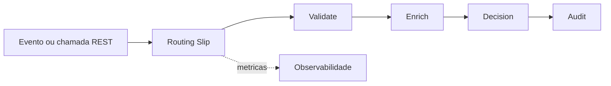

# Visao geral

O **Routing Slip Studio** ajuda a criar, validar e testar workflows YAML para o motor `routing-slip-pattern`.

O motor executa uma mensagem com payload, metadados e uma lista ordenada de etapas. Cada etapa e resolvida por um handler registrado, permitindo criar fluxos reutilizaveis e modulares sem acoplar regras de dominio ao executor.

Use o Studio para escrever o workflow, validar a estrutura, simular a execucao, testar integracoes e navegar pela documentacao sem sair da tela de trabalho.

| Conceito | Papel |
|---|---|
| **Message** | Unidade de trabalho com payload, headers e cursor. |
| **Step** | Etapa declarada no YAML. |
| **Handler** | Implementacao que executa uma etapa. |
| **StateStore** | Persistencia do cursor e snapshots para retomada. |

