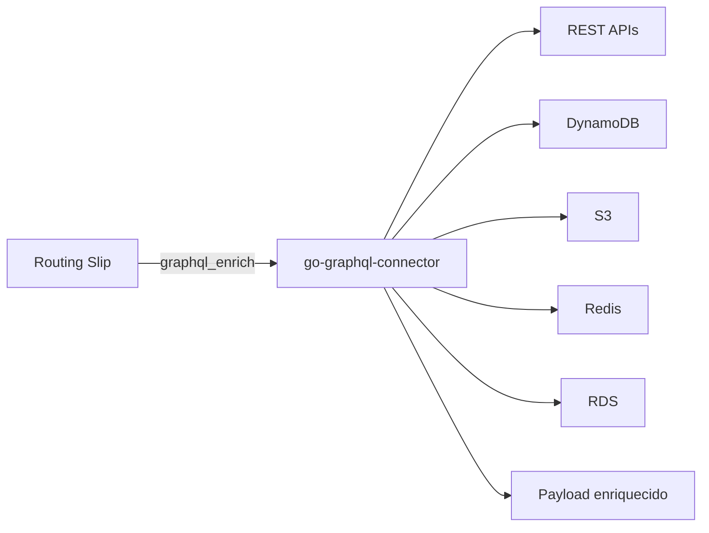

# GraphQL Connector

O `go-graphql-connector` e a camada de integracao usada para enriquecer payloads do routing slip sem acoplar o workflow diretamente a APIs, bancos, caches ou servicos externos.

Ele funciona como uma **Anti-Corruption Layer**: o workflow conhece uma query GraphQL estavel, enquanto o conector resolve como buscar os dados nas fontes configuradas.

| Papel | Beneficio |
|---|---|
| API GraphQL dinamica | Expor um contrato unico para varias fontes externas. |
| Connectors configuraveis | Trocar origem de dados sem mudar o workflow. |
| Response transform | Simplificar respostas removendo wrappers desnecessarios. |
| Timeout/retry/opcionalidade | Controlar resiliencia por fonte integrada. |
| Configuracao por arquivo ou cloud | Usar local, env, SSM, Secrets Manager, S3 e DynamoDB. |



No routing slip, o uso acontece pelo handler `graphql_enrich`:

```yaml
- name: graphql_enrich
  params:
    endpoint: "${GRAPHQL_ENDPOINT:-http://localhost:8090/graphql}"
    query: "query ($sku: String!) { dataSources(sku: $sku) { catalogo { produtos { sku preco { valor } } } } }"
    variables:
      sku: "{itens.0.sku}"
    target: catalogo
    result_path: dataSources.catalogo
    timeout_ms: 3000
    required: true
```
