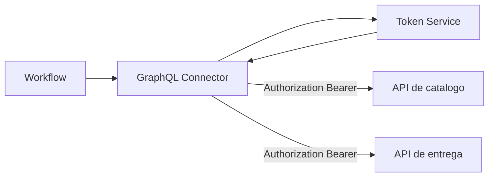

O `go-graphql-connector` permite compor uma fachada de dados sem espalhar logica de integracao dentro do workflow.

## Transformacao de resposta

Use `responseTransform.unwrapPath` para retornar somente o trecho relevante:

```json
{
  "responseTransform": {
    "unwrapPath": "data",
    "errorsPath": "errors",
    "failOnErrors": true
  }
}
```

Isso reduz payloads como:

```json
{ "data": { "id": "P-100" }, "errors": [] }
```

para:

```json
{ "id": "P-100" }
```

## Falha parcial

`allow_partial` no service ou `optional` por connector permite que uma fonte falhe sem derrubar toda a query, quando isso fizer sentido para o processo.

## Timeout e retry

```json
{
  "timeoutMs": 3000,
  "retries": 2
}
```

## Token STS

O conector suporta emissao de token STS/OAuth por `client_credentials`. Quando habilitado, o runtime:

1. chama o endpoint definido em `token_authorization_url`;
2. envia `grant_type=client_credentials`, `client_id` e `client_secret`;
3. aplica headers customizados do `tokenService.headers`;
4. guarda o `access_token` retornado;
5. injeta `Authorization: Bearer <token>` nos connectors REST.

```json
{
  "authorization": {
    "require_token_sts": true,
    "tokenService": {
      "token_authorization_url": "${STS_TOKEN_URL}",
      "headers": {
        "x-serial-number": "${STS_SERIAL_NUMBER}"
      },
      "credentials": {
        "client_id": "${STS_CLIENT_ID}",
        "client_secret": "${STS_CLIENT_SECRET}"
      }
    }
  }
}
```

### Opcoes

| Campo | Descricao |
|---|---|
| `require_token_sts` | Liga/desliga autenticacao centralizada. |
| `token_authorization_url` | URL do emissor de token. |
| `headers` | Headers enviados somente para a chamada de token. |
| `credentials.client_id` | Identificador da aplicacao cliente. |
| `credentials.client_secret` | Segredo da aplicacao cliente. |

### Quando usar

Use token STS quando varias APIs integradas exigem o mesmo `Bearer token`. O workflow continua chamando apenas GraphQL, enquanto o conector gerencia autenticacao e renovacao.



### Cuidados

- Se um connector REST ja possuir `Authorization` em `adapterConfig.headers`, o token automatico nao sobrescreve esse valor.
- Mantenha `client_secret` em Secrets Manager, SSM seguro ou variavel de ambiente protegida.
- Configure `timeoutMs` e `retries` por fonte para evitar que uma API lenta degrade todo o workflow.
