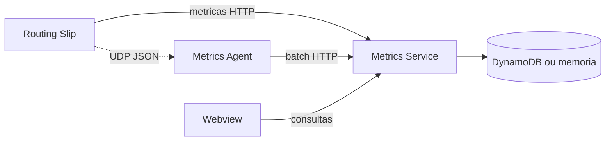

# Custom Business Metrics

O `custom-business-metrics` e a camada usada para observar o processamento em tempo real com metricas de negocio, eventos de etapa e dashboards configuraveis.

Ele complementa logs tecnicos: em vez de responder apenas "a aplicacao esta de pe?", ele ajuda a responder "onde esta cada processamento?", "qual etapa falhou?", "quanto falta?" e "qual fluxo esta demorando mais?".

Componentes principais:

| Componente | Papel |
|---|---|
| `agent` | Recebe eventos JSON via UDP, agrupa e encaminha em lote. |
| `service` | API HTTP de ingestao, consulta, agregacao, retencao e dashboards. |
| `webview` | Interface para visualizar e editar dashboards. |
| `storage` | Memoria para desenvolvimento ou DynamoDB/DynamoDB Local para persistencia. |

