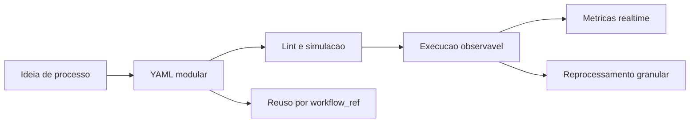

# Beneficios e potencial

O routing-slip-pattern combina **velocidade de construcao**, **clareza operacional** e **capacidade de reprocessamento**.

| Beneficio | Impacto |
|---|---|
| Velocidade | Workflows sao declarados em YAML, sem recompilar o motor. |
| Facilidade | Handlers pequenos reduzem complexidade cognitiva. |
| Rastreabilidade | Cada etapa registra historico, cursor e erros. |
| Observabilidade | Eventos e metricas permitem dashboards realtime. |
| Explicabilidade | O YAML mostra o motivo de cada decisao. |
| Transparencia | Logs por fase ajudam a entender entrada, regra e saida. |
| Reprocessamento | Execucoes retomam do ponto de falha. |
| Modularidade | `workflow_ref` divide fluxos extensos em scripts menores. |
| Escalabilidade | Integracoes e metricas podem evoluir separadamente. |

Na pratica, a ferramenta ajuda equipes a transformar processos complexos em fluxos compreensiveis, testaveis e auditaveis.
